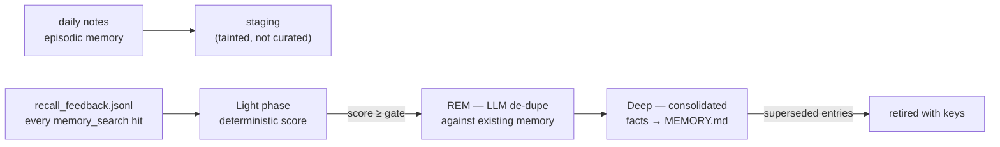
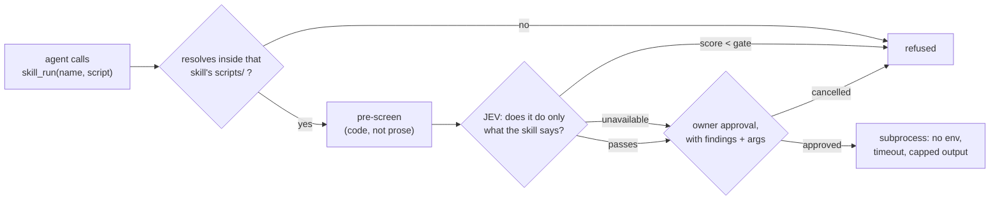
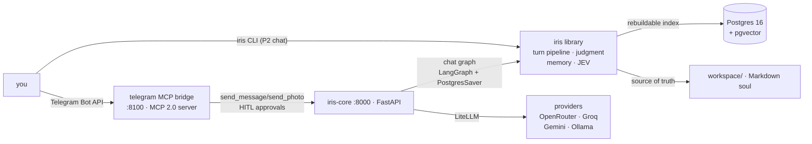

# Iris — a personal AI assistant with a visible mind

Iris is a production-grade personal AI assistant whose **memory is the product**,
packaged as a **library** (`import iris`) with a thin **CLI** (`iris …`) as its
face.

Built to demonstrate four AI-engineering disciplines end to end:

- **Memory engineering** — a layered memory engine (Markdown soul +
  Postgres/pgvector index): curated core, episodic daily notes, procedural
  skills, dream-time consolidation with recall feedback, forgetting curves,
  taint gating, contextual chunking.
- **Agent graph engineering** — LangGraph runtime: durable chat graph with
  compaction, streaming visibility, subagent escalation, human-in-the-loop
  approval gates, sleep/consolidation graph, onboarding wizard.
- **Context engineering** — bootstrap budgets, stable-prefix prompt caching,
  cost-split recall lanes, bounded-history compaction, per-turn JSON traces.
- **Typed judgments (JEV)** — TypeSafe's System One model supplies the decisions
  that would otherwise be hand-tuned heuristics or an extra LLM call: recall
  reranking, skill selection, instruction-injection screening, the capture gate,
  delegation effort, answer sufficiency, and the reflection pass's
  sentence-by-sentence support check. Every call is best-effort with a
  deterministic fallback, so the stack is identical with no key, and **every
  judgment is recorded per turn** — which memory won and by how much, what was
  refused at the door, and where the seconds went. Anything that needs
  *generation* stays with the model; [`docs/jev.md`](docs/jev.md) §3.0 is the
  audit of every call site.

She lives in your pocket (Telegram over MCP), sleeps on command (`/sleep`),
dreams in `DREAMS.md`, teaches herself skills, and her memory is proven by a
full **ablation study** in `reports/eval_lab.md`.

---

## Status: P8 of 8 — shipped: guards that refuse before the spend, and approvals bound to what was shown

The repo was reborn in place: same package, same import path (`iris`), same
memory, agent graph and JEV behavior — but the **web dashboard is deleted**, the
engine's boot path lives in the library (`iris.harness()`), both clients of it
(the CLI and the Telegram bridge) go through one shared client contract, skills
are a discovered, validated, policed registry whose code runs only through one
bounded gate, delegation is a **bounded, observable** part of the agent rather
than a hidden helper, and a runaway turn is now **refused before it spends**
rather than merely observed afterwards.

| Phase | Deliverable | Gate to the next |
|---|---|---|
| **P1 — skeleton + CLI** ✅ | Dashboard deleted; `iris --help \| version \| doctor`; honest tests/CI/docs | user ticks the DoD checklist |
| **P2 — core brain** ✅ | `iris.harness()` turn pipeline as a library API; `iris chat` (streaming REPL, degraded mode) | P1 verified |
| **P3 — Telegram** ✅ | Bridge as a first-class client on the library brain (`iris.channels.*`), idempotent updates, `/forget` fixed | P2 verified |
| **P4 — skills** ✅ | Registry across sources, Agent Skills manifests, `allowed-tools` policy, JEV-gated script boundary, `iris skills` | P3 verified |
| **P5 — multi-agent** ✅ | Lead + two specialists, typed handoffs with provenance, code-owned budgets, two JEV judgments, `iris agents` | P4 DoD still open — the owner waived the gate to run P5 early (recorded in the P5 log) |
| **P6 — cron** ✅ | Interval + calendar + one-off jobs in one store, a declared misfire policy, `iris cron list \| add \| rm`, trace content policy with redaction | owner waived the gate on 2026-09-24 (recorded in the P6 log) |
| **P7 — computer-use** ✅ | One `computer` tool (screenshot / navigate / click / type), declared tool classes + a visible-surface budget, an action audit log that never records typed text, `iris tools` | owner waived the gate on 2026-09-24 (recorded in the P7 log) |
| **P8 — ship** ✅ | Pre-tool guard chain (spiral detection + cascade breaker), scoped budgets with split counters, approval integrity, eval statistics, packaging verified by CI | owner waived the gate on 2026-09-24 (recorded in the P8 log) |

Full scope and risk register: [`docs/blueprint.md`](docs/blueprint.md). Phase
specs live in `docs/superpowers/specs/`, task plans in
`docs/superpowers/plans/`, execution status in `docs/superpowers/progress/`.

**What each phase actually changed.** P1 changed the Python-facing shape
(library + CLI) and the docs; P2 moved the boot path into the library; P3 moved
the bridge onto the library's client contract and fixed one real bug on the
forget path; P4 made skill *selection* flow through the registry (so a disabled
skill is never named) and put skill code behind one gate. P5 adds delegation to
the tool surface: `deep_dive` now runs through the role policy and returns
findings *with provenance*, a new `verify_answer` tool exposes the sufficiency
judgment, and per-turn token spend is recorded. P6 makes time a trigger without
adding a second scheduler — recurrence and misfire behaviour are declarative in
the store the agent already wrote — and makes the trace policy explicit, closing
a real leak where raw tool arguments went to disk. P7 replaced two hand-maintained
tool allowlists with declared classes that drive policy, so a capability cannot
arrive unclassified; and P8 closed the four harness gaps the audit named — a
pre-tool chain that refuses a loop or a failing tool *before* dispatch, budgets
scoped beyond the turn with counters split by kind, approvals pinned to the
digest of the action they showed, and eval reports with intervals instead of
points. P8 also turned the last LLM-driven *decision* on the turn path into a
JEV judgment (reflection), gave the reply-path judgment its own latency budget,
and made the ceilings inspectable with `iris guards`. The memory algorithms, the
deterministic recall lanes and the HTTP API are unchanged.

Phase specs live in `docs/superpowers/specs/`, plans in
`docs/superpowers/plans/`, per-phase evidence in `docs/superpowers/progress/`.
The conformance audit that drove P6 and the P7/P8 scope lives in
`docs/superpowers/specs/2026-09-24-principles-conformance-audit.md`.

### What the CLI does today

| Command | Behavior |
|---|---|
| `iris` (no arguments) | The start screen: a generated mark, then the real help. Skipped in a pipe, under `NO_COLOR`, or with `IRIS_NO_BANNER=1` — scripts and CI logs get plain text |
| `iris chat` | Streaming REPL / one-shot turn (`--once`) on the same pipeline the API uses; `--session` picks the thread; `--no-banner`; `/exit`, `/help` |
| `iris --help` / `iris -h` | Rich-styled help; lists only commands that exist |
| `iris version` / `iris --version` / `iris -V` | `iris <ver>`, `python <ver>`, package path |
| `iris doctor` | Offline checks: `.env` presence, package import, provider key names, `TYPESAFE_API_KEY`. Exit `1` only when a check **fails**; warnings exit `0` |
| `iris skills list` | Every skill, from every source, with its origin, enabled flag, success score, declared tools and scripts |
| `iris skills show <name>` | One skill's manifest and full procedure — what the agent only sees after `skill_apply` |
| `iris skills validate` | Every registry issue plus name conflicts; **exit `1` on errors**, so it works as a gate |
| `iris agents roles` | Every declared role with the bound that shapes it: tier, recall lane, tool allowlist, round cap, output cap |
| `iris agents show <name>` | One role's full system prompt and bounds |
| `iris agents handoffs` | Recent delegations read back out of the turn traces: who asked whom, claims, unsourced claims, tokens, milliseconds |
| `iris cron list` | Every scheduled job with its schedule, next run, outcome counters and last result. Works with **no engine running** |
| `iris cron add "every 6h" <instruction>` | Write a recurring job to the same store the agent writes. `--at`, `--every`, `--once` for explicit forms |
| `iris cron rm <id>` | Remove a job; prefix matching, and it refuses an ambiguous prefix rather than guessing |
| `iris tools` | Every declared tool with its class, the policy that class resolves to, where the decision came from, and whether it is on the always-visible surface or deferrable |
| `iris tools actions` | Recent computer-use actions from `config/actions.jsonl`: what, where, allowed or not — **never** what was typed |
| `iris guards` | The pre-tool chain and today's token budget: every ceiling in force, the counters split by kind, and the policy version. Read-only, works with **no engine running** (`--json` for scripting). `GET /guards` adds live circuit state |
| `--debug` / `IRIS_DEBUG=1` | Re-raise instead of printing the friendly hint, so you get a real traceback |

`doctor` never prints a secret **value** — only names and `set` / `missing`:

```text
$ iris doctor
Iris doctor
  ok   .env: present
  ok   package: importable at …/src/iris
  ok   provider keys: GEMINI_API_KEY, OPENROUTER_API_KEY
  warn TYPESAFE_API_KEY: missing — JEV disabled (deterministic fallback)
3 ok · 1 warn · 0 fail
```

### The library API

The engine is the library; the CLI, the HTTP API and the Telegram bridge are
clients of it. Booting it is one call:

```python
import asyncio
import iris


async def main() -> None:
    async with iris.harness() as brain:          # postgres="require" for the API's contract
        reply = await brain.respond("what do you remember about tea?", session_id="notes")
        print(reply)

        async for kind, payload in brain.stream("and when did we last talk?"):
            ...                                   # same events `/chat/stream` sends


asyncio.run(main())
```

`iris.harness()` returns a `Harness` with `respond()`, `resume()`, `stream()`
and the wired engine (`files`, `index`, `runtime`, `graph`, `jev`).

### Degraded mode (what happens without Postgres)

`iris chat` opens the harness with `postgres="auto"`, so a missing database is a
warning rather than a dead end:

```text
$ iris chat --once "hi"
degraded no Postgres at postgresql+psycopg://…@localhost:5433/iris (ConnectionRefusedError: …)
         recall is unavailable this session — new memories are still written to
         the workspace and indexed later.
iris> PONG
```

| | Full | Degraded |
|---|---|---|
| Conversation | ✅ durable threads | ✅ in-memory threads |
| Recall (`memory_search`) | ✅ hybrid search | ❌ raises `MemoryUnavailable`, whose message names the fix — never an empty result set |
| Writing memory (daily notes, captures, `remember`/`note`) | ✅ | ✅ (Markdown is the source of truth; the index is rebuilt later) |
| Traces, JEV judgments, reflection | ✅ | ✅ |

The HTTP API keeps `postgres="require"`: a missing database is still a boot
failure there, because a service that silently cannot remember is worse than
one that refuses to start.

---

## Quickstart

Prerequisites: Python 3.13 + [uv](https://docs.astral.sh/uv/). Docker only for
Postgres and the full stack.

```bash
git clone <this repo> && cd Iris
uv sync                      # install the library + CLI into .venv
uv run iris --help           # the CLI shell
uv run iris doctor           # what's configured, and what isn't
uv run iris chat             # talk to her (add --once "hi" to script one turn)
```

To give her a brain, copy the env template and fill in one provider key (see
[Providers](#providers)); `iris doctor` reports which key names it found:

```bash
cp .env.example .env
uv run iris doctor
```

No network is used by any P1 command, so `iris doctor` is CI-safe and works on a
plane.

### Running the engine (API + Telegram bridge)

The library is the engine; the HTTP API and the Telegram bridge are its existing
clients. Local dev, Windows-friendly:

```bash
docker compose up -d postgres                # just the DB (pgvector) on :5433
uv run python scripts/run_core.py            # API on :8000
uv run python scripts/run_bridge.py          # Telegram MCP bridge on :8100
```

Or the whole stack, including Postgres, in containers:

```bash
docker compose up --build                    # postgres, iris-core, telegram-mcp
```

Compose services are `postgres`, `iris-core` and `telegram-mcp` — there is no
web frontend. `iris-core` and `telegram-mcp` are bound to loopback so `docker
compose up` never exposes an auth-disabled API to the network.

### Meet her

Message the bot on Telegram. The **onboarding wizard** kicks in — you name her,
pick her personality/tone/timezone/sleep preferences, and she writes her identity
to `USER.md` + `config/iris.json`. That's the moment she's born.

---

## How it works

### The memory model (the soul)

Iris's memory is **plain Markdown files** — always human-readable, always the
source of truth. Postgres is only a rebuildable vector index over them.

```
workspace/
├── AGENTS.md              # operating contract — survives every reset
├── USER.md                # your profile (stable preferences, relationships)
├── MEMORY.md              # curated long-term memory (evergreen facts)
├── DREAMS.md              # dream diary — read-only for Iris
├── memory/YYYY-MM-DD.md   # episodic daily notes (decay over time)
├── skills/*.md            # procedural skills she writes herself
├── imports/*.md           # ingested URLs (UNTRUSTED origin)
├── config/iris.json       # onboarding state / identity
├── config/tasks.json      # scheduled one-off tasks
├── config/traces.jsonl    # per-turn traces
├── config/llm_calls.jsonl # cost ledger (every LLM call)
├── config/hallucination_flags.jsonl  # reflection pass output
└── memory/.dreams/        # staging, contextual-chunk cache, recall feedback
```

Four provenances gate everything: **owner** (you wrote it), **agent** (her own
pipelines), **untrusted** (imports, web pages — recallable, never promotable),
**system** (operational logs — never injected). Curated content may only
graduate from owner/agent sources; the check is structural, not a prompt rule.

### What happens on every chat turn


Every turn is bounded by a **120 s budget** and a recursion cap — a provider
hiccup can never hang you; you get a graceful "still thinking" instead. When the
streaming client goes away, the turn is cancelled rather than left running.

#### The capture node (why the memory tier isn't empty)

The orchestration-v2 design deleted per-turn extraction and left the "is this
worth keeping?" decision to the agent's own `note` tool. That was measured and
it failed: **0 `note` calls across 36 traced turns**, so `MEMORY.md` only ever
grew from compaction flush and the whole promotion pipeline ran on empty.

The capture node restores the volume without restoring v2's problems:

1. **A deterministic prefilter** (`capture.worth_capturing`) decides whether a
   turn is even worth *spending* a judgment on — first-person + durability cues,
   plus a length floor. "ok"/"thanks" turns cost **zero** model calls, which was
   v2's actual win.
2. **One judgment** decides whether the turn holds a new durable fact: one JEV
   request (`Noul` ×2 + a `Score` for importance, all in a single call) when
   TypeSafe is configured, otherwise one cheap-tier JSON call. JEV supplies the
   judgment; the owner's own words supply the fact, because Jev emits no text.
3. **It cannot write curated memory.** A capture is an ADD-only line in the
   daily note, stamped `(note)`, agent provenance, and it must still clear the
   deterministic Light-phase gate to reach `MEMORY.md`.

Recall-loop prevention is structural, not a prompt plea: the judgment is shown
the same assembled context Iris sees and asked *"is this already in it?"*, so a
fact recalled a hundred times still enters the daily note once.

### Context engineering

- **Bootstrap budgets** — `USER.md` and `MEMORY.md` enter the prompt at fixed
  token budgets (default 4000), kept in stable prefix order.
- **Prompt caching** — a LiteLLM local cache is installed at boot
  (`caching=True` on every call), keeping repeated stable prefixes warm;
  cache-hit tokens are recorded in the ledger and reported by `GET /costs`
  (cache-hit % per day).
- **Compaction** — when serialized history exceeds the trigger (12k tokens), a
  compaction turn flushes durable facts into the daily note, summarizes, and
  trims history to a keep-budget (2k). The conversation stays bounded forever
  without losing what mattered. The cut is repaired at a turn boundary, so tool
  results are never orphaned from the calls that produced them.
- **Contextual chunking** — before embedding, each chunk gets a cheap-model
  context header (≤60 tokens) explaining the surrounding document, so vectors
  carry document-level meaning (Anthropic-style contextual retrieval). Results
  are cached per file by content hash in `memory/.dreams/contexts/`; plain
  chunks are the automatic fallback.
- **JEV skill selection** — the skills block names only the skill worth looking
  at, chosen by one TypeSafe judgment over the roster (see
  [`docs/jev.md`](docs/jev.md)); the deterministic trigger matcher is the
  offline fallback.
- **Explicit budgets, not vibes** — `BOOTSTRAP_BUDGET_TOKENS` (4000) for
  `MEMORY.md`, `USER_PROFILE_BUDGET_TOKENS` (1500) for `USER.md`, a 2k keep-budget
  after compaction, ≤60 tokens per context header, and the capture node's own
  prefilter. Every one of them is a setting, not a magic number in the code.

### Latency: what was on the reply path that shouldn't have been

Two post-reply passes had very different contracts and were treated the same:

- **Capture** decides whether the turn taught her something, and the trace
  reports it — it must finish before the turn is done.
- **Reflection** (hallucination triage) only appends to
  `config/hallucination_flags.jsonl`. It cannot change the reply, the memory or
  the trace, and its own docstring already claimed it was not on the reply path
  — but it was awaited, so **every retrieval-backed turn waited on an extra
  cheap-tier completion (~2–6 s) before the graph returned.** That was pure
  latency, and it is now a tracked background task (`iris/background.py`): a
  bare `asyncio.create_task` is not enough, because the loop holds only a weak
  reference and can garbage-collect a task mid-flight.

Where the judgment layer *is* the latency win: one JEV request carries many
independent questions, so a rerank of twenty candidates is one round trip rather
than twenty, a batched guard screen is one request for a whole search result
page, and the capture judgment replaced a full cheap-tier generation with one
probability call. JEV also became the fallback-aware front door for all three:
with no `TYPESAFE_API_KEY` the deterministic paths run unchanged.

Per-stage timings are recorded on every turn (`stages_ms` in the trace) so this
is measured rather than asserted — including on the streamed path, where the
agent stage is what the owner is actually waiting on.

### Recall lanes

- **Default lane** — vector + FTS shortlist, **reranked by JEV** (one request
  per recall, one probability per candidate), then × recency decay × importance
  and MMR diversity. JEV supplies relevance only; decay and importance stay in
  code because they encode forgetting policy, not relevance.
- **Escalation lane** — decay disabled, daily notes only, triggered by
  temporal questions ("when did…", "last month") or a weak default lane.
  Recovers the old facts the default lane deliberately hides. Proven by the
  eval lab: the two lanes together answer everything either alone misses.
- **Subagent lane (`deep_dive`)** — when the answer isn't obvious, Iris hands
  the question to a research subagent with its own context window and tools
  for iterative deep retrieval, then reports back. Separate `memory_search`
  queries mean subagent recalls count as recall feedback too.

### Dreaming (consolidation)

`/sleep` runs a graph: **Light → REM → Deep**:



The Light phase scores staged signals on five weighted axes — occurrence,
importance, richness, trigger-diversity, and **recall feedback** (how often
she actually went back to this memory): memories she keeps reaching for are
promoted faster. Memories are promoted into the curated core **only by
dreaming** — never by the write path directly (the taint gate).

### Forgetting & human-in-the-loop

Nothing is silently deleted. `retention` computes how much of each memory
survived decay (`/retention`); entries below the rot threshold are flagged
(`/rot`) and surfaced for your decision.

`forget` is a **two-phase HITL gate** built on LangGraph `interrupt()`:
asking her to forget pauses the graph mid-turn and raises an approval request
(the chat API and Telegram both surface it). The memory is superseded **only
after you approve**; a cancel resumes the thread with the memory intact.
Daily notes are append-only.

### Harness guards: refusing before the spend

Everything about a runaway loop used to be observational — the trace recorded it
after the fact. P8 runs a deterministic chain **before dispatch**, outside the
tool, so a refusal costs nothing and never reaches a provider:

    budget → circuit → spiral/dedup → context → record

- **Spiral detection** — the same tool with near-identical arguments three times,
  argument **Jaccard > 0.72**, or more than the declared number of calls in a turn
  (the normal is 1–3) is refused. Case and whitespace don't disguise a loop, and
  legitimately varying arguments are not a false positive.
- **A cascade breaker** — two consecutive failures of the same tool open that
  tool's circuit for the rest of the run (`unavailable — do not retry`); three
  distinct failing tools escalate the turn. A success resets the streak.
- **Scoped budgets** — a per-turn ceiling and a per-day ceiling that survives a
  restart, with counters split by **input / output / cached / embedding /
  tool-schema** rather than one total, because they fail differently. `0` means no
  ceiling.
- **Every refusal is a reason, not just a no** — the message says what to do
  instead, and lands in the turn trace as a `tool_guard` event.

Approval is bound to the action it showed. The interrupt envelope carries the
**effective digest of the arguments after edits**, so an edited resume cannot pass
as the original; one `tool_call_id` grants **once per thread**; resuming a thread
with nothing waiting is refused rather than handed to the graph; and a
side-effecting action with no digest **fails closed** whichever way the owner
answered.

### Eval gates: intervals, not points

An eval that reports a point estimate on a small set is a coin flip with a chart.
`iris.eval.stats` (stdlib only, so the arithmetic is unit-tested without a database
or a model) supplies Wilson intervals for rates, a seeded bootstrap for means, a
**paired** interval for "candidate vs baseline", a measured noise floor, sample
sizing that *derives* the ~63-samples-per-arm figure for Δ=0.02 at σ=0.04,
Cohen's κ for judge–human agreement, and a **pre-registered decision rule** that
reports `inconclusive` rather than a pass when it cannot pass.
`scripts/eval_lab.py` renders those intervals instead of points.

### Skills: a registry, a policy, and one gate for code

Skills are procedural memory that the agent can *act* on. P4 gave them a
registry, and the registry has three rules that matter more than its features:

| Rule | What it means in practice |
|---|---|
| **Nothing is silently dropped** | Four sources are merged — `workspace/skills/` (learned `*.json`+`*.md` pairs *and* hand-written `SKILL.md` directories), `SKILLS_EXTRA_DIRS`, installed packages advertising the `iris.skills` entry point, and the repo's shipped `skills/`. A name clash is a reported conflict with a winner and a loser, never a coin flip |
| **A skill can only narrow** | `allowed-tools` in the manifest restricts the turn to those tools while that skill is active. An empty list means no restriction (every pre-P4 skill), a tool the runtime does not have is a validation *error*, and a skill can never re-open what the session already closed |
| **Safe loading holds by construction** | Discovery reads data. The only way a skill's code runs is the `skill_run` tool, and that tool refuses more than it allows |

Skills come in two encodings, normalized into one shape: the flat sidecar pair
Iris writes herself, and the open **Agent Skills** layout
(<https://agentskills.io/specification>) — `SKILL.md` with YAML frontmatter
(`name`, `description`, `license`, `compatibility`, `metadata`, `allowed-tools`)
plus optional `scripts/`, `references/` and `assets/` directories. Triggers ride
in `metadata.iris-triggers`, so JEV selection and the deterministic matcher work
identically for both.

```bash
uv run iris skills list        # every skill, every source, with score + tools
uv run iris skills show pdf-notes
uv run iris skills validate    # issues + conflicts; exit 1 on errors
```

### Roles and handoffs: two specialists and a policy that can say no

The lead is the main agent — it orchestrates, **executes** and authors. Two
specialists report to it, and there is no executor role on purpose: a second
executor would duplicate the main loop and add exactly the inter-agent
dependency multi-agent systems are worst at.

| Role | Tier | What it is for |
|---|---|---|
| **researcher** | cheap | Digs old daily notes and sandbox files, read-only, max 3 tool rounds. This is the worker that already shipped, generalized |
| **critic** | strong | Checks a draft claim by claim against the findings. Read-only, and deliberately on the *other* tier from the producer |

Three things make this safe rather than merely capable:

| Rule | What it means in practice |
|---|---|
| **A role can only narrow** | A role declares an allowlist over the tool surface; it intersects with what the session already grants, so a specialist can never reach a tool you were denied — and no role may call `deep_dive`, because a subagent that can spawn subagents is a recursion with no bottom |
| **Findings carry provenance** | Every handoff is a typed value. A report the researcher produced *without consulting anything* is marked `UNSOURCED` rather than presented as fact, and a finding cannot forge a header or a code fence to impersonate the prompt |
| **Code owns every bound** | Calls per turn (2), section deadline (20 s), fan-out width (3), tool rounds, output caps, one revision. A breach returns a stable reason and the lead still answers from what it has |

Routing stays **tool-initiated**: the lead decides to delegate by calling a tool.
v2 deliberately deleted regex-triggered auto-research, and P5 does not bring it
back — what P5 adds is that calling `deep_dive` now reaches a policy instead of a
hardcoded subgraph.

Two JEV judgments sit on that path, and both fail open:

- **Effort** — "is this several independent things, or one question?" Below the
gate there is no fan-out, because the documented failure mode of production
multi-agent systems is a swarm of subagents for a simple query.
- **Sufficiency** — "is every factual claim in this draft supported by the
findings?" Below the gate the critic reads the draft and **one** revision is
allowed; after that the lead must say what it could not ground.

The reason the ceilings exist: multi-agent systems use roughly **15x** the tokens
of a chat ([Anthropic's measurement](https://www.anthropic.com/engineering/multi-agent-research-system)),
so an unbounded orchestrator is a cost bug with a nice name. `GET /traces` shows
the spend per turn.

```bash
uv run iris agents roles        # the pack, with each role's bounds
uv run iris agents show critic  # the critic's full instructions
uv run iris agents handoffs     # what was delegated recently, and what it cost
```

#### Running a skill's script: four gates



- **The judgment gate is binding.** A refusal cannot be approved away — the
  threat it defends against is a manipulated model asking the owner nicely.
  With no `TYPESAFE_API_KEY` the gate *cannot* pass silently: the run degrades to
  approval-only and the trace says the gate did not run.
- **The environment is built, not cleaned:** only `PATH`, a locale and a temp
  directory survive, with `HOME` pointed at the skill directory. A script cannot
  read a key that was never handed to it.
- **Bounds:** a timeout (the manifest's, capped by `SKILL_SCRIPT_TIMEOUT_SECONDS`)
  and capped output. Non-zero exits and crashes come back as data the model reads.
- **Residual risk, stated plainly:** this is process isolation, not kernel
  isolation. See [`docs/deployment.md`](docs/deployment.md) for what that means
  and how to harden it.

One builtin skill ships as the format's proof:
[`skills/web-page-to-notes/`](skills/web-page-to-notes/SKILL.md) turns a saved
page into notes with a stdlib-only script — no network, no environment reads.

### Sandboxed file tools (computer-use, jailed)

Iris may only touch `workspace/sandbox/` (configurable via `SANDBOX_DIR`).
`file_create / file_write / file_read / file_list` validate every path —
traversal (`..`), absolute paths and drive letters are rejected, so she can
organize notes and drafts without ever reaching `.env` or system files.

### Web search + document ingestion

- `web_search` — Tavily (free tier, set `TAVILY_API_KEY`); without a key it
  answers "not configured" gracefully.
- `ingest_url` — fetch any URL, strip it to readable text, store as
  `imports/YYYY-MM-DD-<hash>.md`. Imports are **UNTRUSTED origin**: recallable
  on demand, never promoted into curated memory (the trust model refuses it).
  Private and internal hostnames (loopback, RFC1918, `postgres`, `iris-core`,
  `telegram-mcp`) are refused before the request leaves the process, and the
  fetched text is screened by the JEV injection guard.

### Images

Send her an image: a vision-capable turn reads the image and answers questions
about it, and a **one-line caption** is appended to the daily note so the moment
survives in episodic memory. She can also send you photos back over Telegram
(`send_photo`).

### Voice notes (Groq Whisper)

Send a Telegram voice message; the bridge downloads it and posts it to
`POST /voice`, where `groq/whisper-large-v3-turbo` transcribes it and the
graph answers on the transcript. Needs `GROQ_API_KEY` (free tier). While any
turn is in flight, Telegram shows the **typing…** indicator and the API streams
**thinking + tool calls live** (SSE `/chat/stream`) — she feels alive instead of
frozen during free-tier latency.

### Circadian proactivity

APScheduler runs two jobs in your timezone:

- **04:00 nightly sleep** — the dream cycle consolidates the day into `MEMORY.md`.
- **08:00 morning brief** — a Telegram digest: what dreaming promoted, how
  retention looks, what's flagged as rot. Requires `OWNER_CHAT_ID` + a
  connected channel; otherwise it stays silent.

Both are no-ops when they can't run safely — the scheduler never crashes the
process.

### Scheduled jobs: three kinds, one store, one policy

Jobs live in `workspace/config/tasks.json` and are created either by asking her
in chat (*"remind me in 3 days to renew the lease"*, *"every Monday at 9 run the
weekly review"*) or from the CLI. One grammar parses recurrence in both places —
the CLI reuses the agent's parsers rather than inventing a second one.

| Kind | Example | Fires |
|---|---|---|
| `once` | `in 3 days`, `2026-10-01T09:00` | Once, then removed |
| `every` | `every 6h`, `every 2d` | On an interval, anchored to the last run |
| `calendar` | `daily at 09:00`, `mon,wed,fri at 18:30` | On the wall clock, in your timezone |

What happens when a window is missed is a **declared function**, not a library
default:

| Situation | Outcome |
|---|---|
| Iris was down across several windows of a recurring job | Fires **once** (coalesced). Never once per missed window |
| A one-off job's time passed while offline | Counted as `missed` and recorded *before* it is dropped, so "why didn't my reminder fire?" has an answer |
| A job keeps raising | Its failure count rises and past the threshold the job **disables itself** rather than retrying forever |
| Nothing is due | Tick does nothing and never crashes the process |

Every job carries its own history — `runs`, `misses`, `failures`, `last_outcome`,
`last_run`, `last_error` — and `iris cron list` shows exactly that:

```bash
uv run iris cron list
uv run iris cron add "every 6h" "summarize new notes in the vault"
uv run iris cron add --at "mon,wed,fri at 18:30" "what shipped today?"
uv run iris cron rm 3f9a
```

A job's instruction runs through the **same chat graph** with `origin="task"`,
which means a scheduled run can never write durable memory — time triggers
cannot poison the vault. Delivery goes over Telegram when the bridge is up, and
a job whose run produces nothing says so in its own record.

`iris cron add` from the CLI writes to the store; a **running** engine picks it
up on `POST /cron/reload` (the CLI prints that reminder rather than pretending
the job is already live).

### The bridge: Telegram over MCP

`mcp_servers/telegram/` is a custom **MCP 2.0 server** (streamable HTTP) that
wraps the Telegram Bot API with long-polling. It exposes `send_message`,
`send_photo`, `get_chat_history`, `broadcast` as MCP tools to Iris and
forwards your inbound messages to the agent API. It also parses slash commands
(`/start /help /mind /skills /forget /rot /retention /dream_now /sleep /wake`)
and learns your chat id from the first `/start`. Once an owner is bound, the
bot is **private**: any other chat is refused (set `OWNER_CHAT_ID` in `.env`
to pin ownership in env instead of letting the first `/start` claim it).
HITL approval events are surfaced inline ("I'd like your OK before touching
that memory") and the thread is kept unblocked automatically.

Since P3 the bridge is **a client of the library, not a second brain**:

- Turn streaming and every command call go through
  `iris.channels.brain.HttpBrainClient` — one definition of the HTTP/SSE
  contract, shared with the CLI. The bridge keeps only transport concerns
  (long-polling, sending, progressive edits, typing, file downloads, the owner
  gate), so a change to the API shape is a one-file change.
- Updates are normalized by `iris.channels.updates.normalize_update()` and
  de-duplicated by an `UpdateLedger` persisted beside `owner.json`. A restart
  resumes from the stored offset instead of replaying already-handled updates
  into fresh turns — and in-memory memory writes are no longer repeated either.
- The image installs the library (`pip install --no-deps .`, built from the repo
  root) so the bridge and the core cannot drift apart; no agent-stack
  dependency (LangGraph, asyncpg, pgvector) enters it.

### Providers

Two-tier brain via LiteLLM (any provider works). Pick one with `LLM_PROVIDER`
in `.env` — `auto` uses the first key it finds:

| Provider | Env var (key) | Strong (default) | Cheap (default) | Notes |
|---|---|---|---|---|
| **OpenRouter** | `OPENROUTER_API_KEY` | `openrouter/nvidia/nemotron-3-super-120b-a12b:free` | `openrouter/nvidia/nemotron-nano-9b-v2:free` | free `:free` variants; override with `OPENROUTER_STRONG_MODEL` / `_CHEAP_MODEL` |
| **Groq** | `GROQ_API_KEY` | `groq/openai/gpt-oss-120b` | `groq/openai/gpt-oss-20b` | free tier (30 RPM / 1k RPD), very fast. Ids verified 2026-09-21 — the previous defaults had a doubled `groq/groq/` prefix and named a decommissioned model |
| **Gemini** | `GEMINI_API_KEY` | `gemini/gemini-3.5-flash` | `gemini/gemini-3.1-flash-lite` | also powers embeddings |
| **Ollama** | *none* (local) | `ollama/qwen2.5-coder:3b` | `ollama/qwen2.5-coder:3b` | `ollama serve` + `ollama pull <model>`; base URL via `OLLAMA_BASE_URL` |
| voice (always Groq) | `GROQ_API_KEY` | — | — | `groq/whisper-large-v3-turbo` |
| web search (optional) | `TAVILY_API_KEY` | — | — | free tier at tavily.com |
| **JEV (optional)** | `TYPESAFE_API_KEY` | — | — | `jev-latest` (TypeSafe System One) for recall reranking, skill selection and injection screening. No key = deterministic fallbacks. See [`docs/jev.md`](docs/jev.md) |

The table above mirrors the defaults in `src/iris/config.py` — that file is the
single source of truth. Model names drift, so treat it as the contract and these
docs as a snapshot.

**Embeddings** are the one constraint: OpenRouter and Groq don't offer them.
Iris uses Gemini when `GEMINI_API_KEY` is set, otherwise falls back to
`ollama/nomic-embed-text` automatically — so an OpenRouter-only or Groq-only
setup still indexes, as long as Ollama is running.

Rate limits are handled by a client-side throttle (strong tier), retry with
jitter, `Retry-After` parsing, and graceful fallback. Keys are read from
`.env` and passed explicitly to LiteLLM — no shell exports needed.

### The HTTP API

`iris.api:app` is the engine's HTTP surface (unchanged in P1). It is what the
Telegram bridge calls today, and what the CLI will call in P2.

| Route | What it does |
|---|---|
| `GET /health` | liveness + judgment summary + in-flight background work (unauthenticated on purpose) |
| `GET /jev` | judgment-layer health: enabled or not, *why not*, counters, last latency |
| `POST /chat` · `POST /chat/stream` · `POST /chat/resume` | one turn (JSON, SSE, or HITL resume) |
| `POST /voice` | Telegram voice note → transcript → turn |
| `GET /onboarding` | onboarding wizard state |
| `POST /sleep` | run the dream cycle now |
| `GET /mind` · `GET /skills` · `GET /tasks` | memory snapshot, learned skills, scheduled tasks |
| `GET /rot` · `GET /retention` | forgetting report |
| `POST /forget` · `POST /forget/confirm` | two-phase forget |
| `GET /costs` · `GET /traces` | cost ledger rollups, per-turn traces |

#### API auth

Set `IRIS_API_TOKEN` in `.env` to protect every endpoint except `/health` with
an `Authorization: Bearer` check. The Telegram bridge forwards the token
automatically; when unset, auth is off and the core logs a warning at boot.
Recommended for anything beyond localhost.

### Observability

- **Cost ledger** — every LLM call is appended to
  `workspace/config/llm_calls.jsonl` (per-call usage + estimated cost;
  unknown models price at $0). `GET /costs` reports daily/weekly/total rollups
  + prompt-cache hit rates.
- **Turn traces** — one JSON line per turn in `config/traces.jsonl` (rotated
  at 1 MB): timestamp, session, latency, tools called, pending-approval
  markers, and **what the capture node wrote** (`capture`) — so the write path
  is observable rather than something you take on faith. `GET /traces` returns
  them with the capture rendered as `💭 [importance] fact`.
- **Trace content policy** (`IRIS_TRACE_CONTENT`) — `metadata` (default),
  `redacted`, `sampled`, or `full`. **Credentials never reach the trace file in
  any mode**, and tool arguments are recorded as an `args_hash` rather than
  verbatim — `_trace_turn` used to write raw `tool_call.args` to disk, so a
  secret a model passed as an argument was persisted. Scheduled runs happen
  with nobody watching, which is why this became explicit in P6.
- **Judgment events + stage timings** — the same trace line carries an
  `events` list (every recall rerank with the probability it gave each
  candidate, every guard verdict including the ones that passed, the skill
  decision with its gate inputs, the capture verdict and its rejection reason,
  and whether reflection ran inline or in the background) plus `stages_ms`
  (`assemble`, `agent`, `tools`, `rerank`, `guard`, `capture`, `reflection`,
  `jev`). A judgment nobody can inspect is indistinguishable from one that
  silently failed, so "not checked" is recorded as explicitly as "checked".
  Implementation detail: `iris/turnlog.py`.
- **Judgment health** — `GET /jev` reports whether JEV is enabled, *why not* if
  it is not, and its request/failure counters and last latency.
  `background.pending` in `/health` shows in-flight post-reply work.
- **Reflection** — turns that actually retrieved memory get a cheap-model
  pass that flags claims not supported by the retrieved excerpts
  (`config/hallucination_flags.jsonl`, also counted in `/mind`). It runs **off
  the reply path** by default (`IRIS_REFLECTION_BACKGROUND=0` to run it
  inline): it only appends to a telemetry file, so making the owner wait on it
  was pure latency. `background.drain()` is awaited on shutdown so a deliberate
  fire-and-forget still finishes.

### Healthchecks

`docker compose` runs per-service healthchecks (HTTP for `iris-core`, TCP for
the Telegram bridge) with `depends_on: condition: service_healthy`, so the
bridge never starts before the core is answering.

### Commands

These are the commands the Telegram bridge dispatches
(`mcp_servers/telegram/server.py: CommandDispatcher`):

| Command | What it does |
|---|---|
| `/start` | bind this chat as the owner (ignored once bound) |
| `/sleep` | run the dream cycle now |
| `/wake` | morning-style briefing (chunks, decaying memories, rot) |
| `/mind` | inspect what she currently knows |
| `/forget <text>` | supersede a memory, two-phase with an explicit confirm |
| `/forget-confirm` · `/forget-cancel` | complete or abort a pending forget |
| `/skills` | list learned skills |
| `/tasks` | list pending scheduled tasks |
| `/rot` · `/retention` | forgetting report |
| `/help` | command list |

There is deliberately no `/remember` or `/dream_now` slash command — durable
facts are written by the agent's own `remember`/`note` tools during
conversation, and `/sleep` covers consolidation.

Scheduled tasks: ask her in chat — *"remind me in 3 days to renew the lease"*
or *"run the weekly summary tomorrow 9:30"*, or *"every Monday at 9 review the
backlog"* — she parses ISO/relative/shorthand/interval/calendar times, persists
them to `workspace/config/tasks.json`, and at fire time runs the instruction
through the graph and delivers the result over Telegram. The same store is
readable and writable offline via `iris cron list|add|rm`.

---

## Development

### Tests

```bash
uv run pytest tests -q --ignore=tests/test_memory_pipeline.py   # 806 tests, deterministic, no API calls
uv run ruff check .                                             # lint (also enforced in CI)
uv run python scripts/eval_lab.py                               # ablation study → reports/eval_lab.md
```

The 5 tests in `test_memory_pipeline.py` are integration tests against a real
pgvector database, and they **fail loudly** — with the command that fixes it —
when one is missing; they do not silently skip:

```bash
docker compose up -d postgres
docker compose exec postgres psql -U iris -d iris -c 'CREATE DATABASE iris_test;'
uv run pytest tests -q                                          # 806 + the 5 DB-backed tests
```

They use their **own** database so a test run can never touch real memory.
Point them elsewhere with `IRIS_TEST_POSTGRES_DSN`. CI starts a
`pgvector/pgvector:pg16` service and runs the whole suite, so these no longer
depend on a developer's laptop.

### Quality gates

GitHub Actions (`.github/workflows/ci.yml`) runs on every push and PR:
**ruff**, the **full** test suite against a real pgvector Postgres, a production
**image build** that asserts the container is non-root, and a **packaging** job
that builds the wheel, installs it in a clean venv and runs the console entry
(`iris version`, `iris --help`) — because a build that only exists in
`pyproject.toml` is a claim, not a deliverable. See
[`docs/support.md`](docs/support.md) for the support matrix and how a release is
cut.

### Reset

```bash
uv run python scripts/fresh_start.py      # wipes memory/dreams/skills/imports/sandbox/tasks/traces/index
```

`AGENTS.md` and `.env` survive — she's a newborn again, and the next chat
re-runs onboarding.

---

## Docs

| Document | What it covers |
|---|---|
| `README.md` (this file) | Pitch, architecture, status/roadmap, quickstart, operations |
| [`CONTRIBUTING.md`](CONTRIBUTING.md) | Setup, the verify commands, what a good change looks like, commit conventions |
| [`docs/architecture.md`](docs/architecture.md) | Module map, the turn lifecycle, the ten invariants, where state lives |
| [`docs/extending.md`](docs/extending.md) | Recipes: add a tool, a skill, a channel, a role, a guard, an eval metric |
| [`docs/blueprint.md`](docs/blueprint.md) | The whole P1–P8 plan: scope, gates, risk register |
| [`docs/jev.md`](docs/jev.md) | JEV: what it is, where it is integrated, where it is deliberately not, config, troubleshooting |
| [`docs/deployment.md`](docs/deployment.md) | Hosting options, volumes and ownership, secrets, harness guards and budgets, backups, rollback, demo mode |
| [`docs/support.md`](docs/support.md) | Support matrix (Python, OS, providers, the pgvector requirement), what CI verifies, and how a release is cut |
| `docs/superpowers/specs/` | Per-phase design specs (P1 skeleton, P3 Telegram client) and the [conformance audit](docs/superpowers/specs/2026-09-24-principles-conformance-audit.md) that drove P6–P8 |
| `docs/superpowers/plans/` | Task-by-task implementation plans |
| `docs/superpowers/progress/` | Execution status + verification log per phase |
| `research/` | Research synthesis that informed the design (Aug 2026 snapshot) |
| `reports/eval_lab.md` | Recall ablation results (regenerate with `scripts/eval_lab.py`) |
| `assets/mermaid/*.mmd` | Mermaid sources for the day cycle, dream pipeline and forgetting decision diagrams |

## Architecture map



```
┌─────────────┐   ┌──────────────────────────────┐   ┌─────────────┐
│  Telegram   │──▶│  mcp_servers/telegram        │──▶│  iris-core  │
│  (you)      │   │  MCP 2.0 server + dispatcher │   │  FastAPI    │
└─────────────┘   └──────────────────────────────┘   │  :8000      │
        ▲              send_message ◀────────────────│  LangGraph  │
        │                                            └──────┬──────┘
┌───────┴────────┐   ┌──────────────┐   ┌──────────────┐    │
│  iris CLI      │   │  workspace/  │◀──│  memory/     │    │
│  (library face)│   │  Markdown    │   │  index+write │    │
└────────────────┘   │  (soul)      │   │  +dreams     │    │
                     └──────┬───────┘   │  +forgetting │    │
                            │           └──────┬───────┘    │
                     ┌──────▼───────┐          │            │
                     │ Postgres 16  │◀─────────┘            │
                     │ + pgvector   │   rebuildable index   │
                     └──────────────┘                       │
```

## Build order (history)

1. Scaffold
2. Memory engine core — tiers, hybrid index, write path, recall lanes
3. Dreaming + forgetting + skill learning
4. LangGraph runtime — chat graph, tools, HITL
5. Telegram MCP bridge + onboarding wizard
6. ~~Web dashboard — the visible mind~~ *(deleted in the P1 rebirth; the CLI is
   the front door now)*
7. Memory lab — ablation evals
8. Local deploy + end-to-end verification
9. **v0.2 pass** — compaction & memory flush, prompt caching, streaming
   visibility, images, subagent escalation, recall-feedback dreaming,
   contextual chunking, approval-gated forgetting, turn traces, provider
   matrix (OpenRouter/Groq/Gemini/Ollama)
10. **v0.3 pass** — typed judgments (JEV) for recall reranking, skill selection
    and injection screening; the capture node that un-starved the write path;
    CI + lint + non-root image; per-turn judgment events and stage timings;
    reflection moved off the reply path
11. **P1 rebirth** — library-first skeleton + CLI shell; dashboard removed
12. **P2 core brain** — the boot path moved into the library (`iris.harness()`),
    a public turn API (`respond`/`resume`/`stream`), and `iris chat` with an
    honest degraded mode when Postgres is absent
13. **P3 Telegram client** — the bridge became a client of the library
    (`iris.channels.brain` / `iris.channels.updates`), updates are idempotent
    across restarts, and the `/forget` confirm path stopped crashing on a
    missing `chunk_index`
14. **P4 skill registry** — one `Skill` with a manifest, discovery across four
    sources with reported conflicts, `allowed-tools` enforced at tool dispatch,
    and script execution behind a JEV judgment gate + owner approval in a
    constructed (secret-free) environment
15. **P5 multi-agent** — the research subagent became a declared **role**, a
    **critic** joined it on the opposite tier, handoffs became typed values
    carrying provenance, and every bound (calls, deadline, fan-out, rounds,
    output, revisions) is owned by code. Two new JEV judgments decide whether to
    fan out and whether a draft is grounded; `deep_dive` and `verify_answer`
    expose them, and `GET /agents`, `iris agents` make delegation observable
16. **P6 cron** — interval and calendar recurrence alongside one-off tasks in
    one store and one run path, an explicit `missed_decision()` policy (a job
    that was down fires once, a stale one-off is counted before it is dropped, a
    repeatedly failing job disables itself), `iris cron list|add|rm` +
    `POST /cron/reload`, and a trace content policy in which credentials never
    reach the trace file and raw tool arguments are replaced by a hash
17. **P7 tool surface + computer-use** — every tool declares a class that
    derives its policy (most-specific-wins, deny always wins), a visible-surface
    budget defers `extended` tools with `find_tools` to bring one back, and
    screen control arrived as **one** `computer` tool behind a permission model
    and an append-only action log that records a length and a digest of typed
    text, never the text. `iris tools`, `GET /tools`, `GET /actions`
18. **P8 ship** — a deterministic pre-tool guard chain (spiral detection, a
    per-tool cascade breaker, scoped budgets with counters split by kind) that
    refuses before dispatch, approval envelopes bound to the effective argument
    digest with a per-thread replay guard and fail-closed side effects, eval
    reporting with Wilson/bootstrap intervals, a derived sample-size rule and a
    pre-registered decision rule with `inconclusive`, and a CI packaging job that
    builds the wheel and runs the console entry

Research basis: `research/00-synthesis.md` (12 parallel research briefs,
Aug 2026). Design history: `docs/superpowers/specs/2026-08-15-iris-design.md`.
