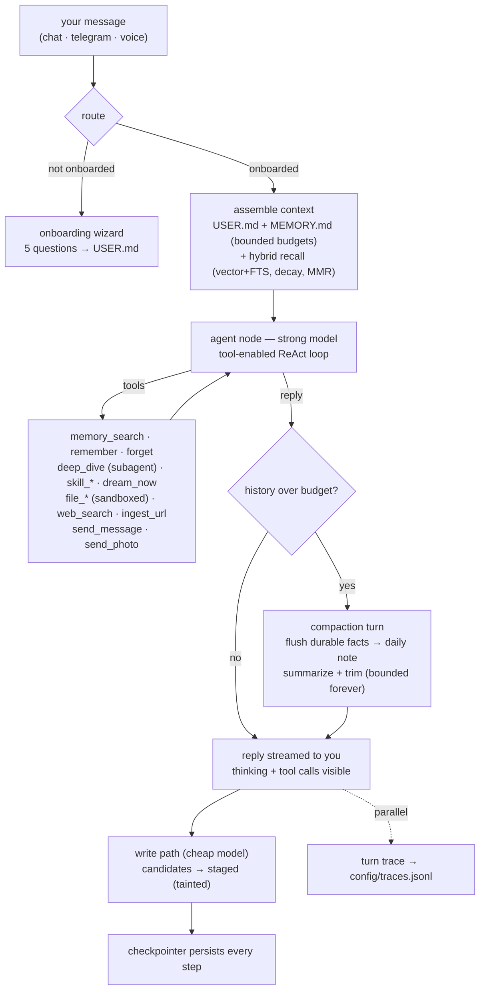
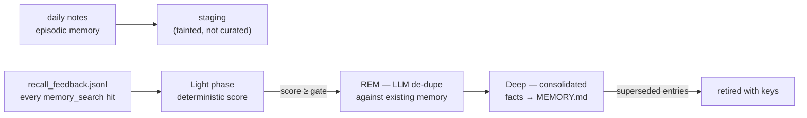
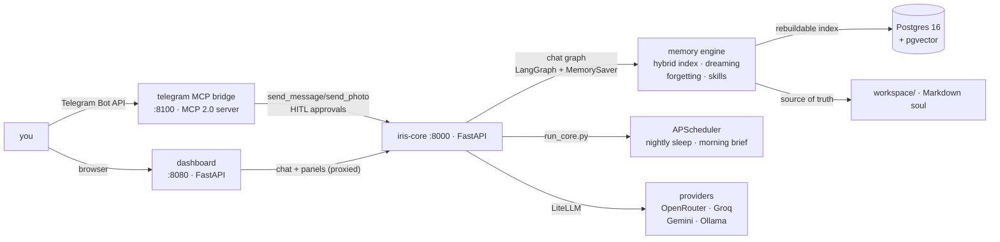

# Iris — an AI assistant with a visible mind

Iris is a production-grade personal AI assistant whose **memory is the product**.
Built to demonstrate three AI-engineering disciplines end to end:

- **Memory engineering** — a layered memory engine (Markdown soul +
  Postgres/pgvector index): curated core, episodic daily notes, procedural
  skills, dream-time consolidation with recall feedback, forgetting curves,
  taint gating, contextual chunking.
- **Agent graph engineering** — LangGraph runtime: durable chat graph with
  compaction, streaming visibility, subagent escalation, human-in-the-loop
  approval gates, sleep/consolidation graph, onboarding wizard.
- **Context engineering** — bootstrap budgets, stable-prefix prompt caching,
  trigger injection, cost-split recall lanes, bounded-history compaction,
  per-turn JSON traces.

She lives in your pocket (Telegram over MCP), sleeps on command (`/sleep`),
dreams in `DREAMS.md`, teaches herself skills, and her memory is proven by a
full **ablation study** in `reports/eval_lab.md`.

---

## How it works

### The memory model (the soul)

Iris's memory is **plain Markdown files** — always human-readable, always the
source of truth. Postgres is only a rebuildable vector index over them.

```
workspace/
├── AGENTS.md              # operating contract — survives every reset
├── USER.md                # your profile (stable preferences, relationships)
├── MEMORY.md              # curated long-term memory (evergreen facts)
├── DREAMS.md              # dream diary — read-only for Iris
├── memory/YYYY-MM-DD.md   # episodic daily notes (decay over time)
├── skills/*.md            # procedural skills she writes herself
├── imports/*.md           # ingested URLs (UNTRUSTED origin)
├── config/iris.json       # onboarding state / identity
├── config/tasks.json      # scheduled one-off tasks
├── config/traces.jsonl    # per-turn traces (dashboard panel)
├── config/llm_calls.jsonl # cost ledger (every LLM call)
├── config/hallucination_flags.jsonl  # reflection pass output
└── memory/.dreams/        # staging, contextual-chunk cache, recall feedback
```

Four provenances gate everything: **owner** (you), **agent** (her pipelines),
**telegram** (chat history), **import** (bulk files). Curated content may only
graduate from owner/agent sources.

### What happens on every chat turn



Every turn is bounded by a **120 s budget** and a recursion cap — a provider
hiccup can never hang you; you get a graceful "still thinking" instead.

### Context engineering

- **Bootstrap budgets** — `USER.md` and `MEMORY.md` enter the prompt at fixed
  token budgets (default 4000), kept in stable prefix order.
- **Prompt caching** — LiteLLM `caching=True` keeps the stable prefix warm
  across calls; cache-hit tokens are recorded in the ledger and shown in the
  dashboard (`/costs`, cache-hit % per day).
- **Compaction** — when serialized history exceeds the trigger (12k tokens), a
  compaction turn flushes durable facts into the daily note, summarizes, and
  trims history to a keep-budget (2k). The conversation stays bounded forever
  without losing what mattered.
- **Contextual chunking** — before embedding, each chunk gets a cheap-model
  context header (≤60 tokens) explaining the surrounding document, so vectors
  carry document-level meaning (Anthropic-style contextual retrieval). Results
  are cached per file by content hash in `memory/.dreams/contexts/`; plain
  chunks are the automatic fallback.
- **Trigger injection** — fast prefilter injects a compact block when inbound
  messages match curated memory trigger phrases.

### Recall lanes

- **Default lane** — precision-tuned hybrid search (vector + FTS × recency
  decay × importance, MMR diversity). Best for "what do you know about X".
- **Escalation lane** — decay disabled, daily notes only, triggered by
  temporal questions ("when did…", "last month") or a weak default lane.
  Recovers the old facts the default lane deliberately hides. Proven by the
  eval lab: the two lanes together answer everything either alone misses.
- **Subagent lane (`deep_dive`)** — when the answer isn't obvious, Iris hands
  the question to a research subagent with its own context window and tools
  for iterative deep retrieval, then reports back. Separate `memory_search`
  queries mean subagent recalls count as recall feedback too.

### Dreaming (consolidation)

`/sleep` runs a graph: **Light → REM → Deep**:



The Light phase scores staged signals on five weighted axes — occurrence,
importance, richness, trigger-diversity, and **recall feedback** (how often
she actually went back to this memory): memories she keeps reaching for are
promoted faster. Memories are promoted into the curated core **only by
dreaming** — never by the write path directly (the taint gate).

### Forgetting & human-in-the-loop

Nothing is silently deleted. `retention` computes how much of each memory
survived decay (`/retention`); entries below the rot threshold are flagged
(`/rot`) and surfaced for your decision.

`forget` is a **two-phase HITL gate** built on LangGraph `interrupt()`:
asking her to forget pauses the graph mid-turn and raises an approval request
(chat API, dashboard, and Telegram all surface it). The memory is superseded
**only after you approve**; a cancel resumes the thread with the memory intact.
Daily notes are append-only.

### Sandboxed file tools (computer-use, jailed)

Iris may only touch `workspace/sandbox/` (configurable via `SANDBOX_DIR`).
`file_create / file_write / file_read / file_list` validate every path —
traversal (`..`), absolute paths and drive letters are rejected, so she can
organize notes and drafts without ever reaching `.env` or system files.

### Web search + document ingestion

- `web_search` — Tavily (free tier, set `TAVILY_API_KEY`); without a key it
  answers "not configured" gracefully.
- `ingest_url` — fetch any URL, strip it to readable text, store as
  `imports/YYYY-MM-DD-<hash>.md`. Imports are **UNTRUSTED origin**: recallable
  on demand, never promoted into curated memory (the trust model refuses it).

### Images

Send her an image (dashboard or Telegram): a vision-capable turn reads the
image and answers questions about it, and a **one-line caption** is appended
to the daily note so the moment survives in episodic memory. She can also send
you photos back over Telegram (`send_photo`).

### Voice notes (Groq Whisper)

Send a Telegram voice message; the bridge downloads it and posts it to
`POST /voice`, where `groq/whisper-large-v3-turbo` transcribes it and the
graph answers on the transcript. Needs `GROQ_API_KEY` (free tier). While any
turn is in flight, Telegram shows the **typing…** indicator and the dashboard
streams **thinking + tool calls live** (SSE `/chat/stream`) — she feels alive
instead of frozen during free-tier latency.

### Circadian proactivity

APScheduler runs two jobs in your timezone:
- **04:00 nightly sleep** — the dream cycle consolidates the day into `MEMORY.md`.
- **08:00 morning brief** — a Telegram digest: what dreaming promoted, how
  retention looks, what's flagged as rot. Requires `OWNER_CHAT_ID` + a
  connected channel; otherwise it stays silent.

Both are no-ops when they can't run safely — the scheduler never crashes the
process.

### The bridge: Telegram over MCP

`mcp_servers/telegram/` is a custom **MCP 2.0 server** (streamable HTTP) that
wraps the Telegram Bot API with long-polling. It exposes `send_message`,
`send_photo`, `get_chat_history`, `broadcast` as MCP tools to Iris and
forwards your inbound messages to the agent API. It also parses slash commands
(`/start /help /mind /skills /forget /rot /retention /dream_now /sleep /wake`)
and learns your chat id from the first `/start`. HITL approval events are
surfaced inline ("I'd like your OK before touching that memory") and the
thread is kept unblocked automatically.

### Providers

Two-tier brain via LiteLLM (any provider works). Pick one with `LLM_PROVIDER`
in `.env` — `auto` uses the first key it finds:

| Provider | Env var (key) | Strong (default) | Cheap (default) | Notes |
|---|---|---|---|---|
| **OpenRouter** | `OPENROUTER_API_KEY` | `openrouter/deepseek/deepseek-chat-v3.1:free` | `openrouter/meta-llama/llama-3.1-8b-instruct:free` | free `:free` models; override with `OPENROUTER_STRONG_MODEL` / `_CHEAP_MODEL` |
| **Groq** | `GROQ_API_KEY` | `groq/llama-3.3-70b-versatile` | `groq/llama-3.1-8b-instant` | generous free tier, very fast |
| **Gemini** | `GEMINI_API_KEY` | `gemini/gemini-3.5-flash` | `gemini/gemini-3.1-flash-lite` | also powers embeddings |
| **Ollama** | *none* (local) | `ollama/llama3.1:8b` | `ollama/llama3.1:8b` | `ollama serve` + `ollama pull llama3.1:8b`; base URL via `OLLAMA_BASE_URL` |
| voice (always Groq) | `GROQ_API_KEY` | — | — | `groq/whisper-large-v3-turbo` |
| web search (optional) | `TAVILY_API_KEY` | — | — | free tier at tavily.com |

**Embeddings** are the one constraint: OpenRouter and Groq don't offer them.
Iris uses Gemini when `GEMINI_API_KEY` is set, otherwise falls back to
`ollama/nomic-embed-text` automatically — so an OpenRouter-only or Groq-only
setup still indexes, as long as Ollama is running.

Rate limits are handled by a client-side throttle (strong tier), retry with
jitter, `Retry-After` parsing, and graceful fallback. Keys are read from
`.env` and passed explicitly to LiteLLM — no shell exports needed.

---

## Running it

### Prerequisites

- Python 3.13 + [uv](https://docs.astral.sh/uv/)
- Docker (for Postgres + the full compose stack)
- At least one provider key: OpenRouter (openrouter.ai/keys), Groq
  (console.groq.com/keys), or Gemini (aistudio.google.com/apikey) — see the
  provider table above; Ollama instead if you want fully-local
- A Telegram bot token from [@BotFather](https://t.me/BotFather)

### 1. Setup

```bash
cp .env.example .env      # fill in LLM_PROVIDER + keys + bot token
docker compose up -d postgres   # just the DB for local dev
uv sync                   # install deps into .venv
```

### 2. Run (local dev, Windows-friendly)

```bash
uv run python scripts/run_core.py      # API on :8000 (handles the Windows event-loop quirks)
uv run python mcp_servers/telegram/server.py   # Telegram MCP bridge on :8100
uv run python dashboard/app.py         # dashboard on :8080
```

Or one shot with Docker (everything, ports 8000/8080/8100 + Postgres on 5433):

```bash
docker compose up --build
```

### 3. Meet her

Message the bot on Telegram (or use the dashboard chat). The **onboarding
wizard** kicks in — you name her, pick her personality/tone/timezone/sleep
preferences, and she writes her identity to `USER.md` + `config/iris.json`.
That's the moment she's born.

### The dashboard

A chat-first console on `:8080` — conversation owns the screen, and everything
else lives in a collapsible left sidebar:

```
┌──────────────────┬───────────────────────────────────────────────┐
│ ◉ IRIS · memory  │  status ●   theme ◐                            │
│ console     [≡]  │                                                │
├──────────────────┼────────────────────────────────────────────────┤
│ ◆ memory   124   │     CONVERSATION                               │
│   MEMORY.md      │   ┌──────────────────────────────────────────┐ │
│   USER.md        │   │ chat log (streaming replies)             │ │
│ ☾ dreams    —    │   │ ▸ activity  thinking & tool calls live   │ │
│ ∿ decay    3 rot │   └──────────────────────────────────────────┘ │
│ ⚙ skills   12    │   [ type a message…                   send ↵ ] │
│ ◷ tasks    5     │                                                │
│ $ spend   $0.42  │                                                │
│ ⤳ traces  20     │                                                │
├──────────────────┴────────────────────────────────────────────────┤
│  index: 124 chunks · owner 118 · agent 6 · iris — memory eng.     │
└────────────────────────────────────────────────────────────────────┘
```

`[≡]` collapses the sidebar to an icon rail; sections expand in place.
Panels: memory (files + avg retention), dreams (run cycle + hallucination
flags), decay (retention curve + rot), skills, tasks, llm spend (daily
rollups + cache-hit %), and turn traces (per-turn latency + tools + approvals).

### Commands

| Command | What it does |
|---|---|
| `/sleep` · `/wake` | run / pause the dream cycle |
| `/mind` | inspect what she currently knows |
| `/remember <x>` | direct memory write (owner provenance) |
| `/forget <x>` | supersede a memory (**approval-gated**, two-phase) |
| `/skills` | list learned skills |
| `/tasks` | list pending scheduled tasks |
| `/rot` · `/retention` | forgetting report |
| `/dream_now` | force a consolidation pass |
| `/help` | command list |

Scheduled tasks: ask her in chat — *"remind me in 3 days to renew the lease"*
or *"run the weekly summary tomorrow 9:30"* — she parses ISO/relative/shorthand
times, persists them to `workspace/config/tasks.json`, and at fire time runs
the instruction through the graph and delivers the result over Telegram.

### API auth

Set `IRIS_API_TOKEN` in `.env` to protect every iris-core endpoint except
`/health` with a `Authorization: Bearer` check. The Telegram bridge and the
dashboard forward the token automatically; when unset, auth is off and the
core logs a warning at boot. Recommended for anything beyond localhost.

### Observability

- **Cost ledger** — every LLM call is appended to
  `workspace/config/llm_calls.jsonl` (per-call usage + estimated cost;
  unknown models price at $0). `GET /costs` and the dashboard *spend* panel
  show daily/weekly/total rollups + prompt-cache hit rates.
- **Turn traces** — one JSON line per turn in `config/traces.jsonl` (rotated
  at 1 MB): timestamp, session, latency, tools called, and pending-approval
  markers. `GET /traces` and the dashboard *traces* panel.
- **Reflection** — turns that actually retrieved memory get a cheap-model
  pass that flags claims not supported by the retrieved excerpts
  (`config/hallucination_flags.jsonl`, counted on the dashboard and in `/mind`).

### Healthchecks

`docker compose` runs per-service healthchecks (HTTP for iris-core/dashboard,
TCP for the telegram bridge) and `depends_on: condition: service_healthy`,
so the bridge never starts before the core is answering and the dashboard
never proxies to a dead core.

### Tests, eval lab

```bash
uv run pytest tests -q --ignore=tests/test_memory_pipeline.py   # 146 tests, deterministic, no API calls
uv run python scripts/eval_lab.py         # ablation study → reports/eval_lab.md
```

(The 5 tests in `test_memory_pipeline.py` need a local Postgres at
`localhost:5433` — they run in the compose stack.)

### Reset

```bash
uv run python scripts/fresh_start.py      # wipes memory/dreams/skills/index
```

`AGENTS.md` and `.env` survive — she's a newborn again, and the next chat
re-runs onboarding.

---

## Architecture map



```
┌─────────────┐   ┌──────────────────────────────┐   ┌─────────────┐
│  Telegram   │──▶│  mcp_servers/telegram        │──▶│  iris-core  │
│  (you)      │   │  MCP 2.0 server + dispatcher │   │  FastAPI    │
└─────────────┘   └──────────────────────────────┘   │  :8000      │
        │              send_message ◀────────────────│  LangGraph  │
        │                                            └──────┬──────┘
┌───────▼────────┐   ┌──────────────┐   ┌──────────────┐    │
│ dashboard:8080 │   │  workspace/  │◀──│  memory/     │    │
│ FastAPI UI     │   │  Markdown    │   │  index+write │    │
└────────────────┘   │  (soul)      │   │  +dreams     │    │
                     └──────┬───────┘   │  +forgetting │    │
                            │           └──────┬───────┘    │
                     ┌──────▼───────┐          │            │
                     │ Postgres 16  │◀─────────┘            │
                     │ + pgvector   │   rebuildable index   │
                     └──────────────┘                       │
```

## Chapters (build order)

1. Scaffold
2. Memory engine core — tiers, hybrid index, write path, recall lanes
3. Dreaming + forgetting + skill learning
4. LangGraph runtime — chat graph, tools, HITL
5. Telegram MCP bridge + onboarding wizard
6. Web dashboard — the visible mind
7. Memory lab — ablation evals
8. Local deploy + end-to-end verification
9. **v0.2 pass** — compaction & memory flush, prompt caching, streaming
   visibility, images, subagent escalation, recall-feedback dreaming,
   contextual chunking, approval-gated forgetting, turn traces, provider
   matrix (OpenRouter/Groq/Gemini/Ollama), dashboard redesign

Research basis: `research/00-synthesis.md` (12 parallel research briefs,
Aug 2026). Design: `docs/superpowers/specs/2026-08-15-iris-design.md`.