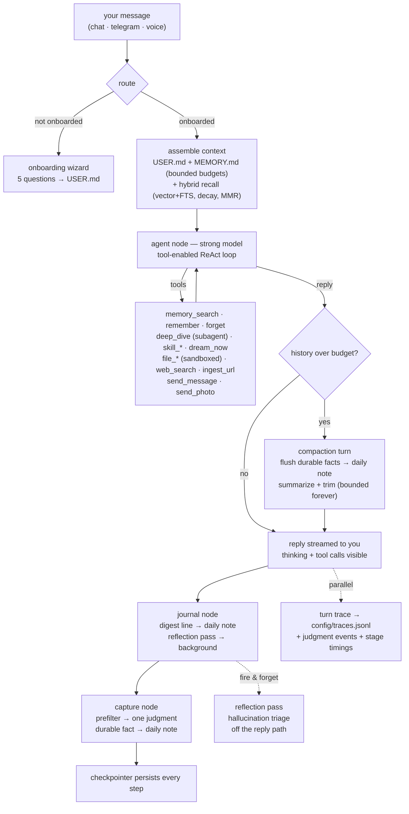
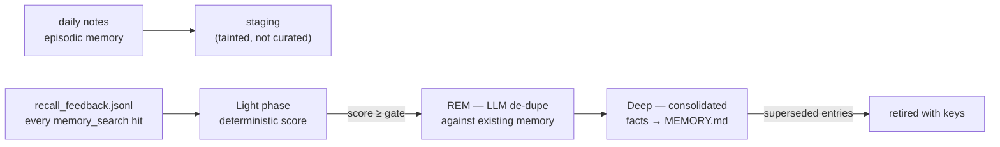
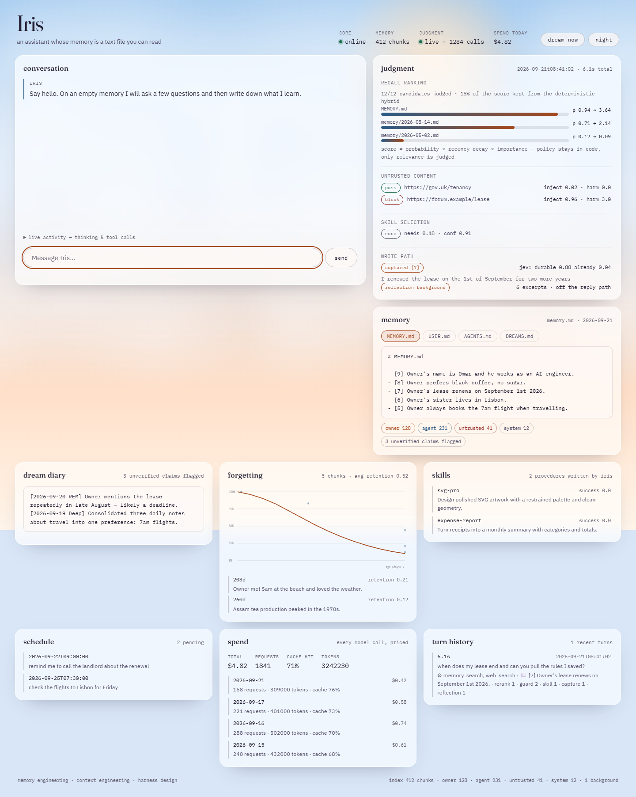
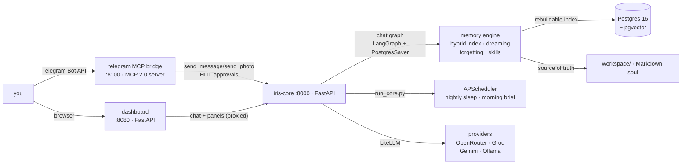

# Iris — an AI assistant with a visible mind

Iris is a production-grade personal AI assistant whose **memory is the product**.
Built to demonstrate three AI-engineering disciplines end to end:

- **Memory engineering** — a layered memory engine (Markdown soul +
  Postgres/pgvector index): curated core, episodic daily notes, procedural
  skills, dream-time consolidation with recall feedback, forgetting curves,
  taint gating, contextual chunking.
- **Agent graph engineering** — LangGraph runtime: durable chat graph with
  compaction, streaming visibility, subagent escalation, human-in-the-loop
  approval gates, sleep/consolidation graph, onboarding wizard.
- **Context engineering** — bootstrap budgets, stable-prefix prompt caching,
  cost-split recall lanes, bounded-history compaction, per-turn JSON traces.
- **Typed judgments (JEV)** — TypeSafe's System One model supplies the three
  judgments that used to be hand-tuned heuristics: recall reranking, skill
  selection, and instruction-injection screening of untrusted content. Every
  call is best-effort with a deterministic fallback, so the stack is identical
  with no key, and **every judgment is recorded per turn** — which memory won
  and by how much, what was refused at the door, and where the seconds went.
  See [`docs/jev.md`](docs/jev.md).
- **A console that shows all of it at once** — a dawn-sky canvas with nine live
  panels and no collapsed sidebar: conversation, the last turn's judgment
  waterfall, all four memory tiers, the dream diary, the forgetting curve,
  skills, schedule, spend and turn history. Screenshots and design notes in
  [`docs/console.md`](docs/console.md).

She lives in your pocket (Telegram over MCP), sleeps on command (`/sleep`),
dreams in `DREAMS.md`, teaches herself skills, and her memory is proven by a
full **ablation study** in `reports/eval_lab.md`.

---

## How it works

### The memory model (the soul)

Iris's memory is **plain Markdown files** — always human-readable, always the
source of truth. Postgres is only a rebuildable vector index over them.

```
workspace/
├── AGENTS.md              # operating contract — survives every reset
├── USER.md                # your profile (stable preferences, relationships)
├── MEMORY.md              # curated long-term memory (evergreen facts)
├── DREAMS.md              # dream diary — read-only for Iris
├── memory/YYYY-MM-DD.md   # episodic daily notes (decay over time)
├── skills/*.md            # procedural skills she writes herself
├── imports/*.md           # ingested URLs (UNTRUSTED origin)
├── config/iris.json       # onboarding state / identity
├── config/tasks.json      # scheduled one-off tasks
├── config/traces.jsonl    # per-turn traces (dashboard panel)
├── config/llm_calls.jsonl # cost ledger (every LLM call)
├── config/hallucination_flags.jsonl  # reflection pass output
└── memory/.dreams/        # staging, contextual-chunk cache, recall feedback
```

Four provenances gate everything: **owner** (you wrote it), **agent** (her own
pipelines), **untrusted** (imports, web pages — recallable, never promotable),
**system** (operational logs — never injected). Curated content may only
graduate from owner/agent sources; the check is structural, not a prompt rule.

### What happens on every chat turn



Every turn is bounded by a **120 s budget** and a recursion cap — a provider
hiccup can never hang you; you get a graceful "still thinking" instead.

#### The capture node (why the memory tier isn't empty)

The orchestration-v2 design deleted per-turn extraction and left the "is this
worth keeping?" decision to the agent's own `note` tool. That was measured and
it failed: **0 `note` calls across 36 traced turns**, so `MEMORY.md` only ever
grew from compaction flush and the whole promotion pipeline ran on empty.

The capture node restores the volume without restoring v2's problems:

1. **A deterministic prefilter** (`capture.worth_capturing`) decides whether a
turn is even worth *spending* a judgment on — first-person + durability cues,
plus a length floor. "ok"/"thanks" turns cost **zero** model calls, which was
v2's actual win.
2. **One judgment** decides whether the turn holds a new durable fact: one JEV
request (`Noul` ×2 + a `Score` for importance, all in a single call) when
TypeSafe is configured, otherwise one cheap-tier JSON call. JEV supplies the
judgment; the owner's own words supply the fact, because Jev emits no text.
3. **It cannot write curated memory.** A capture is an ADD-only line in the
daily note, stamped `(note)`, agent provenance, and it must still clear the
deterministic Light-phase gate to reach `MEMORY.md`.

Recall-loop prevention is structural, not a prompt plea: the judgment is shown
the same assembled context Iris sees and asked *"is this already in it?"*, so a
fact recalled a hundred times still enters the daily note once.

### Context engineering

- **Bootstrap budgets** — `USER.md` and `MEMORY.md` enter the prompt at fixed
  token budgets (default 4000), kept in stable prefix order.
- **Prompt caching** — a LiteLLM local cache is installed at boot
  (`caching=True` on every call), keeping repeated stable prefixes warm;
  cache-hit tokens are recorded in the ledger and shown in the dashboard
  (`/costs`, cache-hit % per day).
- **Compaction** — when serialized history exceeds the trigger (12k tokens), a
  compaction turn flushes durable facts into the daily note, summarizes, and
  trims history to a keep-budget (2k). The conversation stays bounded forever
  without losing what mattered. The cut is repaired at a turn boundary, so tool
  results are never orphaned from the calls that produced them.
- **Contextual chunking** — before embedding, each chunk gets a cheap-model
  context header (≤60 tokens) explaining the surrounding document, so vectors
  carry document-level meaning (Anthropic-style contextual retrieval). Results
  are cached per file by content hash in `memory/.dreams/contexts/`; plain
  chunks are the automatic fallback.
- **JEV skill selection** — the skills block names only the skill worth looking
  at, chosen by one TypeSafe judgment over the roster (see
  [`docs/jev.md`](docs/jev.md)); the deterministic trigger matcher is the
  offline fallback.
- **Explicit budgets, not vibes** — `BOOTSTRAP_BUDGET_TOKENS` (4000) for
  `MEMORY.md`, `USER_PROFILE_BUDGET_TOKENS` (1500) for `USER.md`, a 2k keep-budget
  after compaction, ≤60 tokens per context header, and the capture node's own
  prefilter. Every one of them is a setting, not a magic number in the code.

### Latency: what was on the reply path that shouldn't have been

Two post-reply passes had very different contracts and were treated the same:

- **Capture** decides whether the turn taught her something, and the trace
  reports it — it must finish before the turn is done.
- **Reflection** (hallucination triage) only appends to
  `config/hallucination_flags.jsonl`. It cannot change the reply, the memory or
  the trace, and its own docstring already claimed it was not on the reply path
  — but it was awaited, so **every retrieval-backed turn waited on an extra
  cheap-tier completion (~2–6 s) before the graph returned.** That was pure
  latency, and it is now a tracked background task (`iris/background.py`): a
  bare `asyncio.create_task` is not enough, because the loop holds only a weak
  reference and can garbage-collect a task mid-flight.

Where the judgment layer *is* the latency win: one JEV request carries many
independent questions, so a rerank of twenty candidates is one round trip
rather than twenty, a batched guard screen is one request for a whole search
result page, and the capture judgment replaced a full cheap-tier generation with
one probability call. JEV also became the fallback-aware front door for all
three: with no `TYPESAFE_API_KEY` the deterministic paths run unchanged.

Per-stage timings are recorded on every turn (`stages_ms` in the trace) and
rendered as a waterfall in the console, so this is measured rather than asserted
— including on the streamed path, where the agent stage is what the owner is
actually waiting on.

### Recall lanes

- **Default lane** — vector + FTS shortlist, **reranked by JEV** (one request
  per recall, one probability per candidate), then × recency decay × importance
  and MMR diversity. JEV supplies relevance only; decay and importance stay in
  code because they encode forgetting policy, not relevance.
- **Escalation lane** — decay disabled, daily notes only, triggered by
  temporal questions ("when did…", "last month") or a weak default lane.
  Recovers the old facts the default lane deliberately hides. Proven by the
  eval lab: the two lanes together answer everything either alone misses.
- **Subagent lane (`deep_dive`)** — when the answer isn't obvious, Iris hands
  the question to a research subagent with its own context window and tools
  for iterative deep retrieval, then reports back. Separate `memory_search`
  queries mean subagent recalls count as recall feedback too.

### Dreaming (consolidation)

`/sleep` runs a graph: **Light → REM → Deep**:



The Light phase scores staged signals on five weighted axes — occurrence,
importance, richness, trigger-diversity, and **recall feedback** (how often
she actually went back to this memory): memories she keeps reaching for are
promoted faster. Memories are promoted into the curated core **only by
dreaming** — never by the write path directly (the taint gate).

### Forgetting & human-in-the-loop

Nothing is silently deleted. `retention` computes how much of each memory
survived decay (`/retention`); entries below the rot threshold are flagged
(`/rot`) and surfaced for your decision.

`forget` is a **two-phase HITL gate** built on LangGraph `interrupt()`:
asking her to forget pauses the graph mid-turn and raises an approval request
(chat API, dashboard, and Telegram all surface it). The memory is superseded
**only after you approve**; a cancel resumes the thread with the memory intact.
Daily notes are append-only.

### Sandboxed file tools (computer-use, jailed)

Iris may only touch `workspace/sandbox/` (configurable via `SANDBOX_DIR`).
`file_create / file_write / file_read / file_list` validate every path —
traversal (`..`), absolute paths and drive letters are rejected, so she can
organize notes and drafts without ever reaching `.env` or system files.

### Web search + document ingestion

- `web_search` — Tavily (free tier, set `TAVILY_API_KEY`); without a key it
  answers "not configured" gracefully.
- `ingest_url` — fetch any URL, strip it to readable text, store as
  `imports/YYYY-MM-DD-<hash>.md`. Imports are **UNTRUSTED origin**: recallable
  on demand, never promoted into curated memory (the trust model refuses it).

### Images

Send her an image (dashboard or Telegram): a vision-capable turn reads the
image and answers questions about it, and a **one-line caption** is appended
to the daily note so the moment survives in episodic memory. She can also send
you photos back over Telegram (`send_photo`).

### Voice notes (Groq Whisper)

Send a Telegram voice message; the bridge downloads it and posts it to
`POST /voice`, where `groq/whisper-large-v3-turbo` transcribes it and the
graph answers on the transcript. Needs `GROQ_API_KEY` (free tier). While any
turn is in flight, Telegram shows the **typing…** indicator and the dashboard
streams **thinking + tool calls live** (SSE `/chat/stream`) — she feels alive
instead of frozen during free-tier latency.

### Circadian proactivity

APScheduler runs two jobs in your timezone:
- **04:00 nightly sleep** — the dream cycle consolidates the day into `MEMORY.md`.
- **08:00 morning brief** — a Telegram digest: what dreaming promoted, how
  retention looks, what's flagged as rot. Requires `OWNER_CHAT_ID` + a
  connected channel; otherwise it stays silent.

Both are no-ops when they can't run safely — the scheduler never crashes the
process.

### The bridge: Telegram over MCP

`mcp_servers/telegram/` is a custom **MCP 2.0 server** (streamable HTTP) that
wraps the Telegram Bot API with long-polling. It exposes `send_message`,
`send_photo`, `get_chat_history`, `broadcast` as MCP tools to Iris and
forwards your inbound messages to the agent API. It also parses slash commands
(`/start /help /mind /skills /forget /rot /retention /dream_now /sleep /wake`)
and learns your chat id from the first `/start`. Once an owner is bound, the
bot is **private**: any other chat is refused (set `OWNER_CHAT_ID` in `.env`
to pin ownership in env instead of letting the first `/start` claim it).
HITL approval events are surfaced inline ("I'd like your OK before touching
that memory") and the thread is kept unblocked automatically.

### Providers

Two-tier brain via LiteLLM (any provider works). Pick one with `LLM_PROVIDER`
in `.env` — `auto` uses the first key it finds:

| Provider | Env var (key) | Strong (default) | Cheap (default) | Notes |
|---|---|---|---|---|
| **OpenRouter** | `OPENROUTER_API_KEY` | `openrouter/nvidia/nemotron-3-super-120b-a12b:free` | `openrouter/nvidia/nemotron-nano-9b-v2:free` | free `:free` variants; override with `OPENROUTER_STRONG_MODEL` / `_CHEAP_MODEL` |
| **Groq** | `GROQ_API_KEY` | `groq/openai/gpt-oss-120b` | `groq/openai/gpt-oss-20b` | free tier (30 RPM / 1k RPD), very fast. Ids verified 2026-09-21 — the previous defaults had a doubled `groq/groq/` prefix and named a decommissioned model |
| **Gemini** | `GEMINI_API_KEY` | `gemini/gemini-3.5-flash` | `gemini/gemini-3.1-flash-lite` | also powers embeddings |
| **Ollama** | *none* (local) | `ollama/qwen2.5-coder:3b` | `ollama/qwen2.5-coder:3b` | `ollama serve` + `ollama pull <model>`; base URL via `OLLAMA_BASE_URL` |
| voice (always Groq) | `GROQ_API_KEY` | — | — | `groq/whisper-large-v3-turbo` |
| web search (optional) | `TAVILY_API_KEY` | — | — | free tier at tavily.com |
| **JEV (optional)** | `TYPESAFE_API_KEY` | — | — | `jev-latest` (TypeSafe System One) for recall reranking, skill selection and injection screening. No key = deterministic fallbacks. See [`docs/jev.md`](docs/jev.md) |

The table above mirrors the defaults in `src/iris/config.py` — that file is the
single source of truth. Model names drift, so treat it as the contract and these
docs as a snapshot.

**Embeddings** are the one constraint: OpenRouter and Groq don't offer them.
Iris uses Gemini when `GEMINI_API_KEY` is set, otherwise falls back to
`ollama/nomic-embed-text` automatically — so an OpenRouter-only or Groq-only
setup still indexes, as long as Ollama is running.

Rate limits are handled by a client-side throttle (strong tier), retry with
jitter, `Retry-After` parsing, and graceful fallback. Keys are read from
`.env` and passed explicitly to LiteLLM — no shell exports needed.

---

## Running it

### Prerequisites

- Python 3.13 + [uv](https://docs.astral.sh/uv/)
- Docker (for Postgres + the full compose stack)
- At least one provider key: OpenRouter (openrouter.ai/keys), Groq
  (console.groq.com/keys), or Gemini (aistudio.google.com/apikey) — see the
  provider table above; Ollama instead if you want fully-local
- A Telegram bot token from [@BotFather](https://t.me/BotFather)

### 1. Setup

```bash
cp .env.example .env      # fill in LLM_PROVIDER + keys + bot token
docker compose up -d postgres   # just the DB for local dev
uv sync                   # install deps into .venv
```

### 2. Run (local dev, Windows-friendly)

```bash
uv run python scripts/run_core.py          # API on :8000 (handles the Windows event-loop quirks)
uv run python scripts/run_bridge.py        # Telegram MCP bridge on :8100 (loads .env)
uv run uvicorn dashboard.app:app --port 8080   # dashboard on :8080
```

Or one shot with Docker (everything, ports 8000/8080/8100 + Postgres on 5433):

```bash
docker compose up --build
```

### 3. Meet her

Message the bot on Telegram (or use the dashboard chat). The **onboarding
wizard** kicks in — you name her, pick her personality/tone/timezone/sleep
preferences, and she writes her identity to `USER.md` + `config/iris.json`.
That's the moment she's born.

### The console

A single-canvas console on `:8080`, styled as a dawn sky with drifting cloud
strata (and a night-sky theme that keeps the same contrast budget). Nothing is
collapsed and nothing is behind a click, because the whole claim is that the
mind is *visible*:

| Panel | What it shows |
|---|---|
| **masthead vitals** | core reachability, indexed chunks by origin, whether the judgment layer is live (and why not if it isn't), today's spend |
| **conversation** | streamed replies with live thinking + tool calls |
| **judgment** | the last turn end to end: recall probabilities per memory, guard verdicts (`pass`/`review`/`block`), skill selection with its gate inputs, what capture kept or declined and why, whether reflection ran inline or in the background, and a per-stage time waterfall |
| **memory** | `MEMORY.md` · `USER.md` · `AGENTS.md` · `DREAMS.md` tabs — the actual files, plus provenance counts |
| **dream diary** | `DREAMS.md` and the unverified-claim count from the reflection pass |
| **forgetting** | retention curve with one mote per stored chunk (age × retention), plus the rot list |
| **skills / schedule / spend / turn history** | procedures she wrote, pending reminders, per-day cost + cache-hit rate, and recent turns with per-stage latency |



<sub>Dawn and night themes — the night variant is
[`docs/screenshots/console-night.png`](docs/screenshots/console-night.png), and the
phone layout is [`docs/screenshots/console-mobile.png`](docs/screenshots/console-mobile.png).</sub>

The sky is decoration, never information: cloud layers are `aria-hidden`, frozen
under `prefers-reduced-motion`, and every label sits on a frosted panel that
meets WCAG AA in both themes. Contrast was verified by compositing each text
colour against its real backdrop stack (axe cannot resolve translucent layers),
and the page reports zero axe violations at desktop and phone widths.
Design notes and the verification method: [`docs/console.md`](docs/console.md).

### Commands

| Command | What it does |
|---|---|
| `/start` | bind this chat as the owner (ignored once bound) |
| `/sleep` | run the dream cycle now |
| `/wake` | morning-style briefing (chunks, decaying memories, rot) |
| `/mind` | inspect what she currently knows |
| `/forget <text>` | supersede a memory, two-phase with an explicit confirm |
| `/forget-confirm` · `/forget-cancel` | complete or abort a pending forget |
| `/skills` | list learned skills |
| `/tasks` | list pending scheduled tasks |
| `/rot` · `/retention` | forgetting report |
| `/help` | command list |

These are the commands the bridge actually dispatches
(`mcp_servers/telegram/server.py: CommandDispatcher`). There is deliberately no
`/remember` or `/dream_now` slash command — durable facts are written by the
agent's own `remember`/`note` tools during conversation, and `/sleep` covers
consolidation.

Scheduled tasks: ask her in chat — *"remind me in 3 days to renew the lease"*
or *"run the weekly summary tomorrow 9:30"* — she parses ISO/relative/shorthand
times, persists them to `workspace/config/tasks.json`, and at fire time runs
the instruction through the graph and delivers the result over Telegram.

### API auth

Set `IRIS_API_TOKEN` in `.env` to protect every iris-core endpoint except
`/health` with a `Authorization: Bearer` check. The Telegram bridge and the
dashboard forward the token automatically; when unset, auth is off and the
core logs a warning at boot. Recommended for anything beyond localhost.

### Observability

- **Cost ledger** — every LLM call is appended to
  `workspace/config/llm_calls.jsonl` (per-call usage + estimated cost;
  unknown models price at $0). `GET /costs` and the dashboard *spend* panel
  show daily/weekly/total rollups + prompt-cache hit rates.
- **Turn traces** — one JSON line per turn in `config/traces.jsonl` (rotated
  at 1 MB): timestamp, session, latency, tools called, pending-approval
  markers, and **what the capture node wrote** (`capture`) — so the write path
  is observable rather than something you take on faith. `GET /traces` and the
  dashboard *traces* panel show it as `💭 [importance] fact`.
- **Judgment events + stage timings** — the same trace line carries an
  `events` list (every recall rerank with the probability it gave each
  candidate, every guard verdict including the ones that passed, the skill
  decision with its gate inputs, the capture verdict and its rejection reason,
  and whether reflection ran inline or in the background) plus `stages_ms`
  (`assemble`, `agent`, `tools`, `rerank`, `guard`, `capture`, `reflection`,
  `jev`). A judgment nobody can inspect is indistinguishable from one that
  silently failed, so "not checked" is recorded as explicitly as "checked".
  `git log`-style detail: `iris/turnlog.py`.
- **Judgment health** — `GET /jev` (authenticated; `/health` carries the
  summary as `judgment`) reports whether JEV is enabled, *why not* if it is not,
  and its request/failure counters and last latency. `background.pending` in
  `/health` shows in-flight post-reply work.
- **Reflection** — turns that actually retrieved memory get a cheap-model
  pass that flags claims not supported by the retrieved excerpts
  (`config/hallucination_flags.jsonl`, counted on the dashboard and in `/mind`).
  It runs **off the reply path** by default (`IRIS_REFLECTION_BACKGROUND=0` to
  run it inline): it only appends to a telemetry file, so making the owner wait
  on it was pure latency. `background.drain()` is awaited on shutdown so a
  deliberate fire-and-forget still finishes.

### Healthchecks

`docker compose` runs per-service healthchecks (HTTP for iris-core/dashboard,
TCP for the telegram bridge) and `depends_on: condition: service_healthy`,
so the bridge never starts before the core is answering and the dashboard
never proxies to a dead core.

### Tests, eval lab

```bash
uv run pytest tests -q --ignore=tests/test_memory_pipeline.py   # 217 tests, deterministic, no API calls
uv run ruff check .                       # lint (also enforced in CI)
uv run python scripts/eval_lab.py         # ablation study → reports/eval_lab.md
```

(The 5 tests in `test_memory_pipeline.py` need a local Postgres at
`localhost:5433` — CI runs them against a real `pgvector/pgvector:pg16`
service, so they are no longer local-only. They use their **own** database so a
test run can never touch real memory:

```bash
docker compose up -d postgres
docker compose exec postgres psql -U iris -d iris -c 'CREATE DATABASE iris_test;'
```

Point them elsewhere with `IRIS_TEST_POSTGRES_DSN`.)

### Quality gates

GitHub Actions (`.github/workflows/ci.yml`) runs on every push and PR:
**ruff**, the **full** test suite against a real pgvector Postgres, and a
production **image build** that asserts the container is non-root. Before this,
the repo had no CI and no linter at all — "lint passes" and "tests pass" were
both unmeasurable.

### Reset

```bash
uv run python scripts/fresh_start.py      # wipes memory/dreams/skills/imports/sandbox/tasks/traces/index
```

`AGENTS.md` and `.env` survive — she's a newborn again, and the next chat
re-runs onboarding.

---

## Docs

| Document | What it covers |
|---|---|
| `README.md` (this file) | Pitch, architecture, quickstart, operations |
| [`docs/jev.md`](docs/jev.md) | JEV: what it is, where it is integrated, where it is deliberately not, config, troubleshooting |
| [`docs/console.md`](docs/console.md) | The console: design language, every panel, accessibility verification, how to preview it |
| `docs/superpowers/specs/2026-08-15-iris-design.md` | **Historical.** Original design + rejected alternatives |
| `docs/superpowers/specs/2026-08-20-memory-orchestration-v2.md` | **Implemented, with a stated caveat.** The one-curator write path — its "let the agent decide" half is now backed by the capture node |
| [`docs/deployment.md`](docs/deployment.md) | Hosting options, volumes and ownership, secrets, backups, rollback, demo mode |
| `research/` | Research synthesis that informed the design (Aug 2026 snapshot) |
| `reports/eval_lab.md` | Recall ablation results (regenerate with `scripts/eval_lab.py`) |
| `assets/mermaid/*.mmd` | Mermaid sources for the day cycle, dream pipeline and forgetting decision diagrams |

## Architecture map



```
┌─────────────┐   ┌──────────────────────────────┐   ┌─────────────┐
│  Telegram   │──▶│  mcp_servers/telegram        │──▶│  iris-core  │
│  (you)      │   │  MCP 2.0 server + dispatcher │   │  FastAPI    │
└─────────────┘   └──────────────────────────────┘   │  :8000      │
        │              send_message ◀────────────────│  LangGraph  │
        │                                            └──────┬──────┘
┌───────▼────────┐   ┌──────────────┐   ┌──────────────┐    │
│ dashboard:8080 │   │  workspace/  │◀──│  memory/     │    │
│ FastAPI UI     │   │  Markdown    │   │  index+write │    │
└────────────────┘   │  (soul)      │   │  +dreams     │    │
                     └──────┬───────┘   │  +forgetting │    │
                            │           └──────┬───────┘    │
                     ┌──────▼───────┐          │            │
                     │ Postgres 16  │◀─────────┘            │
                     │ + pgvector   │   rebuildable index   │
                     └──────────────┘                       │
```

## Chapters (build order)

1. Scaffold
2. Memory engine core — tiers, hybrid index, write path, recall lanes
3. Dreaming + forgetting + skill learning
4. LangGraph runtime — chat graph, tools, HITL
5. Telegram MCP bridge + onboarding wizard
6. Web dashboard — the visible mind
7. Memory lab — ablation evals
8. Local deploy + end-to-end verification
9. **v0.2 pass** — compaction & memory flush, prompt caching, streaming
   visibility, images, subagent escalation, recall-feedback dreaming,
   contextual chunking, approval-gated forgetting, turn traces, provider
   matrix (OpenRouter/Groq/Gemini/Ollama), dashboard redesign
10. **v0.3 pass** — typed judgments (JEV) for recall reranking, skill selection
    and injection screening; the capture node that un-starved the write path;
    CI + lint + non-root image; per-turn judgment events and stage timings;
    reflection moved off the reply path; the console rebuilt as a single
    dawn-sky canvas

Research basis: `research/00-synthesis.md` (12 parallel research briefs,
Aug 2026). Design: `docs/superpowers/specs/2026-08-15-iris-design.md`.