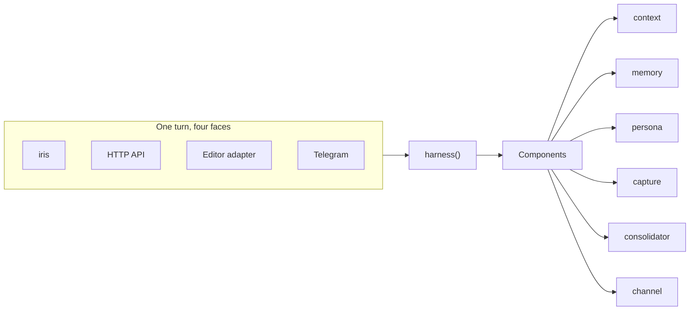
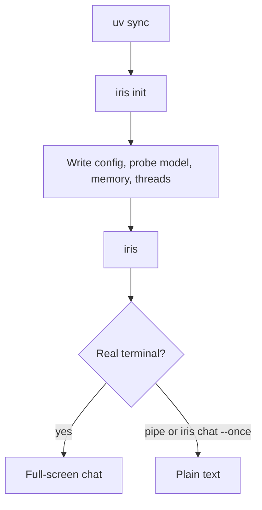
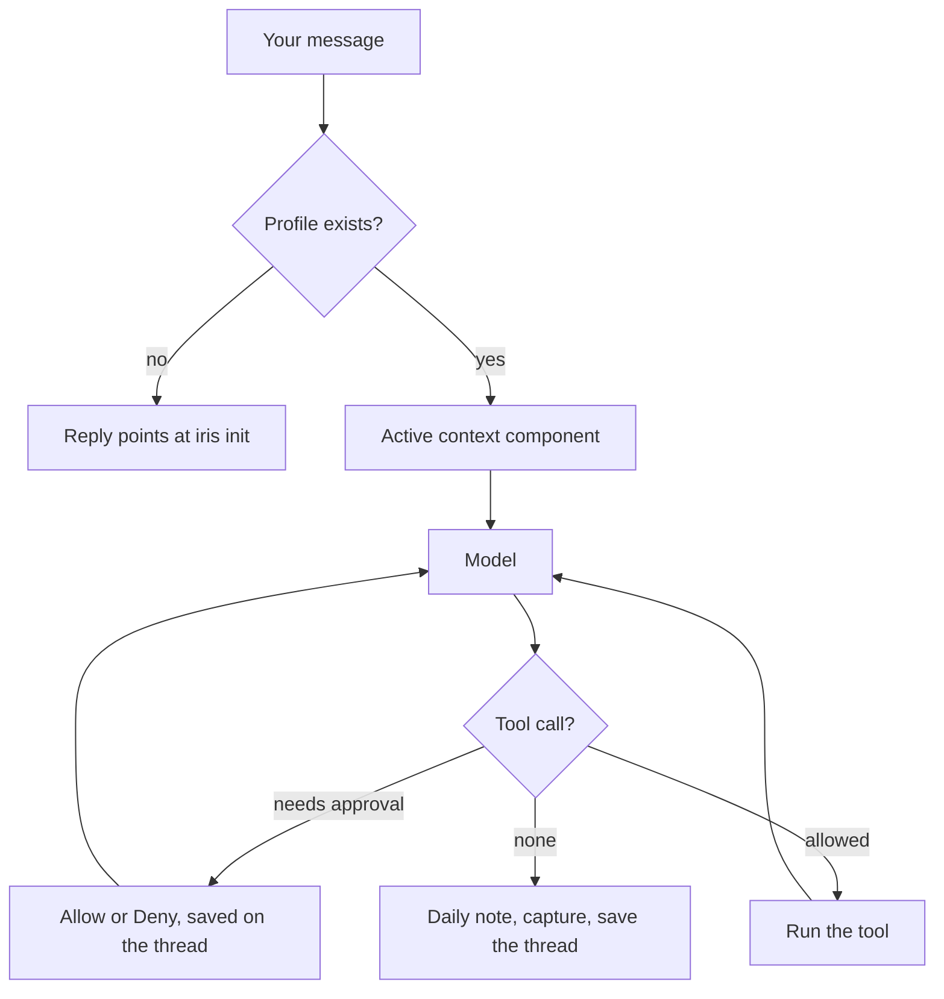

# Iris

**Swap how an agent thinks, remembers, speaks, and listens without forking the runtime.**
The kernel keeps approvals, policy, budgets, and the trace. The engine, context,
memory, persona, capture, consolidator, and channel are components: a folder, a
package, or one line in `config/harness.toml`. You can write one, or ask Iris to
write it, and it loads only at the digest you approved.

On the shipped stale-fact suite, the default context scores `stale_as_current=1.00`
and `temporal-rag` scores `0.00` (`uv run iris eval context`). Both still recall
the current fact. The command is the measurement.

| component | suite | metric | default | catalog | command |
|---|---|---|---|---|---|
| temporal-rag | context/temporal-recall | stale_as_current | 1.00 | 0.00 | `uv run iris eval context --component temporal-rag` |
| evidence-memory | memory/supersession | stale_at_5 | 1.00 | 0.00 | `uv run iris eval memory --component evidence-memory` |
| decision-only | capture/decision-signal | f1 | 0.25 | 1.00 | `uv run iris eval capture --component decision-only` |
| conflict-resolver | consolidator/conflicts | silent_overwrite | 1.00 | 0.00 | `uv run iris eval consolidator --component conflict-resolver` |
| strict-reviewer | persona/format | format_compliance | 0.00 | 1.00 | `uv run iris eval persona --component strict-reviewer` |

The paired interval on each of those rows excludes zero. `iris components simulate <kind> <name>` prints it. `iris evolve` archives a run and does not activate anything.

```bash
uv sync
uv run iris init
uv run iris
```

`iris init` walks provider, key, model, memory, and a short profile with the
arrow keys, checks the key with one live call, then writes `.env` and
`config/harness.toml` and measures the result. `iris` opens the chat. On a pipe, or with `--once`, the
same turn loop prints plain text.

Install a global `iris` from this repository:

```bash
uv tool install git+https://github.com/omhome16/Iris
```

Skip the questions with flags. The key is written to `.env` with mode `0600`
and is never printed:

```bash
uv run iris init --provider groq --model openai/gpt-oss-120b --api-key-env GROQ_API_KEY
uv run iris init --yes          # blank profile, what CI runs
uv run iris init --offline      # skip the live probes
```


SQLite is the memory and the thread store. Postgres, the HTTP API, MCP, the
scheduler, and the judge SDK are extras: `uv sync --extra all`.

The map of a session is [docs/architecture.md](docs/architecture.md).
The swap recipe is [docs/harness.md](docs/harness.md).
Component folders are [docs/components.md](docs/components.md).

## Plug and play


```mermaid
flowchart LR
  subgraph faces ["One turn, four faces"]
    cli["iris"]
    api["HTTP API"]
    acp["Editor adapter"]
    tg["Telegram"]
  end
  faces --> harness["harness()"]
  harness --> parts["Components"]
  parts --> context["context"]
  parts --> memory["memory"]
  parts --> persona["persona"]
  parts --> capture["capture"]
  parts --> consolidator["consolidator"]
  parts --> channel["channel"]
```

A name in `iris components list` is a name that loads. A component that fails
to import does not stop Iris. The previous choice, or the built-in, is used,
and `iris doctor` names the fix.

| Kind | Built in | What it does |
|---|---|---|
| context | `default`, `recall-first`, `minimal` | What the model sees before it answers |
| memory | `sqlite`, `markdown`, `pgvector` | Where notes are indexed |
| persona | `blank`, `file`, `assistant`, `coder`, `researcher`, `tutor` | The voice in the system prompt |
| capture | `default`, `off` | Facts kept from a finished turn |
| consolidator | `dreaming`, `off` | Promotion into `MEMORY.md` |
| channel | registered transports (`telegram`) | Where a message is delivered. `terminal` and `http` are faces: `iris serve` |

`default` context reads `MEMORY.md` and `USER.md` and does not search the index.
The model recalls with `memory_search`. `recall-first` searches every turn and
puts the hits in front. `minimal` loads no memory. `blank` persona adds no
voice. `file` reads `workspace/PERSONA.md`.

```toml
# config/harness.toml
llm_provider = "groq"
groq_strong_model = "openai/gpt-oss-120b"

[components]
context = "recall-first"
persona = "researcher"
capture = "default"
consolidator = "dreaming"
```

Switch from the terminal, then apply it:

```bash
uv run iris components list
uv run iris components use context recall-first
```

In chat, `/reload` re-reads the config and re-attaches components. `/components`
lists the same options.


### A component you own

Three places a part can come from:

1. **Built in**, shipped with Iris. `iris components eject context recall-first` copies it to `components/context/recall-first-local/` so you can edit it. Check and select `recall-first-local`, not `recall-first`.
2. **A local folder** next to `config/`, imported by file path. Iris finds that folder by walking up from the working directory to the harness file, so the command does not have to be run from the project root.
3. **A class path**, `pkg.module:Class`, from your own package.

```text
components/context/graph-rag/
  component.toml
  component.py
  test_component.py
```

```toml
# component.toml
kind = "context"
name = "graph-rag"
entry = "component:GraphRag"
description = "Put a graph walk in front of the prompt."
```

```bash
uv run iris new context graph-rag
uv run iris components check context graph-rag
uv run iris components use context graph-rag
```

`check` runs the contract import and `test_component.py` (when that file exists)
in a separate process. That process does not inherit API keys and cannot write
outside the component folder. `use` writes the choice into `config/harness.toml`
and remembers it in `components.lock`. `iris components rollback context` returns
to the previous choice. A local component that fails its first few calls rolls
back on its own. A component that cannot load does not stop boot: Iris uses the
built-in persona for that process and `iris doctor` names `iris components rollback`.

The constructor is `Class(ctx, **options)`. `ctx` is `iris_ai.sdk.ComponentContext`:
`llm`, `memory`, `files`, and `options`.

| Kind | Method |
|---|---|
| context | `async def assemble_turn(self, user_message, *, session_id) -> tuple[str, list[str]]` |
| memory | `async def search(self, query, **kwargs)`, plus `connect` and `close` |
| persona | `def text(self) -> str` |
| capture | `async def maybe_capture(self, *, user_message, reply, known_context) -> str` |
| consolidator | `async def sleep(self)` |

### Ask Iris to add one

Say "implement this context technique in yourself." Iris writes into
`components/.staging`, checks the code in a separate process, and calls
`component_activate` only after showing you the result. Activation and rollback
wait for your approval, pinned to the digest of the staged files (or to the
rollback target). Iris does not edit its own package, so an upgrade does not
collide with a part you or Iris added. Then type `/reload`.

Components run in-process after you approve them. The check runs in a child
process that does not inherit API keys. On Linux that child is held by Landlock
(write and create only inside the component folder, execute denied) and a
seccomp filter that rejects `execve` and new sockets, plus a network namespace
when `unshare` can make one. `ctypes`/`cffi` imports are refused as well. That
stops a staged component from running a shell (including `ctypes.CDLL(None).system`),
changing timestamps outside its folder, or resolving DNS. It does not contain
the component after you approve it, and it is not a defence against a kernel
bug. Where Landlock is unavailable the check detail says `isolation=audit`:
the import ban and the audit hook are the whole guarantee. Agent and untrusted
turns cannot stage or check a component; only an owner turn can, and activation
still waits for your approval. Read a component before you activate it.
The skill Iris follows is [`skills/component-author/SKILL.md`](skills/component-author/SKILL.md).

## Use it as a library

The library is the product. The CLI, the HTTP API, and the editor adapter are
clients of one `harness()`.

```python
import asyncio
import os

import iris_ai


async def main() -> None:
    async with iris_ai.harness(
        provider="groq",
        model="openai/gpt-oss-120b",
        api_key=os.environ["GROQ_API_KEY"],
    ) as iris:
        print(await iris.respond("Say hello in one sentence."))


asyncio.run(main())
```

`provider`, `model`, `api_key`, and `memory` win over `.env` and
`config/harness.toml`. The same call is in
[`examples/quickstart.py`](examples/quickstart.py).

## A session


```mermaid
flowchart TD
  sync["uv sync"] --> init["iris init"]
  init --> measure["Write config, probe model, memory, threads"]
  measure --> chat["iris"]
  chat --> tty{"Real terminal?"}
  tty -->|yes| tui["Full-screen chat"]
  tty -->|pipe or iris chat --once| plain["Plain text"]
```

`iris config` reopens setup. `iris config model` starts at the model step.
Sections are `provider`, `key`, `model`, `embeddings`, `parts`, `mcp`, and
`profile`. Re-running init keeps a file you already edited.
`--force` replaces `.env` and the manifest.

## One message


```mermaid
flowchart TD
  msg["Your message"] --> profile{"Profile exists?"}
  profile -->|no| setupReply["Reply points at iris init"]
  profile -->|yes| assemble["Active context component"]
  assemble --> agent["Model"]
  agent --> tools{"Tool call?"}
  tools -->|needs approval| pause["Allow or Deny, saved on the thread"]
  pause --> agent
  tools -->|allowed| run["Run the tool"]
  run --> agent
  tools -->|none| save["Daily note, capture, save the thread"]
```

A tool result with `"ok": false` is a failure, and the model is told not to
claim the write succeeded. `/dream` runs consolidation. There is no
`iris dream` command.

In chat: `/reload` and `/components` for parts, `/model` and `/provider` for
the model, `/team` and `/parallel` for roles, `/mcp` for servers, `/help` for
the rest.

## The CLI

`iris` on a terminal opens the chat. `iris --help` is the command list, read
from the registry, so a command that exists is a command that is listed.


| | |
|---|---|
| **Start** | `init` · `chat` · `serve` · `config` · `doctor` · `version` |
| **Configure** | `secrets` · `mcp` · `models` · `components` · `policy` · `new` |
| **Inspect** | `tools` · `plugins` · `guards` · `costs` · `agents` · `skills` · `cron` |
| **Maintain** | `migrate` |

`serve` starts a face: `terminal`, `telegram`, or `http`. Inspection commands
read declarations and files, so `iris policy`, `iris tools`, and `iris guards`
answer with no engine running.

`iris doctor` uses one vocabulary everywhere: `+ ok`, `! warn`, `x fail`, and
`~` for an optional extra. `iris doctor --fix` copies `.env.example` to `.env`
when `.env` is missing. Secret values are never printed. Key names are.

Colour is not the only carrier of meaning. Pipe a command and the styling
drops. The exit code and the words stay.

## Configuration

```text
defaults  <  .env  <  config/harness.toml  <  real environment  <  library or CLI override
```

`.env` holds secrets. `config/harness.toml` is the committable manifest.
`.mcp.json` declares MCP servers, with `${VAR}` resolved through the secret
store. `HARNESS_CONFIG=examples/assistant/harness.toml` selects another
manifest, which is how [`examples/assistant/`](examples/assistant/README.md) works.

| File | Holds |
|---|---|
| `workspace/USER.md` | Profile from setup |
| `workspace/MEMORY.md` | Facts consolidation promoted |
| `workspace/memory/YYYY-MM-DD.md` | Daily note |
| `workspace/PERSONA.md` | Optional voice, when persona is `file` |
| `workspace/sandbox/` | The only place file tools may write |
| `workspace/logs/iris.log` | Provider failover and harness logs |
| `components/<kind>/<name>/` | A local component |
| `components.lock` | The last choice, so rollback has somewhere to return |

## Extras

The core install is the chat, SQLite memory, and the CLI.

| Extra | What it adds |
|---|---|
| `postgres` | pgvector memory and shared threads |
| `api` | `iris serve http` (loopback by default; a public bind needs `IRIS_API_TOKEN` or `--insecure`) |
| `mcp` | MCP servers and the Telegram channel |
| `schedule` | nightly consolidation and reminders |
| `judge` | typed probability judgments |
| `secrets` | the OS keychain |
| `acp` | the editor adapter, `iris-acp` |
| `otel` | OTLP traces |
| `all` | every extra above |

```bash
uv sync --extra mcp
uv sync --extra all
```

## Docs

| | |
|---|---|
| [docs/architecture.md](docs/architecture.md) | a session, one message, the faces, the files |
| [docs/harness.md](docs/harness.md) | how to swap a part |
| [docs/components.md](docs/components.md) | folders, checks, approval, rollback |
| [DOCS.md](DOCS.md) | the manual: install, commands, settings, memory, safety |
| [CHANGELOG.md](CHANGELOG.md) | what changed, per phase |
| [CONTRIBUTING.md](CONTRIBUTING.md) | setup, the gates, the house rules |
| [examples/assistant/](examples/assistant/README.md) | a reference profile: persona, workspace, channel |
| [examples/quickstart.py](examples/quickstart.py) | ten lines, one reply |
| [skills/component-author/SKILL.md](skills/component-author/SKILL.md) | the procedure Iris follows when you ask it to add a part |

## Requirements

| | |
|---|---|
| Python | 3.12 or 3.13 |
| A provider key | optional to start. Without one, use Ollama, or stay on keyword recall |
| Postgres | optional. SQLite is the default. pgvector is the scale-up |
| Docker | optional. Postgres, the full API stack, or the container script sandbox |

Version **0.3.0**. The turn loop lives in `iris_ai.kernel`. CI runs the suite
on Ubuntu, including Postgres, and the no-database path on Windows.
MIT licensed.
