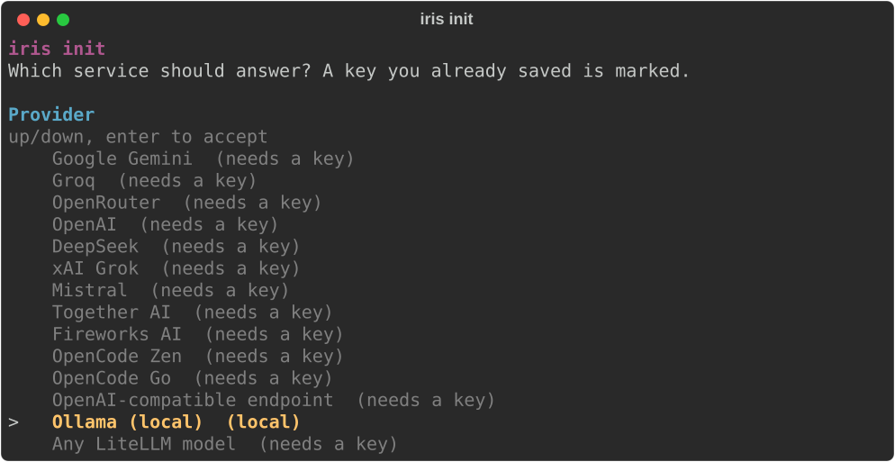
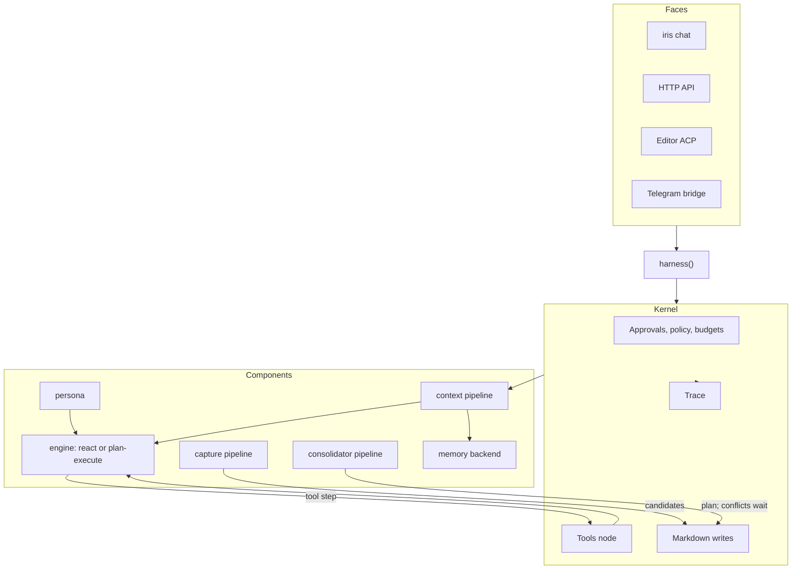
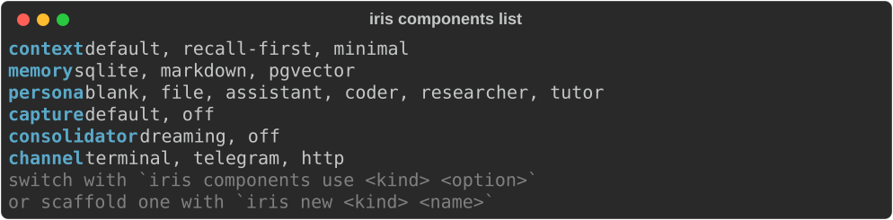
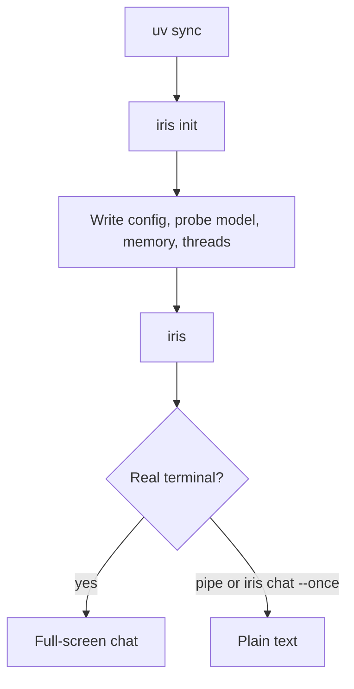
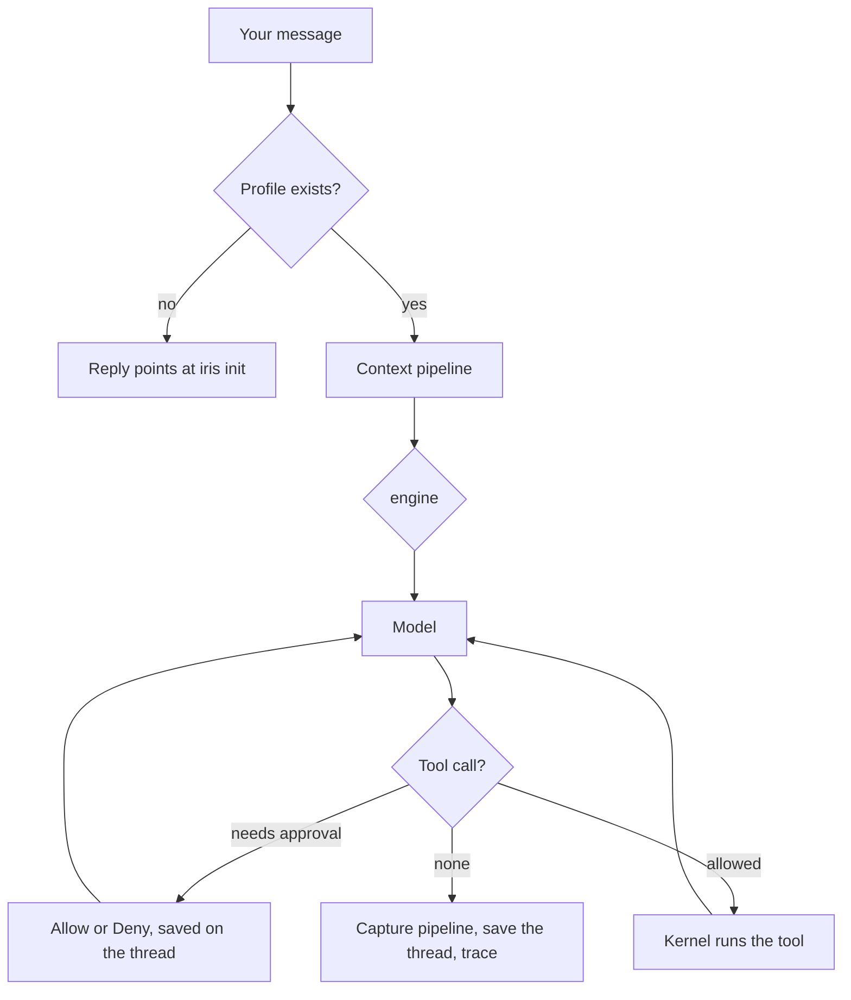
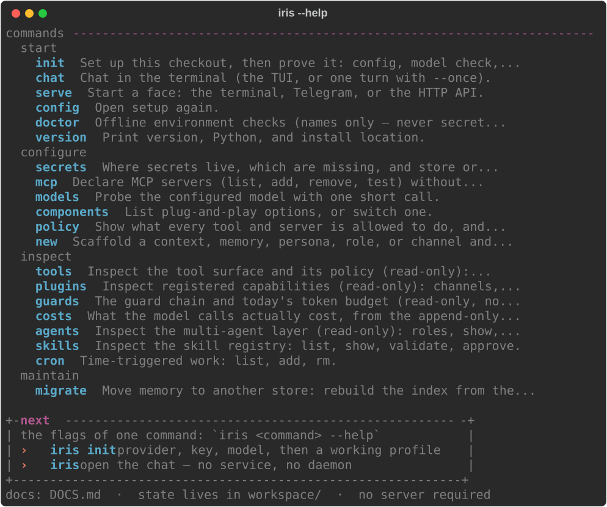

# Iris

**Swap how an agent thinks, remembers, speaks, and listens without forking the runtime.**
The kernel keeps approvals, policy, budgets, durability, and the trace. The engine,
context, memory, persona, capture, consolidator, and channel are components: a
folder, a package, or one line in `config/harness.toml`. A component loads only
at the digest you approved.

On the shipped stale-fact suite, the default context scores `stale_as_current=1.00`
and `temporal-rag` scores `0.00` (`uv run iris eval context`). Both still recall
the current fact. The command is the measurement.

| component | suite | metric | default | catalog | command |
|---|---|---|---|---|---|
| temporal-rag | context/temporal-recall | stale_as_current | 1.00 | 0.00 | `uv run iris eval context --component temporal-rag` |
| evidence-memory | memory/supersession | stale_at_5 | 1.00 | 0.00 | `uv run iris eval memory --component evidence-memory` |
| decision-only | capture/decision-signal | f1 | 0.25 | 1.00 | `uv run iris eval capture --component decision-only` |
| conflict-resolver | consolidator/conflicts | silent_overwrite | 1.00 | 0.00 | `uv run iris eval consolidator --component conflict-resolver` |
| strict-reviewer | persona/format | format_compliance | 0.00 | 1.00 | `uv run iris eval persona --component strict-reviewer` |

The paired interval on each of those rows excludes zero. `iris components simulate <kind> <name>` prints it. `iris evolve` archives a run and does not activate anything.

```bash
uv sync
uv run iris init
uv run iris
```

`iris init` walks provider, key, model, memory, and a short profile with the
arrow keys, checks the key with one live call, then writes `.env` and
`config/harness.toml` and measures the result. `iris` opens the chat. On a pipe, or with `--once`, the
same turn loop prints plain text.

Install a global `iris` from this repository:

```bash
uv tool install git+https://github.com/omhome16/Iris
```

Skip the questions with flags. The key is written to `.env` with mode `0600`
and is never printed:

```bash
uv run iris init --provider groq --model openai/gpt-oss-120b --api-key-env GROQ_API_KEY
uv run iris init --yes          # blank profile, what CI runs
uv run iris init --offline      # skip the live probes
```



SQLite is the memory and the thread store. Postgres, the HTTP API, MCP, the
scheduler, and the judge SDK are extras: `uv sync --extra all`.

## Architecture

Faces are clients of one `harness()`. The kernel is the only place that acts:
it runs tools, pauses for approval, writes Markdown, and records the trace.
Components decide what the model sees, which loop runs, and which facts to keep.


```mermaid
flowchart TB
  subgraph faces ["Faces"]
    chat["iris chat"]
    http["HTTP API"]
    acp["Editor ACP"]
    telegram["Telegram bridge"]
  end
  faces --> harness["harness()"]
  subgraph kernel ["Kernel"]
    policy["Approvals, policy, budgets"]
    tools["Tools node"]
    writes["Markdown writes"]
    trace["Trace"]
  end
  harness --> kernel
  subgraph parts ["Components"]
    context["context pipeline"]
    engine["engine: react or plan-execute"]
    persona["persona"]
    capture["capture pipeline"]
    consolidator["consolidator pipeline"]
    memory["memory backend"]
  end
  kernel --> context
  persona --> engine
  context --> engine
  context --> memory
  engine -->|"tool step"| tools
  tools --> engine
  capture -->|"candidates"| writes
  consolidator -->|"plan; conflicts wait"| writes
  kernel --> trace
```

`react` is the default loop. `plan-execute` plans with a cheap call, acts, then
verifies. Three engine failures set the engine back to `react`.
`uv run iris eval engine --live` runs both on stub tools and prints success,
tool calls, tokens, and latency. It does not call a provider.

Context, capture, persona, and consolidator accept a comma-separated pipeline.
`budget` trims the prefix. `redact` drops a block or a capture candidate that
redaction would change. A stage that fails three times is skipped. `/explain`
and `iris trace` name the stages that ran.

Markdown is the source of truth. Capture returns candidates. A consolidator
returns a plan. The kernel writes the files. A conflict is stored, not applied,
until you resolve it with `iris memory conflicts` or `/conflicts`.

Telegram stays a bridge. `terminal` and `http` are faces: `iris serve`.
`examples/iris-discord` maps DMs and mentions onto the channel contract. It is
a separate package.

## Plug and play

A name in `iris components list` is a name that loads. A component that fails
to import does not stop Iris. The previous choice, or the built-in, is used,
and `iris doctor` names the fix.

| Kind | Built in | What it does |
|---|---|---|
| engine | `react`, `plan-execute` | The loop around the model. Both sit inside the same budgets |
| context | `default`, `recall-first`, `minimal`, `temporal-rag` | What the model sees before it answers. A comma list is a pipeline |
| memory | `sqlite`, `markdown`, `pgvector`, `evidence-memory` | Where notes are indexed |
| persona | `blank`, `file`, `assistant`, `coder`, `researcher`, `tutor`, `strict-reviewer` | The voice in the system prompt. A comma list layers voices |
| capture | `default`, `off`, `decision-only` | Candidates kept from a finished owner turn |
| consolidator | `dreaming`, `off`, `conflict-resolver` | A plan for `MEMORY.md`. Conflicts wait for you |
| channel | registered transports (`telegram`) | Where a message is delivered |

`default` context reads `MEMORY.md` and `USER.md` and does not search the index.
The model recalls with `memory_search`. `recall-first` searches every turn and
puts the hits in front. `minimal` loads no memory. `temporal-rag` prefers the
current fact over a superseded one. `blank` persona adds no voice. `file` reads
`workspace/PERSONA.md`.

```toml
# config/harness.toml
llm_provider = "groq"
groq_strong_model = "openai/gpt-oss-120b"

[components]
engine = "react"
context = "default,temporal-rag"
persona = "researcher"
capture = "decision-only"
consolidator = "dreaming,conflict-resolver"
```

Switch from the terminal, then apply it:

```bash
uv run iris components list
uv run iris components use context recall-first
uv run iris eval context --component temporal-rag
uv run iris trace
```

In chat, `/reload` re-reads the config and re-attaches components. `/components`
lists the same options. `/explain` is the same text as `iris trace`.



### A component you own

Three places a part can come from:

1. **Built in**, shipped with Iris. `iris components eject context recall-first` copies it to `components/context/recall-first-local/` so you can edit it. Check and select `recall-first-local`, not `recall-first`.
2. **A local folder** next to `config/`, imported by file path. Iris finds that folder by walking up from the working directory to the harness file, so the command does not have to be run from the project root.
3. **A class path**, `pkg.module:Class`, from your own package. An `iris_ai.components` entry point named `kind.name` is the same idea.

```text
components/context/graph-rag/
  component.toml
  component.py
  test_component.py
```

```toml
# component.toml
kind = "context"
name = "graph-rag"
api_version = "iris/v1"
entry = "component:GraphRag"
description = "Put a graph walk in front of the prompt."
```

```bash
uv run iris new context graph-rag
uv run iris components check context graph-rag
uv run iris components use context graph-rag
```

`check` runs the contract import and `test_component.py` (when that file exists)
in a separate process. That process does not inherit API keys and cannot write
outside the component folder. `use` writes the choice into `config/harness.toml`
and pins the digest in `config/components.lock`. `iris components lock check`
exits 1 when the folder and the pin disagree. `iris components rollback context`
returns to the previous choice. A local component that fails its first few calls
rolls back on its own. A component that cannot load does not stop boot.

The constructor is `Class(ctx, **options)`. `ctx` is a v1 `ComponentContext`:
the capabilities named in `permissions` (`llm`, `memory`, `files`, `state`,
`clock`). It does not carry the runtime. `ComponentContext(runtime)` raises.

| Kind | Method |
|---|---|
| context | `async def assemble(self, request) -> ContextResult` |
| memory | `async def search(self, query, **kwargs)`, plus `nearest` and `list_chunks` |
| persona | `def text(self) -> str` |
| capture | `async def extract(self, request) -> list[MemoryCandidate]` |
| consolidator | `async def propose(self, request) -> ConsolidationPlan` |

Import the types from `iris_ai.sdk`. `ContextResult.render()` is the prefix the
turn appends.

Install a folder or a git URL with `iris components add <path> --yes`. The
command prints the file count, the line count, the digest, and that the code
runs in-process with Iris's permissions, then pins it. `iris components export <kind> <name> --as-plugin DIR`
writes an Agent Plugin. `iris plugins add <dir>` copies that plugin's skills
and maps `mcp.json` with trust `review`.

### Ask Iris to add one

Say "implement this context technique in yourself." Iris writes into
`components/.staging`, checks the code in a separate process, and calls
`component_activate` only after showing you the result. Activation and rollback
wait for your approval, pinned to the digest of the staged files (or to the
rollback target). Iris does not edit its own package, so an upgrade does not
collide with a part you or Iris added. Then type `/reload`.

`iris components simulate --staged` runs that folder in the check child. The
fixture world is a directory outside the component folder. `--live` is refused
for staged code. `component_simulate` shows the offline comparison before you
activate.

Components run in-process after you approve them. The check runs in a child
process that does not inherit API keys. On Linux that child is held by Landlock
(write and create only inside the component folder, execute denied) and a
seccomp filter that rejects `execve` and new sockets, plus a network namespace
when `unshare` can make one. `ctypes`/`cffi` imports are refused as well. That
stops a staged component from running a shell (including `ctypes.CDLL(None).system`),
changing timestamps outside its folder, or resolving DNS. It does not contain
the component after you approve it, and it is not a defence against a kernel
bug. Where Landlock is unavailable the check detail says `isolation=audit`:
the import ban and the audit hook are the whole guarantee. Agent and untrusted
turns cannot stage or check a component; only an owner turn can, and activation
still waits for your approval. Read a component before you activate it.
The skill Iris follows is [`skills/component-author/SKILL.md`](skills/component-author/SKILL.md).
The shipped skill `web-page-to-notes` is the proof that a builtin resolves from
the installed wheel, not only from a checkout.

`iris evolve <kind> --suite S` writes `workspace/evolve/<run>/` with the
candidate, the search scores, and `frontier.json`. Held-out scores are written
after the loop. Nothing is activated. Where isolation is audit-only, the
command refuses unless `--allow-audit-isolation` is set. The procedure is
[`skills/harness-evolver/SKILL.md`](skills/harness-evolver/SKILL.md).

## Use it as a library

The library is the product. The CLI, the HTTP API, and the editor adapter are
clients of one `harness()`.

```python
import asyncio
import os

import iris_ai


async def main() -> None:
    async with iris_ai.harness(
        provider="groq",
        model="openai/gpt-oss-120b",
        api_key=os.environ["GROQ_API_KEY"],
    ) as iris:
        print(await iris.respond("Say hello in one sentence."))


asyncio.run(main())
```

`provider`, `model`, `api_key`, and `memory` win over `.env` and
`config/harness.toml`. The same call is in
[`examples/quickstart.py`](examples/quickstart.py).

## A session


```mermaid
flowchart TD
  sync["uv sync"] --> init["iris init"]
  init --> measure["Write config, probe model, memory, threads"]
  measure --> chat["iris"]
  chat --> tty{"Real terminal?"}
  tty -->|yes| tui["Full-screen chat"]
  tty -->|pipe or iris chat --once| plain["Plain text"]
```

`iris config` reopens setup. `iris config model` starts at the model step.
Sections are `provider`, `key`, `model`, `embeddings`, `parts`, `mcp`, and
`profile`. Re-running init keeps a file you already edited.
`--force` replaces `.env` and the manifest.

## One message


```mermaid
flowchart TD
  msg["Your message"] --> profile{"Profile exists?"}
  profile -->|no| setupReply["Reply points at iris init"]
  profile -->|yes| assemble["Context pipeline"]
  assemble --> engine{"engine"}
  engine --> agent["Model"]
  agent --> tools{"Tool call?"}
  tools -->|needs approval| pause["Allow or Deny, saved on the thread"]
  pause --> agent
  tools -->|allowed| run["Kernel runs the tool"]
  run --> agent
  tools -->|none| save["Capture pipeline, save the thread, trace"]
```

A tool result with `"ok": false` is a failure, and the model is told not to
claim the write succeeded. `/dream` runs consolidation. There is no
`iris dream` command. Capture runs only for an owner turn, and only under the
daily cap.

In chat: `/reload` and `/components` for parts, `/explain` and `/trace` for
the last turn, `/conflicts` for memory the consolidator would not overwrite,
`/model` and `/provider` for the model, `/team` and `/parallel` for roles,
`/mcp` for servers, `/help` for the rest.

## The CLI

`iris` on a terminal opens the chat. `iris --help` is the command list, read
from the registry, so a command that exists is a command that is listed.



| | |
|---|---|
| **Start** | `init` · `chat` · `serve` · `config` · `doctor` · `version` |
| **Configure** | `secrets` · `mcp` · `models` · `components` · `policy` · `new` |
| **Inspect** | `tools` · `plugins` · `guards` · `costs` · `agents` · `skills` · `cron` · `trace` · `eval` · `evolve` · `memory` |
| **Maintain** | `migrate` |

`serve` starts a face: `terminal`, `telegram`, or `http`. Inspection commands
read declarations and files, so `iris policy`, `iris tools`, and `iris guards`
answer with no engine running. `iris eval` scores the shipped suites offline.
`iris trace` explains the last turn, including the pipeline stages.

`iris doctor` uses one vocabulary everywhere: `+ ok`, `! warn`, `x fail`, and
`~` for an optional extra. `iris doctor --fix` copies `.env.example` to `.env`
when `.env` is missing. Secret values are never printed. Key names are.

Colour is not the only carrier of meaning. Pipe a command and the styling
drops. The exit code and the words stay.

## Configuration

```text
defaults  <  .env  <  config/harness.toml  <  real environment  <  library or CLI override
```

`.env` holds secrets. `config/harness.toml` is the committable manifest.
`.mcp.json` declares MCP servers, with `${VAR}` resolved through the secret
store. `HARNESS_CONFIG=examples/assistant/harness.toml` selects another
manifest, which is how [`examples/assistant/`](examples/assistant/README.md) works.

| File | Holds |
|---|---|
| `workspace/USER.md` | Profile from setup |
| `workspace/MEMORY.md` | Facts consolidation promoted |
| `workspace/memory/YYYY-MM-DD.md` | Daily note |
| `workspace/PERSONA.md` | Optional voice, when persona is `file` |
| `workspace/sandbox/` | The only place file tools may write |
| `workspace/config/traces.jsonl` | One JSON line per turn |
| `workspace/logs/iris.log` | Provider failover and harness logs |
| `components/<kind>/<name>/` | A local component |
| `config/components.lock` | The digest you approved, so a changed folder does not load |

## Extras

The core install is the chat, SQLite memory, and the CLI.

| Extra | What it adds |
|---|---|
| `postgres` | pgvector memory and shared threads |
| `api` | `iris serve http` (loopback by default; a public bind needs `IRIS_API_TOKEN` or `--insecure`) |
| `mcp` | MCP servers and the Telegram channel |
| `schedule` | nightly consolidation and reminders |
| `judge` | typed probability judgments |
| `secrets` | the OS keychain |
| `acp` | the editor adapter, `iris-acp` |
| `otel` | OTLP traces |
| `all` | every extra above |

```bash
uv sync --extra mcp
uv sync --extra all
```

## Docs

| | |
|---|---|
| [DOCS.md](DOCS.md) | the manual: install, commands, settings, memory, safety |
| [CHANGELOG.md](CHANGELOG.md) | what changed, per release |
| [docs/design/open-harness.md](docs/design/open-harness.md) | the design: taxonomy and invariants |
| [docs/design/component-isolation.md](docs/design/component-isolation.md) | the process-isolation design. It is not built |
| [CONTRIBUTING.md](CONTRIBUTING.md) | setup, the gates, the house rules |
| [examples/assistant/](examples/assistant/README.md) | a reference profile: persona, workspace, channel |
| [examples/quickstart.py](examples/quickstart.py) | ten lines, one reply |
| [skills/component-author/SKILL.md](skills/component-author/SKILL.md) | the procedure Iris follows when you ask it to add a part |
| [skills/harness-evolver/SKILL.md](skills/harness-evolver/SKILL.md) | the procedure for a measured evolve run |

## Requirements

| | |
|---|---|
| Python | 3.12 or 3.13 |
| A provider key | optional to start. Without one, use Ollama, or stay on keyword recall |
| Postgres | optional. SQLite is the default. pgvector is the scale-up |
| Docker | optional. Postgres, the full API stack, or the container script sandbox |

Version **0.6.0**. The turn loop lives in `iris_ai.kernel`. CI runs the suite
on Ubuntu, including Postgres, and the no-database path on Windows.
MIT licensed.
