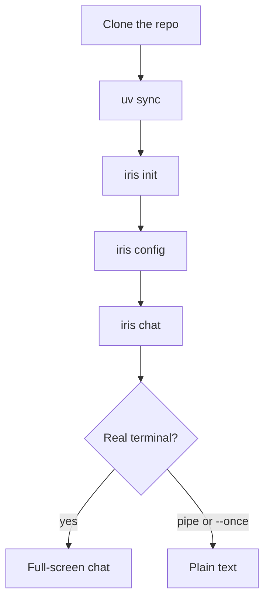
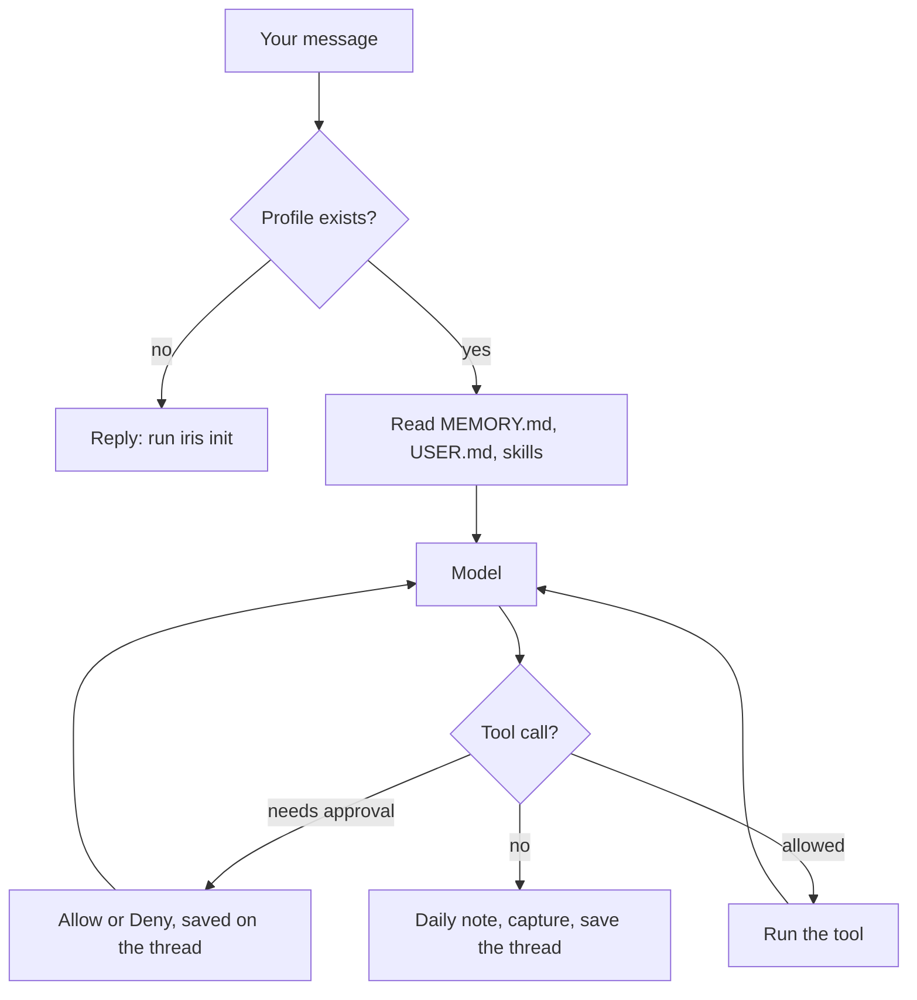
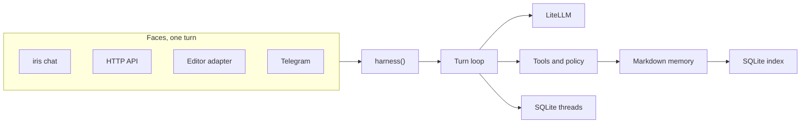

# Iris

**A neutral agent harness with a mind you can open.** The package and the `iris`
command keep that name. There is no persona until you write one. Memory is plain
Markdown, tools stop for approval before a side effect, and the CLI, the HTTP API,
and the editor adapter share one turn loop.

```bash
git clone https://github.com/omhome16/Iris.git && cd Iris
uv sync
uv run iris init        # write the config, seed a workspace, then prove it works
uv run iris config      # name, tone, timezone, persona — editable again later
uv run iris chat        # full-screen chat; --once stays plain
```

No Postgres. No Docker. No daemon. Postgres, the HTTP API, MCP, the scheduler,
and the judge SDK are extras (`uv sync --extra all`).

The map of a session and of one message is [docs/architecture.md](docs/architecture.md).
How to swap context or memory is [docs/harness.md](docs/harness.md).

## A session


```mermaid
flowchart TD
  clone["Clone the repo"] --> sync["uv sync"]
  sync --> init["iris init"]
  init --> config["iris config"]
  config --> chat["iris chat"]
  chat --> tty{"Real terminal?"}
  tty -->|yes| tui["Full-screen chat"]
  tty -->|pipe or --once| plain["Plain text"]
```

`iris init` writes the files and measures them: a cheap model call, the memory
store, and which thread store a conversation would use. `iris init --yes` writes
a blank profile and skips the screen, which is what CI uses. `iris config` is
where you set the owner, the assistant name, tone, timezone, the consolidation
hour, and the persona. Leave `workspace/PERSONA.md` empty and the assistant has
no voice of its own.

## One message


```mermaid
flowchart TD
  msg["Your message"] --> route{"Profile exists?"}
  route -->|no| setupReply["Reply: run iris init"]
  route -->|yes| assemble["Read MEMORY.md, USER.md, skills"]
  assemble --> agent["Model"]
  agent --> tools{"Tool call?"}
  tools -->|needs approval| pause["Allow or Deny, saved on the thread"]
  pause --> agent
  tools -->|allowed| run["Run the tool"]
  run --> agent
  tools -->|no| save["Daily note, capture, save the thread"]
```

Assemble does not search the index. The model recalls with `memory_search`.
A tool that returns `"ok": false` is a failure, and the model is told not to
claim the write succeeded. `/dream` in chat runs consolidation. There is no
`iris dream` command.

## How it fits together


```mermaid
flowchart LR
  subgraph faces ["Faces, one turn"]
    cli["iris chat"]
    api["HTTP API"]
    acp["Editor adapter"]
    tg["Telegram"]
  end
  faces --> harness["harness()"]
  harness --> loop["Turn loop"]
  loop --> model["LiteLLM"]
  loop --> tools["Tools and policy"]
  loop --> threads["SQLite threads"]
  tools --> memory["Markdown memory"]
  memory --> index["SQLite index"]
```

| Piece | Default | Swap |
|---|---|---|
| Context | `MEMORY.md` and `USER.md` | `[components] context = "pkg.mod:Class"` |
| Capture | Daily-note facts | `capture = "off"` or a class |
| Consolidation | Dreaming, and `/dream` | `consolidator = "off"` or a class |
| Threads | `workspace/threads.db` | `postgres` extra |
| Index | SQLite, keyword-only without an embedding key | `postgres` extra |
| Persona | Empty `PERSONA.md` | `iris config` |

```bash
uv run iris new component context
uv run iris new component memory
```

| File | Holds |
|---|---|
| `workspace/USER.md` | Profile from setup |
| `workspace/MEMORY.md` | Facts consolidation promoted |
| `workspace/memory/YYYY-MM-DD.md` | Daily note, one line per finished turn |
| `workspace/PERSONA.md` | Optional voice |
| `workspace/sandbox/` | The only place file tools may write |
| `workspace/logs/iris.log` | Provider failover and harness logs |

---

## What's in the box

- **Memory** that is plain Markdown — indexed, provenance-tagged, decaying, and
  consolidated by *dreaming* rather than on the write path
- **Judgments** as typed probabilities, not vibes: recall relevance, skill choice,
  injection screening, what to capture, and whether an answer is sufficient
- **Safety** by construction: a deterministic guard chain that refuses first,
  approvals bound to the digest of what they showed, and one gate for scripts
- **Budgets** that refuse *before* the spend, with a per-call cost ledger behind
  `iris costs`
- **Durability** from an append-only turn journal, exactly-once tool boundaries,
  and a thread store that survives a restart
- **Observability** as a trace per turn with stage timings, plus optional OTLP spans
- **Tools, hooks and MCP servers** declared once and policed per tool
- **Skills** in the Agent Skills format — validated, listed and approved from the CLI
- **Channels and schedules**, so it can reach you rather than only answer you
- **Roles** to delegate to, each with its own tier, tools and round bound
- **Four faces** — library, CLI, HTTP API, editor adapter — over one turn pipeline
- **Seams** everywhere: a model, store, judge, channel or secret backend is swapped
  by configuration, never by a fork

## Why it is different

Most agent frameworks give you a loop and a prompt. Iris is opinionated about the
four things that actually decide whether an assistant is useful a month later:

| | |
|---|---|
| **Memory you can read** | `MEMORY.md`, `USER.md` and daily notes are the source of truth. The index is derived and rebuildable, so nothing you care about lives only in a database. Four tiers, four provenance levels, decay, diversity, and consolidation by *dreaming* rather than by the write path |
| **Judgment, not vibes** | Every decision that is a *question over supplied text* — recall relevance, skill choice, injection screening, capture, answer sufficiency — is a typed probability from a System One model, with a deterministic fallback and a latency budget. Code owns every threshold |
| **Safe by construction** | A deterministic guard chain refuses before dispatch, approvals are bound to the digest of what they showed, untrusted content is screened, and a skill's script runs in a constructed environment through one gate |
| **Durable and observable** | An append-only turn journal gives exactly-once tool boundaries and approvals that survive a restart. Every turn leaves a trace with stage timings; every model call leaves a cost ledger |

And it is a **harness**: models, memory, judges, channels, tools, hooks and secret
stores are all Protocols behind registries, so a new integration is configuration
rather than a fork. SQLite is the default because a harness that needs a database
before it will say hello is not a five-minute harness.

Everything above the library is a client. The library is the product. A face
does not reach past the turn, and the turn does not know which store it is
talking to, so a guard bug cannot be fixed only in the CLI.

## What `iris init` actually proves

It writes `.env` and `config/harness.toml`, seeds a neutral `workspace/`, and then
**measures** the result rather than assuming it: one no-op completion on the cheap
tier (a provider key that works, with its latency), the configured memory store
opened and counted, and the real thread store walked so the report says which
tier a conversation would land in. Recall is reported honestly — with no embedding
provider it says **keyword-only** and names both fixes instead of printing a green
tick.

`iris init` itself does not ask questions. The profile screen is `iris config`.
Re-running init reports `kept (already exists)` rather than overwriting a file
you edited. `--force` replaces `.env` and the manifest.

## The CLI

Run `iris` with no arguments for the start screen; the help is generated from the
command registry, so it can never list a command that does not exist.

| | |
|---|---|
| **Start** | `init` · `chat` · `config` · `doctor` · `version` |
| **Configure** | `secrets` · `mcp` · `policy` · `new` |
| **Inspect** | `tools` · `plugins` · `guards` · `costs` · `agents` · `skills` · `cron` |
| **Maintain** | `migrate` |

Inspection commands work with **no engine running** — they read declarations and
files, so `iris policy`, `iris tools` and `iris guards` answer questions on a
machine where nothing is up.

## What it looks like

`iris` with no arguments is the start screen: the mark, the tagline, and a command
list read out of the registry, so it cannot advertise a command that does not exist.

```console
$ iris
                          .:-==++****##****++==-:.
                 .-=*#%%%#*+==--::::....::::--==+*#%%%#*=-.
            :+#%%*+-:.                                .:-+*%%#+:
        -*%#+-.                                              .-+#%*-
    .+%#=.                                                        .=#%+.
  =%*:                          .-*@@@@@@*-.                          :*%=
-%=                            =@@+=:..:=+@@=                            =%-
+                            .%@===+=::-=-:-@#.                            +
                            :#@%##*+=..:...:-@*
                            :%@===-:    :-===@%:
                             *@-:...:  :...:-@*
+                            .#@-:-=-..-=-:-@#.                            +
-%=                            =@@+=:..:=+@@=                            =%-
  =%*:                          .-*@@@@@@*-.                          :*%=
    .+%#=.                                                        .=#%+.
        -*%#+-.                                              .-+#%*-
            :+#%%*+-:.                                .:-+*%%#+:
                 .-=*#%%%#*+==--::::....::::--==+*#%%%#*=-.
                          .:-==++****##****++==-:.
  iris 0.3.0
  memory · judgment · agents — one library, one kernel, four faces
commands ———————————————————————————————————————————————————————————————————————
  start
    init  Set up this checkout, then prove it: config, model check,...
    chat  Chat with Iris in the terminal (streaming; same pipeline...
    doctor  Offline environment checks (names only — never secret...
    version  Print version, Python, and install location.
  configure
    secrets  Where secrets live, which are missing, and store or...
    mcp  Declare MCP servers (list, add, remove, test) without...
    policy  Show what every tool and server is allowed to do, and...
  inspect
    tools  Inspect the tool surface and its policy (read-only):...
    plugins  Inspect registered capabilities (read-only): channels,...
    guards  The guard chain and today's token budget (read-only, no...
    costs  What the model calls actually cost, from the append-only...
    agents  Inspect the multi-agent layer (read-only): roles, show,...
    skills  Inspect the skill registry: list, show, validate, approve.
    cron  Time-triggered work: list, add, rm.
  maintain
    migrate  Move memory to another store: rebuild the index from the...

┌─ next ─────────────────────────────────────────────┐
│ the flags of one command: `iris <command> --help`  │
│   › iris init  set up this checkout, then prove it │
│   › iris chat  talk to it — no service, no daemon  │
└────────────────────────────────────────────────────┘
  docs: DOCS.md  ·  state lives in workspace/  ·  no server required
```

Every inspector has the same shape: a titled panel that says what the command *is*
before it says what it found, quiet tables with no vertical rules, and one
vocabulary for a result — `+ ok`, `! warn`, `x fail` — so a finding reads the same
in `iris doctor`, `iris init` and `iris guards`.

```console
$ iris policy
┌──────────────────────────────────────────────────────────────────────────────┐
│  Policy                                                                      │
│  what every tool and server is allowed to do, and where each decision came   │
│  from                                                                        │
└──────────────────────────────────────────────────────────────────────────────┘
Capability classes —————————————————————————————————————————————————————————————

 class          default   override   tools
 ─────────────────────────────────────────
 read           allow     -          9
 filesystem     allow     -          2
 memory_write   allow     -          9
 network        allow     -          2
 credentialed   ask       -          0
 delivery       allow     -          2
 control        ask       -          1
 external       ask       -          0


  precedence: class default < a tool's own source (an MCP server's trust) < a
class override < a per-tool override. `deny` wins outright at every level, so an
override can tighten and never loosen.
Overrides ——————————————————————————————————————————————————————————————————————
  no overrides set (TOOL_POLICY_OVERRIDES is empty)
  No MCP servers declared in .mcp.json (see config/mcp.json.example).
```

Colour is never the only carrier of meaning, and it is never drawn where nobody is
looking. Redirect the same command and it drops the styling and falls back to ASCII
frames, because a Windows console and a CI log are destinations too — the exit code
and the words do not change:

```console
$ iris policy > policy.txt
+-----------------------------------------------------------------------------+
|  Policy                                                                     |
|  what every tool and server is allowed to do, and where each decision came  |
|  from                                                                       |
+-----------------------------------------------------------------------------+
Capability classes ------------------------------------------------------------
+-----------------------------------------+
|class        | default | override | tools|
|-------------+---------+----------+------|
|read         | allow   | -        | 9    |
|filesystem   | allow   | -        | 2    |
|memory_write | allow   | -        | 9    |
|network      | allow   | -        | 2    |
|credentialed | ask     | -        | 0    |
|delivery     | allow   | -        | 2    |
|control      | ask     | -        | 1    |
|external     | ask     | -        | 0    |
+-----------------------------------------+

  precedence: class default < a tool's own source (an MCP server's trust) < a
class override < a per-tool override. `deny` wins outright at every level, so
an override can tighten and never loosen.
Overrides ---------------------------------------------------------------------
  no overrides set (TOOL_POLICY_OVERRIDES is empty)
  No MCP servers declared in .mcp.json (see config/mcp.json.example).
```

## Configuration, in one breath

```
defaults  <  .env  <  config/harness.toml  <  real environment  <  CLI flag
```

`.env` holds secrets and machine-local overrides; `config/harness.toml` is the
committable manifest (channels, capability backends, ordinary settings); `.mcp.json`
declares external MCP servers, with `${VAR}` resolved through the secret store so a
token never sits in a committable file. A profile can ship its own manifest and be
selected with `HARNESS_CONFIG=…`, which is how `examples/assistant/` works.

## Docs

| | |
|---|---|
| **[`docs/architecture.md`](docs/architecture.md)** | the map: a session, one message, the faces, the files |
| **[`docs/harness.md`](docs/harness.md)** | how to swap context, capture, and consolidation |
| **[`DOCS.md`](DOCS.md)** | the manual: install, commands, settings, memory, safety, interfaces, testing |
| [`CHANGELOG.md`](CHANGELOG.md) | what changed, per phase, with the numbers and the method that produced them |
| [`CONTRIBUTING.md`](CONTRIBUTING.md) | setup, the gates to run, and the house rules |
| [`examples/assistant/`](examples/assistant/README.md) | a reference profile: a persona, a workspace and a channel, with no core edits |
| [`workspace/AGENTS.md`](workspace/AGENTS.md) | the neutral operating contract a fresh workspace starts from |
| [`skills/web-page-to-notes/`](skills/web-page-to-notes/SKILL.md) | the builtin skill that proves the Agent Skills format: a stdlib-only script, no network, no environment reads |

New here? Read [`DOCS.md` §1](DOCS.md#1-what-iris-is) and
[§2](DOCS.md#2-install-and-first-run). Changing something? Go straight to
[§18.3](DOCS.md#183-where-to-start-reading).

## Requirements

| | |
|---|---|
| Python | 3.12 or 3.13 |
| A provider key | **optional to start** — without one, recall is keyword-only and model calls degrade |
| Postgres | **not needed** (SQLite is the default; pgvector is the scale-up option) |
| Docker | **not needed** (only for Postgres, the full API + bridge stack, or the `container` script sandbox) |
| Optional extras | `postgres`, `api`, `mcp`, `schedule`, `judge`, `acp`, `otel`, or `all`. A missing extra names itself instead of failing boot |

```bash
pip install iris-personal-ai                 # chat, SQLite, CLI
pip install "iris-personal-ai[all]"          # every extra
pip install "iris-personal-ai[postgres,api]" # one or more, by name
```

## Status

Version **0.3.0**. The turn loop lives in `iris_ai.kernel`.
**1143 tests passed**, 1 skipped, `ruff` clean, on this tree. The two
pgvector-backed files run when Postgres is up and are part of that count in CI.
The wheel installs into a clean venv and the CLI runs with no daemon.

Still outside this release: native provider SDK backends (LiteLLM is the
router), an MCP *server* mode, and `sqlite-vec` as the vector extension.

MIT licensed.
