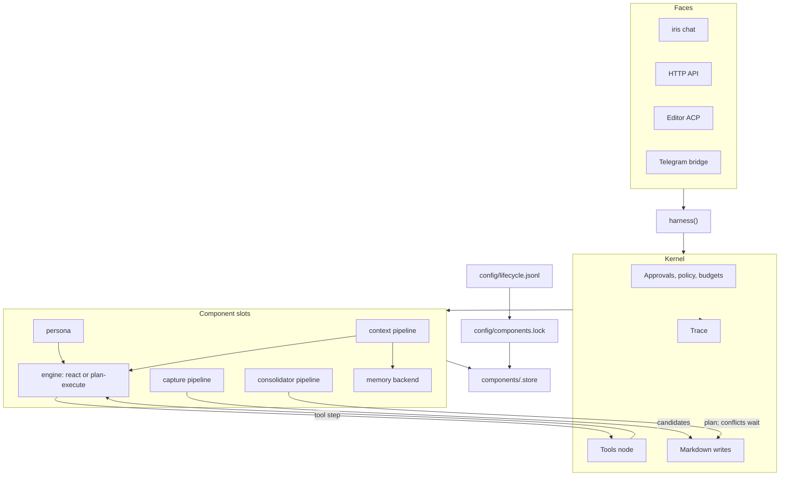
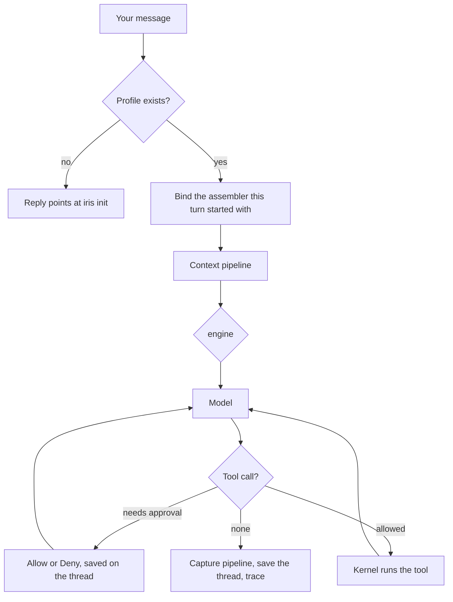
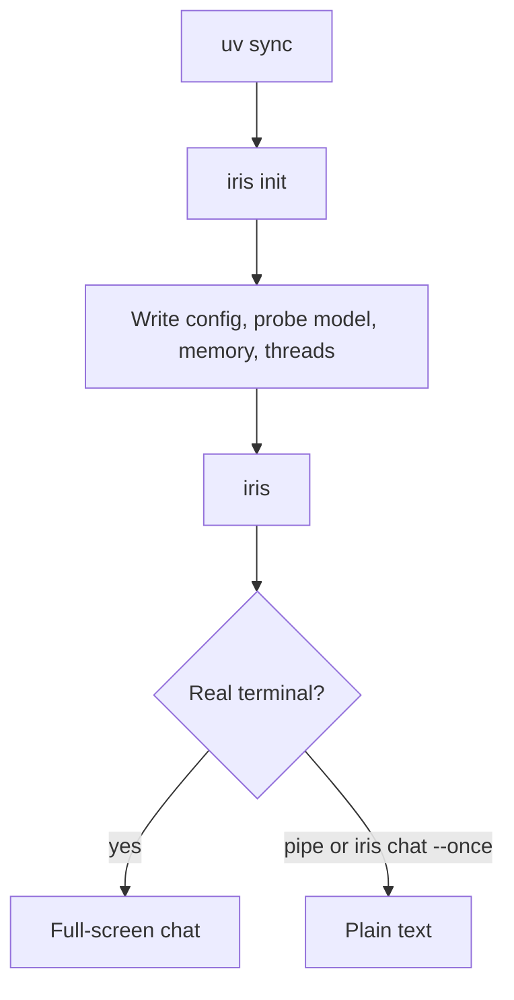

# Iris

**Swap how an agent thinks, remembers, speaks, and listens without forking the runtime.**

The kernel keeps approvals, policy, budgets, durability, and the trace. The engine, context, memory, persona, capture, consolidator, and channel are components: a folder, a package, or one line in `config/harness.toml`. A component loads at the digest you approved. Editing the working folder does not change what is running.

On the shipped stale-fact suite, the default context scores `stale_as_current=1.00` and `temporal-rag` scores `0.00` (`uv run iris eval context`). Both still recall the current fact. The command is the measurement.

| component | suite | metric | default | catalog | command |
|---|---|---|---|---|---|
| temporal-rag | context/temporal-recall | stale_as_current | 1.00 | 0.00 | `uv run iris eval context --component temporal-rag` |
| evidence-memory | memory/supersession | stale_at_5 | 1.00 | 0.00 | `uv run iris eval memory --component evidence-memory` |
| decision-only | capture/decision-signal | f1 | 0.25 | 1.00 | `uv run iris eval capture --component decision-only` |
| conflict-resolver | consolidator/conflicts | silent_overwrite | 1.00 | 0.00 | `uv run iris eval consolidator --component conflict-resolver` |
| strict-reviewer | persona/format | format_compliance | 0.00 | 1.00 | `uv run iris eval persona --component strict-reviewer` |

The paired interval on each of those rows excludes zero. `iris components simulate <kind> <name>` prints it. `iris evolve` archives a run and does not activate anything.

```bash
uv sync
uv run iris init
uv run iris
```

`iris init` walks provider, key, model, memory, and a short profile with the arrow keys, checks the key with one live call, then writes `.env` and `config/harness.toml` and measures the result. `iris` opens the chat. On a pipe, or with `--once`, the same turn loop prints plain text.

Install a global `iris` from this repository:

```bash
uv tool install git+https://github.com/omhome16/Iris
```

Skip the questions with flags. The key is written to `.env` with mode `0600` and is never printed:

```bash
uv run iris init --provider groq --model openai/gpt-oss-120b --api-key-env GROQ_API_KEY
uv run iris init --yes          # blank profile, what CI runs
uv run iris init --offline      # skip the live probes
```


SQLite is the memory and the thread store. Postgres, the HTTP API, MCP, the scheduler, and the judge SDK are extras: `uv sync --extra all`.

## Why it is plug and play

An agent harness has two kinds of code.

The first kind has to stay trustworthy while the process is answering you. Approvals, the pause that waits for Allow or Deny, tool policy, budgets, the Markdown write, and the trace live in the kernel. Iris does not edit those files in order to try a new idea. `iris core propose` writes a git worktree and a `PROPOSAL.md`. It does not apply the change, and it does not edit `approval.py`, the pause path, the lifecycle, the isolation host, or the artifact store.

The second kind is behavior you should be able to replace: what the model sees, which loop runs, whose voice is in the prompt, which facts are kept, where the index lives, and where a message is delivered. Those are components. They sit in named slots. A slot is a built-in name, a local folder, or a class path. Switching a slot is a config change plus a reload, so an experiment is a component you can measure, pin, and roll back.

That split is the plug-and-play claim:

- **A name that loads.** `iris components list` is the catalog. A component that fails to import does not stop boot. The previous choice, or the built-in, is used, and `iris doctor` names the fix.
- **Bytes you approved.** Activation copies the canonical files into `components/.store/sha256-<digest>/` and pins that digest in `config/components.lock`. The working folder stays editable. Loading uses the store copy while the pin still verifies.
- **One door.** `iris components use`, activation, rollback, and `/reload` go through the lifecycle control path. The journal is `config/lifecycle.jsonl`.
- **A measured swap.** `iris eval` and `iris components simulate` score a candidate before it becomes the selection. `iris evolve` archives a run and activates nothing.
- **A way back.** `/reload` swaps the live generation. A turn keeps the assembler it started with, so a reload mid-turn does not change the prefix already in flight. A new pin is on probation: one failure during the first three successful calls rolls the kind back. After that window, three failures do.

The ABI for a component is `iris/v1`. The constructor is `Class(ctx, **options)`. `ctx` carries the capabilities named in `permissions`, and the clock. It does not carry the runtime. `ComponentContext(runtime)` raises.

## Architecture

Faces are clients of one `harness()`. The kernel is the only place that acts: it runs tools, pauses for approval, writes Markdown, and records the trace. Components decide what the model sees, which loop runs, and which facts to keep.


```mermaid
flowchart TB
  subgraph faces ["Faces"]
    chat["iris chat"]
    http["HTTP API"]
    acp["Editor ACP"]
    telegram["Telegram bridge"]
  end
  faces --> harness["harness()"]
  subgraph kernel ["Kernel"]
    policy["Approvals, policy, budgets"]
    tools["Tools node"]
    writes["Markdown writes"]
    trace["Trace"]
  end
  harness --> kernel
  subgraph parts ["Component slots"]
    context["context pipeline"]
    engine["engine: react or plan-execute"]
    persona["persona"]
    capture["capture pipeline"]
    consolidator["consolidator pipeline"]
    memory["memory backend"]
  end
  kernel --> parts
  persona --> engine
  context --> engine
  context --> memory
  engine -->|"tool step"| tools
  tools --> engine
  capture -->|"candidates"| writes
  consolidator -->|"plan; conflicts wait"| writes
  kernel --> trace
  parts --> store["components/.store"]
  lock["config/components.lock"] --> store
  journal["config/lifecycle.jsonl"] --> lock
```

`react` is the default loop. `plan-execute` plans with a cheap call, acts, then verifies. Three engine failures set the engine back to `react`. The model call stays in the chat graph. `uv run iris eval engine --live` runs both on stub tools and prints success, tool calls, tokens, and latency. It does not call a provider.

Context, capture, persona, and consolidator accept a comma-separated pipeline. `budget` trims the prefix. `redact` drops a block or a capture candidate that redaction would change. A stage that fails three times is skipped. `/explain` and `iris trace` name the stages that ran.

Markdown is the source of truth. Capture returns candidates. A consolidator returns a plan. The kernel writes the files. A conflict is stored, not applied, until you resolve it with `iris memory conflicts` or `/conflicts`. Changing the memory backend is a rebuild from that Markdown: `iris migrate --to sqlite`. The index is a derivative. It is not copied.

Telegram stays a bridge. `terminal` and `http` are faces: `iris serve`. `examples/iris-discord` maps DMs and mentions onto the channel contract. It is a separate package.

| Stays in the kernel | Is a component |
|---|---|
| Approval cards and the pause | Engine loop (`react`, `plan-execute`) |
| Tool policy and budgets | Context prefix |
| Markdown writes and the thread | Persona voice |
| The trace and the cost ledger | Capture and consolidation |
| The artifact store and the lock | Memory index, channel |

## What happens on a turn


```mermaid
flowchart TD
  msg["Your message"] --> profile{"Profile exists?"}
  profile -->|no| setupReply["Reply points at iris init"]
  profile -->|yes| pin["Bind the assembler this turn started with"]
  pin --> assemble["Context pipeline"]
  assemble --> engine{"engine"}
  engine --> agent["Model"]
  agent --> tools{"Tool call?"}
  tools -->|needs approval| pause["Allow or Deny, saved on the thread"]
  pause --> agent
  tools -->|allowed| run["Kernel runs the tool"]
  run --> agent
  tools -->|none| save["Capture pipeline, save the thread, trace"]
```

A reload during the turn does not replace that bound assembler. The next turn sees the new generation.

A tool result with `"ok": false` is a failure, and the model is told not to claim the write succeeded. `/dream` runs consolidation. There is no `iris dream` command. Capture runs only for an owner turn, and only under the daily cap.

An approval can carry the artifact digest and the generation id. Resume checks those when they are present: an expired card, a tampered store copy, or a generation that has moved on is refused.

In chat: `/reload` and `/components` for parts, `/explain` and `/trace` for the last turn, `/conflicts` for memory the consolidator would not overwrite, `/model` and `/provider` for the model, `/team` and `/parallel` for roles, `/mcp` for servers, `/help` for the rest. A file at `components/command/<name>/prompt.md` becomes `/<name>`. `$args` is the rest of the line. A name the built-in list already owns is left alone.

## The life of a component


```mermaid
flowchart LR
  write["Write or scaffold"] --> check["check in a child"]
  check --> plan["component_plan"]
  plan --> card["Approval card, digest pinned"]
  card --> ingest["Copy into the store"]
  ingest --> pin["Pin the lock"]
  pin --> reload["/reload"]
  reload --> watch["Probation, then three strikes"]
  watch -->|failure| back["Rollback to the previous selection"]
```

1. **Write.** `iris new context graph-rag` scaffolds `components/context/graph-rag/`. Iris itself writes into `components/.staging` and does not edit the installed package.
2. **Check.** `iris components check` imports the contract and runs `test_component.py` when that file exists. The child does not inherit API keys and cannot write outside the component folder.
3. **Plan.** `component_plan` reports which `permissions` are real grants, which are refused, and whether dependencies are hash-locked wheels. It does not activate the folder and it does not download anything. A git URL, a file URL, an archive, or `setup.py` is refused. A missing wheel is `build_pending`.
4. **Approve.** Activation waits for you. The card is bound to the digest of the staged files.
5. **Store and pin.** The canonical bytes are copied to `components/.store/sha256-<digest>/`. `config/components.lock` records the digest. `config/lifecycle.jsonl` records the event.
6. **Reload.** `/reload` re-reads config and swaps the live components.
7. **Watch.** One failure in the first three successful calls rolls the kind back. After that, three failures do. `iris components rollback <kind>` does the same on purpose.

`iris components lock check` exits 1 when the folder and the pin disagree. `iris doctor` warns when the working folder differs from a store copy that still verifies, and it checks the copy that would actually run.

`iris bench harness` runs a scripted pass of this lifecycle: ingest, assemble in the host, a component that imports the kernel fails, then roll back. It does not call a model.

## What runs where

Two boundaries exist. They are different.

| Boundary | When | What it is |
|---|---|---|
| Check child | Before approval | A short-lived process. On Linux it can apply Landlock, seccomp, and a network namespace when `unshare` can make one. Elsewhere the detail says `isolation=audit`: the import ban and the audit hook are the guarantee. |
| Component host | After approval, opt-in | `COMPONENT_HOST=subprocess` runs **context, capture, and consolidator** in a scrubbed child. The kernel is taken off `sys.path`. Calls for a model, memory, or a file come back to the parent, and the parent answers only grants on the list below. The default is `in-process`. |

Persona and memory backends stay in-process either way. A tool component (`components/tool/<name>/`) runs in the host, and only after an approval card.

The host is an audit boundary. On Linux the child also calls the same Landlock and seccomp helper as the check. If that call cannot install, the label is `audit`. Windows and macOS have no kernel jail. On those platforms an executable local component stays unloaded unless you set `ALLOW_AUDIT_ISOLATION=true`. That flag means you accept the audit subprocess or an in-process load. It does not create a kernel jail.

There is no `net.request` grant. A socket is not a capability the host hands out.

Host grants, and nothing else:

`llm.complete` · `llm.embed` · `memory.search` · `memory.recent` · `memory.curated` · `files.read` · `state.read` · `state.write` · `log`

In-process components still use the v1 context permissions: `llm`, `memory.read`, `files.read`, `state`. The clock is always present. Unknown host grants are refused by `component_plan` before a child starts.

Agent and untrusted turns cannot stage or check a component. Only an owner turn can, and activation still waits for your approval. Read a component before you activate it. The skill Iris follows is [`skills/component-author/SKILL.md`](skills/component-author/SKILL.md). The shipped skill `web-page-to-notes` is the proof that a builtin resolves from the installed wheel, not only from a checkout.

`iris evolve <kind> --suite S` writes `workspace/evolve/<run>/` with the candidate, the search scores, and `frontier.json`. Held-out scores are written after the loop. Nothing is activated. Where isolation is audit-only, the command refuses unless `--allow-audit-isolation` is set. The procedure is [`skills/harness-evolver/SKILL.md`](skills/harness-evolver/SKILL.md).

The as-built note is [docs/design/component-isolation.md](docs/design/component-isolation.md).

## Plug and play

| Kind | Built in | What it does |
|---|---|---|
| engine | `react`, `plan-execute` | The loop around the model. Both sit inside the same budgets |
| context | `default`, `recall-first`, `minimal`, `temporal-rag` | What the model sees before it answers. A comma list is a pipeline |
| memory | `sqlite`, `markdown`, `pgvector`, `evidence-memory` | Where notes are indexed. A backend change rebuilds from Markdown |
| persona | `blank`, `file`, `assistant`, `coder`, `researcher`, `tutor`, `strict-reviewer` | The voice in the system prompt. A comma list layers voices |
| capture | `default`, `off`, `decision-only` | Candidates kept from a finished owner turn |
| consolidator | `dreaming`, `off`, `conflict-resolver` | A plan for `MEMORY.md`. Conflicts wait for you |
| channel | registered transports (`telegram`) | Where a message is delivered |
| command | a `prompt.md` under `components/command/<name>/` | A slash command the REPL and the full-screen chat expand before the turn |
| tool | a folder under `components/tool/<name>/` | A tool the model can call. It runs in the host after approval |

`default` context reads `MEMORY.md` and `USER.md` and does not search the index. The model recalls with `memory_search`. `recall-first` searches every turn and puts the hits in front. `minimal` loads no memory. `temporal-rag` prefers the current fact over a superseded one. `blank` persona adds no voice. `file` reads `workspace/PERSONA.md`.

```toml
# config/harness.toml
llm_provider = "groq"
groq_strong_model = "openai/gpt-oss-120b"

[components]
engine = "react"
context = "default,temporal-rag"
persona = "researcher"
capture = "decision-only"
consolidator = "dreaming,conflict-resolver"
```

Switch from the terminal, then apply it:

```bash
uv run iris components list
uv run iris components use context recall-first
uv run iris eval context --component temporal-rag
uv run iris trace
```

In chat, `/reload` re-reads the config and re-attaches components. `/components` lists the same options. `/explain` is the same text as `iris trace`.


### A component you own

Three places a part can come from:

1. **Built in**, shipped with Iris. `iris components eject context recall-first` copies it to `components/context/recall-first-local/` so you can edit it. Check and select `recall-first-local`, not `recall-first`.
2. **A local folder** next to `config/`, imported by file path. Iris finds that folder by walking up from the working directory to the harness file, so the command does not have to be run from the project root.
3. **A class path**, `pkg.module:Class`, from your own package. An `iris_ai.components` entry point named `kind.name` is the same idea.

```text
components/context/graph-rag/
  component.toml
  component.py
  test_component.py
```

```toml
# component.toml
kind = "context"
name = "graph-rag"
api_version = "iris/v1"
entry = "component:GraphRag"
description = "Put a graph walk in front of the prompt."
permissions = ["memory.search", "files.read"]
```

```bash
uv run iris new context graph-rag
uv run iris components check context graph-rag
uv run iris components use context graph-rag
```

| Kind | Method |
|---|---|
| context | `async def assemble(self, request) -> ContextResult` |
| memory | `async def search(self, query, **kwargs)`, plus `nearest` and `list_chunks` |
| persona | `def text(self) -> str` |
| capture | `async def extract(self, request) -> list[MemoryCandidate]` |
| consolidator | `async def propose(self, request) -> ConsolidationPlan` |
| tool | `def run(self, request)` — the host calls this after approval |

Import the types from `iris_ai.sdk`. `ContextResult.render()` is the prefix the turn appends.

Install a folder or a git URL with `iris components add <path> --yes`. The command prints the file count, the line count, the digest, and that the code runs in-process with Iris's permissions, then pins it. `iris components export <kind> <name> --as-plugin DIR` writes an Agent Plugin. `iris plugins add <dir>` copies that plugin's skills and maps `mcp.json` with trust `review`.

### Ask Iris to add one

Say "implement this context technique in yourself." Iris writes into `components/.staging`, checks the code in a separate process, and calls `component_activate` only after showing you the result. Activation and rollback wait for your approval, pinned to the digest of the staged files (or to the rollback target). Iris does not edit its own package, so an upgrade does not collide with a part you or Iris added. Then type `/reload`.

`iris components simulate --staged` runs that folder in the check child. The fixture world is a directory outside the component folder. `--live` is refused for staged code. `component_simulate` shows the offline comparison before you activate. `component_plan` is the grant and wheel report, and it does not activate anything.

## Use it as a library

The library is the product. The CLI, the HTTP API, and the editor adapter are clients of one `harness()`.

```python
import asyncio
import os

import iris_ai


async def main() -> None:
    async with iris_ai.harness(
        provider="groq",
        model="openai/gpt-oss-120b",
        api_key=os.environ["GROQ_API_KEY"],
    ) as iris:
        print(await iris.respond("Say hello in one sentence."))


asyncio.run(main())
```

`provider`, `model`, `api_key`, and `memory` win over `.env` and `config/harness.toml`. The same call is in [`examples/quickstart.py`](examples/quickstart.py).

## A session


```mermaid
flowchart TD
  sync["uv sync"] --> init["iris init"]
  init --> measure["Write config, probe model, memory, threads"]
  measure --> chat["iris"]
  chat --> tty{"Real terminal?"}
  tty -->|yes| tui["Full-screen chat"]
  tty -->|pipe or iris chat --once| plain["Plain text"]
```

`iris config` reopens setup. `iris config model` starts at the model step. Sections are `provider`, `key`, `model`, `embeddings`, `parts`, `mcp`, and `profile`. Re-running init keeps a file you already edited. `--force` replaces `.env` and the manifest.

## The CLI

`iris` on a terminal opens the chat. `iris --help` is the command list, read from the registry, so a command that exists is a command that is listed.


| | |
|---|---|
| **Start** | `init` · `chat` · `serve` · `config` · `doctor` · `version` |
| **Configure** | `secrets` · `mcp` · `models` · `components` · `policy` · `new` |
| **Inspect** | `tools` · `plugins` · `guards` · `costs` · `agents` · `skills` · `cron` · `trace` · `eval` · `evolve` · `memory` · `bench` |
| **Maintain** | `migrate` · `core` |

`serve` starts a face: `terminal`, `telegram`, or `http`. Inspection commands read declarations and files, so `iris policy`, `iris tools`, and `iris guards` answer with no engine running. `iris eval` scores the shipped suites offline. `iris trace` explains the last turn, including the pipeline stages. `iris bench harness` is the scripted lifecycle check. `iris core propose "<request>"` writes `.proposals/next/PROPOSAL.md` in a detached worktree and leaves the running tree alone.

`iris doctor` uses one vocabulary everywhere: `+ ok`, `! warn`, `x fail`, and `~` for an optional extra. `iris doctor --fix` copies `.env.example` to `.env` when `.env` is missing. Secret values are never printed. Key names are.

Colour is not the only carrier of meaning. Pipe a command and the styling drops. The exit code and the words stay.

## Configuration

```text
defaults  <  .env  <  config/harness.toml  <  real environment  <  library or CLI override
```

`.env` holds secrets. `config/harness.toml` is the committable manifest. `.mcp.json` declares MCP servers, with `${VAR}` resolved through the secret store. `HARNESS_CONFIG=examples/assistant/harness.toml` selects another manifest, which is how [`examples/assistant/`](examples/assistant/README.md) works.

| File or setting | Holds |
|---|---|
| `workspace/USER.md` | Profile from setup |
| `workspace/MEMORY.md` | Facts consolidation promoted. The source a memory migration rebuilds from |
| `workspace/memory/YYYY-MM-DD.md` | Daily note |
| `workspace/PERSONA.md` | Optional voice, when persona is `file` |
| `workspace/sandbox/` | The only place file tools may write |
| `workspace/config/traces.jsonl` | One JSON line per turn |
| `workspace/logs/iris.log` | Provider failover and harness logs |
| `components/<kind>/<name>/` | A local component you can edit |
| `components/.store/sha256-<digest>/` | The bytes that run while the pin verifies |
| `config/components.lock` | The digest, the previous selection, and the probation window |
| `config/lifecycle.jsonl` | Append-only activate, select, rollback, and reload events |
| `COMPONENT_HOST` | `in-process` (default) or `subprocess` for context, capture, and consolidator |
| `ALLOW_AUDIT_ISOLATION` | `false` (default). `true` loads executable components on Windows and macOS. Audit only |
| `LLM_FAILOVER` | `same-provider` keeps a failed call on the provider you configured |

## Extras

The core install is the chat, SQLite memory, and the CLI.

| Extra | What it adds |
|---|---|
| `postgres` | pgvector memory and shared threads |
| `api` | `iris serve http` (loopback by default; a public bind needs `IRIS_API_TOKEN` or `--insecure`) |
| `mcp` | MCP servers and the Telegram channel |
| `schedule` | nightly consolidation and reminders |
| `judge` | typed probability judgments |
| `secrets` | the OS keychain |
| `acp` | the editor adapter, `iris-acp` |
| `otel` | OTLP traces |
| `all` | every extra above |

```bash
uv sync --extra mcp
uv sync --extra all
```

## Docs

| | |
|---|---|
| [DOCS.md](DOCS.md) | the manual: install, commands, settings, memory, safety |
| [CHANGELOG.md](CHANGELOG.md) | what changed, per release |
| [docs/design/open-harness.md](docs/design/open-harness.md) | the design: taxonomy and invariants |
| [docs/design/component-isolation.md](docs/design/component-isolation.md) | the check child and the subprocess host, and what neither of them is |
| [CONTRIBUTING.md](CONTRIBUTING.md) | setup, the gates, the house rules |
| [examples/assistant/](examples/assistant/README.md) | a reference profile: persona, workspace, channel |
| [examples/quickstart.py](examples/quickstart.py) | ten lines, one reply |
| [skills/component-author/SKILL.md](skills/component-author/SKILL.md) | the procedure Iris follows when you ask it to add a part |
| [skills/harness-evolver/SKILL.md](skills/harness-evolver/SKILL.md) | the procedure for a measured evolve run |

## Requirements

| | |
|---|---|
| Python | 3.12 or 3.13 |
| A provider key | optional to start. Without one, use Ollama, or stay on keyword recall |
| Postgres | optional. SQLite is the default. pgvector is the scale-up |
| Docker | optional. Postgres, the full API stack, or the container script sandbox |

Package version **0.6.0**. The turn loop lives in `iris_ai.kernel`. Components are pinned artifacts with the `iris/v1` ABI. CI runs the suite on Ubuntu, including Postgres, and the no-database path on Windows. MIT licensed.
