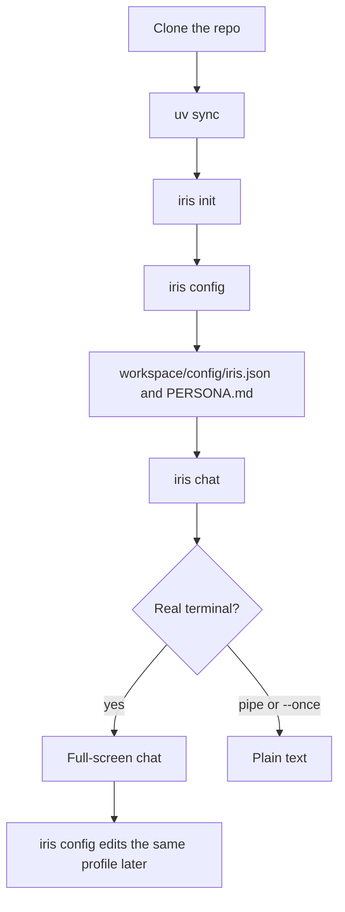
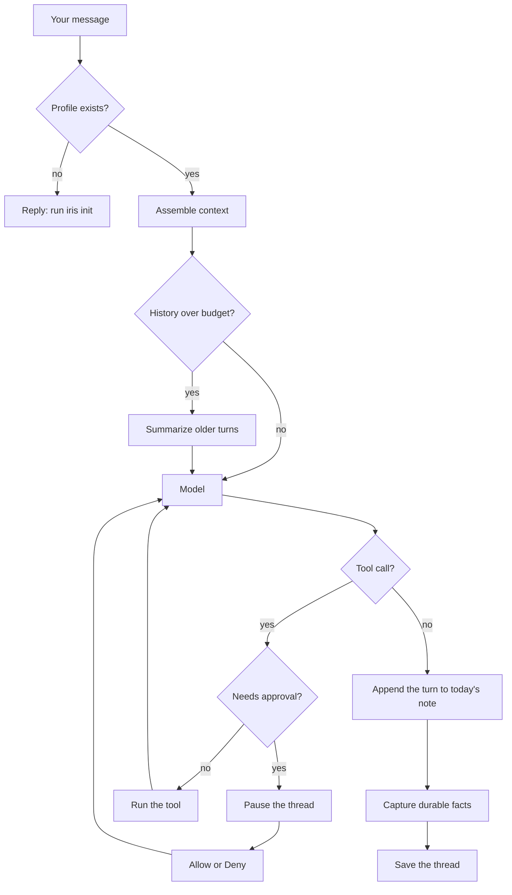
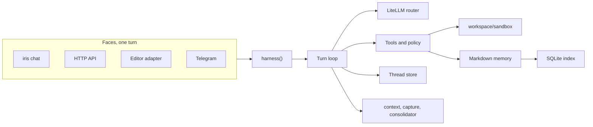

# How Iris works

Iris is a neutral agent harness. The package and the `iris` command keep that
name. There is no personality until you write one in `workspace/PERSONA.md`.

This page is the map: who does what, what one message does, and which files
hold the mind you can open. Install steps and the swap recipe live in
[harness.md](harness.md). The command reference lives in [DOCS.md](../DOCS.md).

## First session



`uv sync` installs the chat, SQLite memory, and the CLI. Postgres, the HTTP
API, MCP, the scheduler, the judge SDK, the editor adapter, and traces are
extras: `uv sync --extra all`.

`iris init` writes `.env` and `config/harness.toml`, seeds `workspace/`, then
measures the result: one cheap model call, the memory store opened, and which
thread store a conversation would land in. On a terminal it opens the setup
wizard (provider, key, model, parts, MCP, profile). `iris init --yes` writes a
blank profile and skips the wizard, which is what CI uses. `iris config` reopens
the same wizard.

Until that profile exists, chat answers with a pointer to `iris init` and does
not run tools.

## One message



Assemble reads `MEMORY.md`, `USER.md`, and the skill list. It does not search
the index. Questions about the owner's life, history, or plans are answered by
the model calling `memory_search`. That tool is the recall path.

A tool result with `"ok": false` is a failure. The next system line tells the
model not to claim the write succeeded.

A tool the policy marks as ask (forget, and anything else in that class) pauses
the thread. Allow or Deny is stored with the thread, so a restart resumes the
same question instead of running the tool twice.

## The pieces



Every face is a client of `iris_ai.harness()`. The CLI, the HTTP API, the
editor adapter, and Telegram run the same loop, so a guard or a memory rule
cannot be "fixed" in only one of them.

| Piece | Default | Replace it with |
|---|---|---|
| Context | Reads `MEMORY.md` and `USER.md` | `[components] context = "pkg.mod:Class"` |
| Capture | Writes durable facts to the daily note | `capture = "off"` or a class |
| Consolidation | Dreaming, also `/dream` in chat | `consolidator = "off"` or a class |
| Threads | SQLite, `workspace/threads.db` | the `postgres` extra |
| Memory index | SQLite. Keyword search when no embedding key is set | the `postgres` extra, for pgvector |
| Persona | Empty file | `workspace/PERSONA.md`, or `iris config` |

```bash
uv run iris new component context
uv run iris new component memory
```

Copies you can read first: `examples/custom_context` and
`examples/custom_memory`.

## What you can open

The mind is Markdown under `workspace/`:

| File | What it holds |
|---|---|
| `USER.md` | The profile from setup |
| `MEMORY.md` | Facts consolidation has promoted |
| `memory/YYYY-MM-DD.md` | The daily note. A finished turn leaves a line here |
| `PERSONA.md` | Optional voice. Empty means the harness contract only |
| `sandbox/` | The only directory file tools may write |
| `config/iris.json` | Owner, assistant name, tone, timezone, sleep hour |
| `logs/iris.log` | Provider failover and other harness logs |

The index is derived. Delete it and it can be rebuilt from the Markdown.
Nothing you care about has to live only in a database.

The system prompt is the harness contract plus `PERSONA.md` when that file has
text. The contract names the real commands and says there is no `iris dream`
command. Consolidation from chat is `/dream`, or the `dream_now` tool.

## Chat commands

`/help` `/new` `/sessions` `/switch` `/model` `/provider` `/persona` `/config`
`/memory` `/search` `/dream` `/forget` `/tools` `/skills` `/costs` `/trace`
`/clear` `/exit`

`iris` and `iris chat` open the full-screen terminal when stdout is a TTY.
`iris chat --once "hello"` and a pipe stay plain text.

The turn loop yields typed events (`TextDelta`, `ToolStart`, `ToolEnd`, `Usage`,
`ErrorEvent`, `Done`). Each event also unpacks as the older `(mode, payload)`
pair, so the plain REPL and the HTTP API keep working. `ToolEnd` carries a
short result and how long the tool took. `Usage` carries tokens and cost.

MCP servers are declared in `.mcp.json`. `iris mcp add <preset>` writes one
from the catalog (filesystem, fetch, github, git, brave-search, playwright,
sqlite). On Windows, a stdio server runs on a Proactor loop because the chat
process uses a selector loop that cannot spawn subprocesses. `iris serve http`
starts the HTTP API. `iris serve telegram` names the token and the mcp extra.

## Extras

| Extra | What it adds |
|---|---|
| `postgres` | pgvector memory and shared threads |
| `api` | `iris serve http` |
| `mcp` | MCP servers and the Telegram channel |
| `schedule` | Nightly consolidation and reminders |
| `judge` | Typed probability judgments |
| `acp` | The editor adapter, `iris-acp` |
| `otel` | OTLP traces |
| `all` | Every extra above |

## Settings

One flat object, `iris_ai.config.settings`, with fields grouped by comment in
`src/iris_ai/config.py`. Precedence:

```text
defaults  <  .env  <  config/harness.toml  <  real environment  <  CLI flag
```

`.env` holds secrets. `config/harness.toml` is the file you commit. A real
environment variable beats the file, so a container can override a checkout
without editing it.
