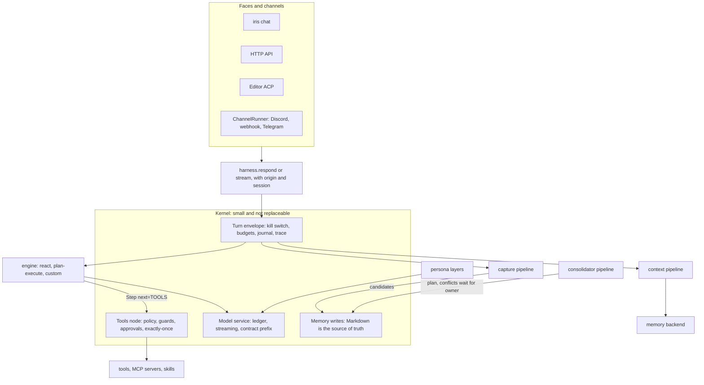
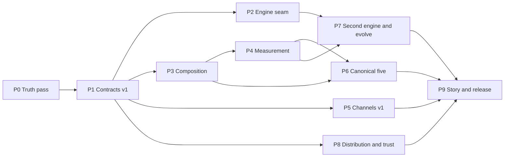

# Iris: an open agent-harness runtime

**Thesis.** Make every decision around the model replaceable without forking the runtime. A small kernel keeps approvals, policy, budgets, durability, and provenance non-negotiable. Iris writing, measuring, and evolving its own parts is the showcase on top, not the product definition.

This document is the architecture the implementation follows. Step-by-step checklists live in `docs/design/plans/`.

## Architecture

Faces and channels are clients of one turn API. The kernel is the only place that acts: it runs tools, writes memory, pauses for approval, and records the trace. Everything that decides — which context to assemble, which loop to run, which facts to keep — is a component.

Engines decide; the kernel acts. A step whose `next` is `TOOLS` hands the last assistant message to the kernel's tools node. That node is the only place a tool runs and the only place a turn pauses. After the tools node (or after the owner resumes), the kernel continues at the engine's `after` node.

## Taxonomy

One vocabulary, used in code, docs, and the CLI.

| Layer | What it is | How it is selected |
|---|---|---|
| Harness components | engine, context, memory, persona, capture, consolidator, channel | `[components]` — a folder, a package, or a dotted path. Typed, versioned, digest-pinned |
| Capabilities | tools, MCP servers, skills | registries and entry points |
| Policy | tool policy, guards, policy hooks, approvals, budgets, sandbox | kernel-owned. Plugins can only tighten it |
| Infrastructure | model, judge, thread store, secret store, telemetry | settings |

Folder components a person (or Iris) can write live under `components/<kind>/<name>/`. In the truth pass those kinds are context, memory, persona, capture, and consolidator. `engine` joins when the engine seam lands. `channel` joins when the channel runner lands. Other extension points (tools, hooks, models, judges, secret stores) stay entry-point plugins; `iris new` for those kinds prints the entry-point recipe instead of scaffolding a folder nothing loads.

## Invariants

These sit after the twelve already asserted in DOCS §6.4. Relaxing one is a design conversation, not a test fix.

13. Engines decide; the kernel acts. Tools run only in the kernel's tools node, and only that node can pause a turn.
14. Policy only tightens, and it fails closed. A guard or policy hook that raises refuses the call.
15. A v1 component receives capabilities, never the runtime.
16. A local or installed component loads only at the digest the owner approved.
17. Components propose memory changes and the kernel writes them. A flagged conflict is never applied without the owner.
18. Every engine runs inside the turn's budgets: recursion cap, token and cost ceilings, kill switch.
19. Every trace names the harness that produced it: the engine, each component or stage with its source and digest, and the model.

## Rules that hold across phases

- **Compatibility.** v1 is the only documented API. The v0 shapes (`assemble_turn` returning a tuple, `maybe_capture` returning a string, `sleep()`, `ctx.runtime`, positional `cls(runtime)`) keep working through adapters with a deprecation warning until 0.6.
- **Trust.** Components run in-process. The capability context narrows the API, not the process. The protection is the staging folder, the jailed check and simulation, digest pins, and approval. Process isolation is designed, and built only when untrusted installs become a goal.
- **Markdown is the source of truth.** Capture returns candidates. Consolidators return plans. The kernel writes the files and rebuilds the index.
- **Two engines.** `react` and `plan-execute`, both inside the same budgets.
- **Measurement before claims.** A component's README states where it loses. Suites keep a held-out split. Numbers in the README name the command that produced them.
- **Distribution uses existing formats.** Python entry points, plus Agent Plugins 1.0 reverse-domain extension directories.

## Phase map

| Phase | Goal | Exit |
|---|---|---|
| 0 Truth pass | Every listed name loads. Policy fails closed. A turn can explain itself | `iris components list` shows only loadable names. Capture and policy-hook tests exist. `/explain` names model, components, context size, tools, tokens, and cost |
| 1 Contracts v1 | Typed SDK. Capability context with no runtime. Digest-pinned lock | Built-ins and examples are v1. A tampered folder does not load. `inspect` shows the trust picture |
| 2 Engine seam | `[components] engine` selects the loop. The kernel still acts | `engine = "react"` matches today's turn. A custom engine reaches tools only through the kernel node |
| 3 Composition | Small components that stack | `iris components use context default,temporal-rag` works. `/explain` attributes each block to its stage. Conflicts wait for the owner |
| 4 Measurement | Score a component offline, with a confidence interval, before it goes live | `iris eval context` scores the built-ins. `simulate` prints a paired comparison |
| 5 Channels v1 | One runner owns identity, sessions, approvals, and rate limits | The same session answers from the terminal and from a channel component. `/explain` shows channel and origin |
| 6 Canonical five | temporal-rag, evidence-memory, strict-reviewer, decision-only, conflict-resolver | Each beats the default on its suite, and its README says where it loses |
| 7 Second engine and evolve | `plan-execute`, then a search over harness code that the owner approves | An evolve run names a frontier candidate with held-out numbers. Activation is the normal digest-pinned approval |
| 8 Distribution | Install, pin, lock, and Agent Plugins 1.0 interop. Isolation is designed, not built | A git URL installs with a pinned digest. `lock --check` fails on drift |
| 9 Story | The README says what the architecture is | Demo script, measured numbers, versions 0.4 / 0.5 / 0.6 |

Versions: 0.4.0 after composition (the iris/v1 API), 0.5.0 after the canonical five, 0.6.0 after distribution (v0 adapters removed).

## Decisions held until their phase

- Whether the distribution stays `iris-personal-ai` (Phase 9).
- The reverse-domain namespace, which needs a domain the project controls (Phase 8). Default used until then: `dev.iris.harness`.
- Telegram stays a bridge. Moving it onto the runner is optional (Phase 5).
- Roles and subagents stay on their own runner until someone moves them onto the engine protocol (Phase 7).
