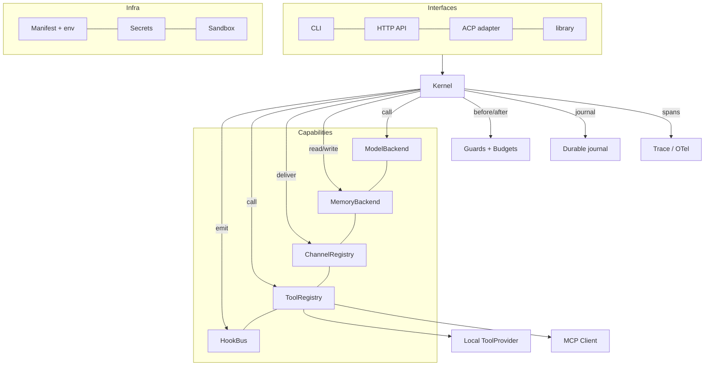

# Iris redesign — master design

> Status: **design**. Nothing here is implemented beyond the plug-and-play layer
> already shipped (`docs/redesign/plugin-architecture.md`). This is the plan to
> re-architect Iris from a personal-assistant project into a **general,
> configurable agent harness**, single-user and local-first, that anyone can run
> and anyone can extend.

This master doc states the vision, the principles, the layer model and the
decisions. Each subsystem has a deep-dive linked at the end; the phased plan and
migration live in `09-roadmap.md`.

---

## 1. What Iris becomes

Today Iris is a personal assistant that happens to be built as a library + CLI.
The redesign keeps the *engine quality* (memory, judgments, evaluation) and
changes the *shape*: a **general-purpose agent harness** where the personal
assistant is one shipped configuration, not the architecture.

Three claims define the product:

1. **Bring your own everything.** Model, memory, tools, channels, storage and
   orchestration are each a registered capability behind a small interface. A
   user picks and mixes; core never needs editing to add one.
2. **Runs on a laptop with one command.** No external service is required to
   start. SQLite is the default store; Postgres, remote MCP, and hosted models
   are opt-in upgrades, never prerequisites.
3. **Visible and safe by construction.** Every model call, tool call, judgment,
   approval and refusal is on a trace; risky capabilities are gated by a policy
   engine and a sandbox, not by a prompt asking the model to behave.

The personal-assistant app (memory-as-the-product, dreaming, bonding) ships as
`examples/assistant/` — the reference configuration that proves the harness.

## 2. Design principles

Ordered, because they conflict and this is the tie-break:

1. **Fast onboarding beats feature breadth.** Clone → `iris init` → `iris chat`
   in under five minutes, with zero required services, is a test we run in CI.
2. **Config over code, for anything a user would change.** Model, store, active
   channels and tools, budgets, log level, trust policy live in one manifest.
3. **Customizable part by part.** Every capability is independently swappable;
   there is no god-object and no god-file.
4. **Safety is default-on.** A capability that is not declared cannot run; a
   denial cannot be re-opened by a lower layer; secrets never reach a trace.
5. **Capability, without a service you must run.** Anything that needs Postgres,
   a browser fleet, or a paid API must degrade to a local fallback.
6. **Performance and cost are correctness.** Budgets, streaming, prompt caching
   and a local judgment layer are part of the design, not tuning afterward.

## 3. Layer model

```
┌───────────────────────────────────────────────────────────────────────────┐
│  Interfaces        CLI · HTTP API · ACP (IDE) · MCP-server mode · library  │
├───────────────────────────────────────────────────────────────────────────┤
│  Kernel            turn state machine · hooks · budgets · guards · trace  │
│                    durable journal · approvals                            │
├───────────────────────────────────────────────────────────────────────────┤
│  Capabilities      models · tools · channels · memory · hooks · evaluators│
│  (registry)        discovered from entry points + manifest                │
├───────────────────────────────────────────────────────────────────────────┤
│  Infrastructure    config manifest · secrets · storage · sandbox · logging│
└───────────────────────────────────────────────────────────────────────────┘
```

The **Kernel** is the only thing that knows how a turn works. Everything the
kernel does to the outside world — call a model, run a tool, read memory, send a
message — goes through a capability interface. That is the whole redesign in one
sentence: *the kernel is small and fixed; the capabilities are large and free.*

## 4. Capability taxonomy

Every extension point is one row. Each has a Protocol, a registry, an entry-point
group, a manifest section, and a conformance test.

| Kind | Interface | Entry-point group | Core default | Replaces |
|---|---|---|---|---|
| model | `ModelBackend` | `iris_ai.models` | LiteLLM gateway | `memory/llm.py` |
| tool (local) | `ToolProvider` | `iris_ai.tools` | built-in toolset | `agent/tools.py` |
| tool (MCP) | MCP client + server spec | (config) | none | hardcoded Telegram |
| channel | `Channel` | `iris_ai.channels` | Telegram over MCP | `channels/telegram_mcp.py` |
| memory | `MemoryBackend` | `iris_ai.memory` | SQLite + sqlite-vec | `memory/index.py` (pgvector) |
| hook | `Hook` | `iris_ai.hooks` | guard chain | inline guards |
| evaluator | `Evaluator` | `iris_ai.eval` | retrieval + judge metrics | `eval/` |
| judgment | `Judge` | `iris_ai.judges` | deterministic + JEV adapter | `jev/` |
| orchestrator | `Orchestrator` | `iris_ai.orchestrators` | native kernel | LangGraph (`agent/chat.py`) |
| command | `Command` | `iris_ai.commands` | built-in CLI verbs | `cli/*` |

The kinds that are **not** pluggable, on purpose: the Kernel, the config loader,
the secret store and the trace writer. Those are the invariants everything else
trusts.

## 5. The reference architecture (mermaid)



## 6. Key decisions and tradeoffs

Each is expanded in its deep-dive. The alternatives are named so the choice is
reviewable.

| # | Decision | Alternative rejected | Why |
|---|---|---|---|
| D1 | **Own the kernel; LangGraph becomes an optional orchestrator adapter** (`01`) | Keep LangGraph as the runtime | The loop is the product; a 900-line dependency between the user and their harness is onboarding friction, and durability is better served by an explicit journal than by a graph library |
| D2 | **SQLite + sqlite-vec is the default memory backend** (`03`) | Postgres/pgvector required | Zero-service startup is principle 1; pgvector becomes an opt-in backend for large corpora |
| D3 | **One manifest (`iris.toml`) + env for secrets**, `.mcp.json` compatible (`06`,`02`) | Env-only, or code-first | Config-over-code is principle 2; `.mcp.json` compatibility means server docs work unchanged |
| D4 | **MCP is a first-class client with a server registry and per-server trust** (`02`) | One hardcoded MCP client | The ecosystem is the capability pool; stdio/http/streamable-http/sse/ws + OAuth 2.1 + tool namespacing is table stakes in 2026 |
| D5 | **Policy engine + approval bound to a digest + process sandbox by default** (`05`) | Prompt-level instructions | Open-source harness: other people run other people's tools; safety must be structural |
| D6 | **OpenTelemetry GenAI spans as the wire format**, JSONL as the local default (`07`) | Bespoke trace only | OTel is where the ecosystem is; a local file keeps zero-dependency startup |
| D7 | **ACP adapter for IDE integration; MCP-server mode for exposing Iris** (`08`) | Only CLI + HTTP | ACP is "LSP for agents"; it is how a harness gets adopted by editors |
| D8 | **Judgments stay first-class and optional** (`07`) | Remove JEV; or hard-depend on it | Typed judgments are a real differentiator; they must degrade to deterministic |
| D9 | **Skills follow the open Agent Skills spec; tools are MCP** (`06`,`02`) | One bespoke capability format | Progressive disclosure + portability; MCP covers the tool half |
| D10 | **Durability = append-only journal + idempotent tool boundaries + versioned prompts** (`01`) | In-memory loops with retries | Agent work must survive a restart and a crash mid-tool |

## 7. Proposed repository layout

```
src/iris_ai/
  kernel/            # the turn state machine — model/transport/store agnostic
    turn.py          # one turn as explicit steps
    journal.py       # append-only durability + replay
    hooks.py         # the hook bus (exists)
    guard.py         # the guard chain (exists)
    budget.py        # ceilings + counters
  capabilities/      # one package per kind, each a Protocol + registry
    models/  tools/  channels/  memory/  judges/  eval/  commands/
  registry.py        # the generic registry (exists)
  manifest.py        # config loader (exists, will grow sections)
  sandbox/  secrets/  trace/
  interfaces/        # cli/  api/  acp/  mcp_server/  library.py
  builtin_skills/    # packaged Agent Skills
examples/assistant/  # the personal-assistant reference config
```

The current `src/iris_ai/` becomes `interfaces/` + capability adapters; the
working algorithms (memory, judgments, eval) move under `capabilities/` behind
their interfaces rather than being rewritten.

## 8. What must be preserved (not redesigned)

Being explicit stops the redesign from becoming a rewrite of the good parts:

- **The memory algorithms** — layered Markdown + vector recall, decay, MMR,
  dreaming, provenance/taint. They move behind `MemoryBackend`, unchanged.
- **Typed judgments** — reranking, skill selection, injection screening, capture,
  sufficiency. They become the `Judge` capability with deterministic fallbacks.
- **The eval discipline** — intervals, paired comparisons, pre-registered rules.
- **The safety ideas** — digest-bound approvals, skill-script gating, untrusted
  content screening, trace redaction.

## 9. Open questions — answered

These were open while the kernel was being specified. They are settled here with
the reason, so a later reader can disagree with a decision rather than guess at
one.

1. **Package identity — keep `iris-personal-ai` / `iris_ai` / `iris`.** The rename
   buys a prettier word and costs a published artifact: the distribution is on
   PyPI, the docs and issue URLs point at it, and `iris` is in every install
   command users already have. The general-harness story is told where it belongs
   — a neutral default profile (`src/iris_ai/templates/`) and the reference app
   (`examples/assistant/`) — not by changing what people type. `iris-acp` was
   added as a *second* console script rather than renaming the first.
2. **Python only — confirmed.** Kernel, capabilities and every extension seam are
   Python. A non-Python client reaches the same harness over a protocol (ACP over
   stdio today, the HTTP API for everything else) rather than through a second
   core. A TypeScript core plus a Python bridge would double the surface — two
   registries, two memory implementations, two approval paths — for no capability
   the harness does not already have.
3. **LangGraph stays the orchestrator in v1; the D1 adapter is deferred.** Phase 5
   shipped the kernel *boundary* first: the append-only journal, the idempotent
   tool boundary, durable approvals, and the versioned prompt/tool surface. That
   boundary is what a swap needs *and* what reliability is actually made of. The
   graph above it is an internal detail nobody configures, and its streaming and
   `interrupt`/resume are precisely what the CLI and the ACP adapter consume — so
   replacing it now would trade a working approval path for a migration. Power
   users lose nothing in the meantime; the mode/orchestrator switches land behind
   the same `Harness` API as the adapter does. What is *not* claimed: that the
   dependency could be dropped tomorrow. `kernel/turn.py` is a boundary and a
   journal today, not yet a standalone loop, and the roadmap says so.
4. **MCP-server mode — deferred to v2** (`08` §5). The client half is what the
   redesign needed (a capability pool configured, not coded). Exposing Iris *as*
   a server needs its own policy story before it can exist: a caller is not the
   owner, so every tool the owner approved for themselves would need a second,
   separate review — and the OAuth half of `02` is v2 for the same reason.
5. **Single user — confirmed, and it stays in scope as an assumption.** One owner,
   one workspace, one set of keys; `USER.md` is singular and an approval is bound
   to one human. Multi-user would change approvals (whose? bound how?), memory
   isolation and the threat model in `05` — that is a different product, and no
   part of this design silently assumes it already works.

## Deep-dives

| Doc | Covers |
|---|---|
| [`01-kernel.md`](01-kernel.md) | The turn state machine, durability, orchestration, multi-agent |
| [`02-integrations-mcp.md`](02-integrations-mcp.md) | MCP client/registry, transports, auth, trust, channels |
| [`03-memory.md`](03-memory.md) | Memory tiers, backends (SQLite/pgvector), retrieval |
| [`04-models.md`](04-models.md) | Model gateway, providers, failover, cost |
| [`05-safety.md`](05-safety.md) | Policy engine, approvals, sandbox, secrets, injection |
| [`06-extensibility.md`](06-extensibility.md) | Registries, skills, hooks, manifest, plugin authoring |
| [`07-observability-eval.md`](07-observability-eval.md) | Tracing/OTel, cost ledger, judgments, evaluation |
| [`08-interfaces.md`](08-interfaces.md) | CLI, HTTP API, ACP, MCP-server mode, library API |
| [`09-roadmap.md`](09-roadmap.md) | Phased plan, migration from today's Iris, risks |
